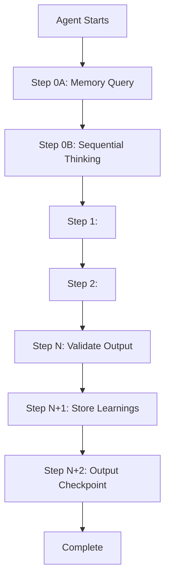
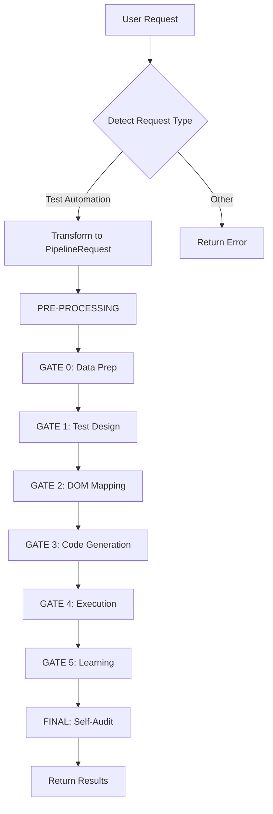
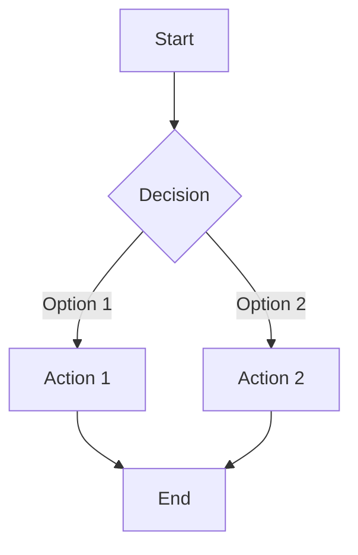
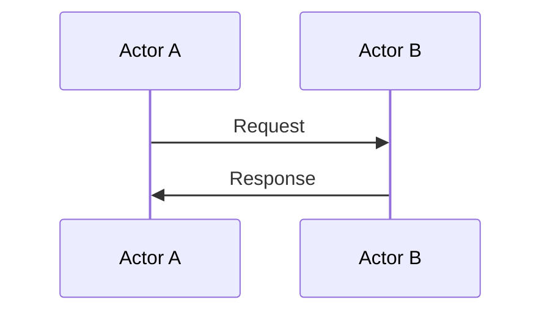
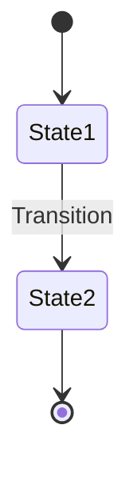

# MASTER REFACTORING TEMPLATE

## Purpose

This template defines the **mandatory structure, tone, and formatting rules** for all instruction files in the QA automation pipeline. Every file must follow this exact pattern to ensure consistency, clarity, and LLM-safety.

---

## File Type Classification

### Type A: Agent Instructions
Files matching `*.agent.instructions.md` (e.g., test_case_designer, dom_analysis, pom_generator, test_healing)

### Type B: Supporting Guides
Files providing cross-agent reference material (e.g., critical_thinking_protocol, mcp_integration_guide, memory_patterns_reference, state_management_guide, data_driven_guide)

### Type C: Orchestration
The master coordinator file (copilot-instructions.md)

---

## Standard Section Structure

### For Type A (Agent Instructions)

```markdown
---
applyTo: '<PATTERN>'
description: '<BRIEF_DESCRIPTION>'
---

# <AGENT_NAME>

## Purpose
[1-2 paragraphs: What problem does this agent solve? What is its role in the pipeline?]

📖 **Reference:** See <GUIDE_NAME> for <SPECIFIC_TOPIC>

## Input Contract
[Commented TypeScript/JSON schema showing STRUCTURE ONLY - non-executable]

```typescript
// Example input structure (non-executable):
// {
//   agentName: "<AGENT_NAME>",
//   timestamp: "<TIMESTAMP_ISO8601>",
//   input: {
//     metadata: {
//       domain: "<SANITIZED_DOMAIN>",
//       feature: "<SANITIZED_FEATURE>",
//       url: "<ORIGINAL_URL>"
//     },
//     <AGENT_SPECIFIC_FIELDS>
//   }
// }
```

## Output Contract
[Commented TypeScript/JSON schema showing STRUCTURE ONLY - non-executable]

```typescript
// Example output structure (non-executable):
// {
//   agentName: "<AGENT_NAME>",
//   timestamp: "<TIMESTAMP_ISO8601>",
//   status: "SUCCESS" | "PARTIAL" | "FAILED",
//   executionTimeMs: <DURATION_MS>,
//   outputData: {
//     <AGENT_SPECIFIC_OUTPUT>
//   },
//   validationResult: {
//     passed: <BOOLEAN>,
//     score: <0_TO_1>,
//     issues: ["<ISSUE_1>"]
//   },
//   executionTrace: {
//     startTime: "<TIMESTAMP_ISO8601>",
//     endTime: "<TIMESTAMP_ISO8601>",
//     executedSteps: ["<STEP_0A>", "<STEP_1>"],
//     skippedSteps: [],
//     failedSteps: [],
//     checkpointCompleted: <BOOLEAN>
//   }
// }
```

## Step-by-Step Procedure



### Step 0A: Query Memory (MANDATORY)

📖 **Reference:** See `memory_patterns_reference.instructions.md` for query patterns.

Query memory for existing patterns:
- Tool: `mcp_memory_search_nodes`
- Query: `"<DOMAIN> <FEATURE> <PATTERN_TYPE> patterns"`
- On found: Apply learned knowledge
- On not found: Proceed with new pattern creation

### Step 0B: Plan with Sequential Thinking (MANDATORY for 3+ steps)

📖 **Reference:** See `mcp_integration_guide.instructions.md` Section 1 for parameters.

Plan execution approach:
- Tool: `mcp_sequential-th_sequentialthinking`
- Minimum: 3 thoughts (analysis → solution → verification)
- Document: Alternatives considered, trade-offs, failure modes

### Step 1: <MAIN_WORKFLOW_STEP_1>
[Describe action, input, output, validation]

📖 **Reference:** See `critical_thinking_protocol.instructions.md` for skepticism framework.

**Critical Thinking Checkpoint:**
- ❓ Challenge: [QUESTION]
- → Analysis: [REASONING]
- → Mitigation: [ACTION]

### Step N: <FINAL_WORKFLOW_STEP>

### Step N+1: Store Learnings (MANDATORY)

📖 **Reference:** See `memory_patterns_reference.instructions.md` for entity schemas.

Store patterns with verification:
- Tool: `mcp_memory_create_entities`
- Entity: `<DOMAIN>-<FEATURE>-<PATTERN_TYPE>`
- Verification: `mcp_memory_open_nodes` to confirm storage
- On failure: Retry once, log warning if still fails

### Step N+2: Output Checkpoint (MANDATORY)

```markdown
**CHECKPOINT: <AGENT_NAME> Completion**

Required MCPs:
✅ mcp_memory_search_nodes - Queried <PATTERN_TYPE>
✅ mcp_sequential-th_sequentialthinking - Planned approach (3 thoughts)
✅ <OTHER_TOOLS> - <STATUS>

MISSING STEPS: <LIST_OR_NONE>

ACTION: <COMPLETED_OR_ISSUE>
```

## Validation Rules

| Rule | Criteria | Threshold |
|------|----------|-----------|
| Schema | Output matches contract | 100% |
| Completeness | All required fields present | 100% |
| Quality Score | Agent-specific metric | ≥ 70% |
| Semantic | Output makes sense for use case | Level 3+ |

## Constraints

**NEVER:**
- Skip memory query (Step 0A)
- Skip sequential thinking for complex operations
- Skip storing learnings after success
- Return executable code in output
- Use dynamic timestamps or UUIDs in examples

**ALWAYS:**
- Query memory before main execution
- Use static placeholders in examples
- Validate semantics, not just structure
- Output checkpoint before completion
- Reference guides instead of duplicating

## Communication Rules

📖 **Reference:** See `rules.instructions.md` Communication Rules section.

**Output Format:** JSON to `.state/<DOMAIN>-<FEATURE>-gate<N>-output.json`

**Console Output:** Natural language progress updates

## Error Handling

| Error Type | Action | Max Retries | Escalation |
|------------|--------|-------------|------------|
| Input Validation | Return error immediately | 0 | User |
| Transient | Retry with backoff | 3 | Orchestration |
| Agent Logic | Log + fallback | 1 | Orchestration |
| Critical | Abort | 0 | User |

## Example Exchange

[One complete example with static data showing input → processing → output]

```json
// Example input (non-executable):
{
  "agentName": "<AGENT_NAME>",
  "timestamp": "<TIMESTAMP_ISO8601>",
  "input": {
    "metadata": {
      "domain": "<EXAMPLE_DOMAIN>",
      "feature": "<EXAMPLE_FEATURE>",
      "url": "<EXAMPLE_URL>"
    }
  }
}

// Example output (non-executable):
{
  "agentName": "<AGENT_NAME>",
  "timestamp": "<TIMESTAMP_ISO8601>",
  "status": "SUCCESS",
  "executionTimeMs": <EXAMPLE_DURATION>,
  "outputData": { },
  "validationResult": {
    "passed": true,
    "score": 0.85,
    "issues": []
  }
}
```
```

---

### For Type B (Supporting Guides)

```markdown
---
applyTo: '<PATTERN>'
description: '<BRIEF_DESCRIPTION>'
---

# <GUIDE_NAME>

## Purpose

[1-2 paragraphs: What problem does this guide solve? Who uses it?]

## Core Concepts

```mermaid
[Diagram showing key concepts and relationships]
```

### Concept 1: <NAME>
[Definition, use cases, constraints]

### Concept 2: <NAME>
[Definition, use cases, constraints]

## Reference Patterns

### Pattern 1: <NAME>

**When to Use:** [Conditions]

**Structure:**
```typescript
// Example pattern structure (non-executable):
// <CODE_TEMPLATE_WITH_PLACEHOLDERS>
```

**Parameters:**

| Parameter | Type | Required | Description |
|-----------|------|----------|-------------|
| `<PARAM>` | string | ✅ | <DESCRIPTION> |

**Example:**
```json
// Example usage (non-executable):
{
  "<PARAM>": "<STATIC_VALUE>"
}
```

### Pattern 2: <NAME>
[Same structure as Pattern 1]

## Integration Points

**Used By:**
- Agent A: Step X for <PURPOSE>
- Agent B: Step Y for <PURPOSE>

**Provides:**
- Reference schemas
- Query templates
- Validation rules

## Examples

[2-3 minimal examples with static data]

## Constraints

**NEVER:**
- [List of prohibited actions]

**ALWAYS:**
- [List of mandatory actions]
```

---

### For Type C (Orchestration)

```markdown
---
description: '<BRIEF_DESCRIPTION>'
---

# ORCHESTRATION AGENT

## Purpose

[2-3 paragraphs: Master coordinator role, pipeline overview, end-to-end responsibility]

## Request Type Detection

[Logic for determining when to trigger orchestration]

## Input Contract

[Commented schema for PipelineRequest]

## Output Contract

[Commented schema for OrchestrationResult]

## Execution Workflow



### PRE-PROCESSING
[Step-by-step with critical thinking checkpoints]

### GATE 0: <NAME> (CONDITIONAL)
[Trigger conditions, execution, validation]

### GATE N: <NAME>
[Agent invocation, input/output, validation]

### FINAL: Self-Audit Checkpoint
[Comprehensive validation, deliverables check, quality metrics]

## Validation Rules

[Cross-gate consistency checks]

## Error Handling

[Pipeline-level error handling strategy]

## Constraints

[Orchestration-specific constraints]

## Example Exchange

[Complete end-to-end example with all gates]
```

---

## Code Transformation Rules

### Rule 1: Comment Out All Code

```typescript
// ❌ BEFORE (executable):
const result = await fetch(url);
const data = Date.now();

// ✅ AFTER (non-executable):
// const result = await fetch(url);
// const data = Date.now();
```

### Rule 2: Replace Dynamic Values

| Dynamic | Static Placeholder |
|---------|-------------------|
| `new Date().toISOString()` | `"<TIMESTAMP_ISO8601>"` |
| `Date.now()` | `<EXECUTION_TIME_MS>` |
| `generateUUID()` | `"<UNIQUE_REQUEST_ID>"` |
| `faker.person.firstName()` | `"<EXAMPLE_FIRST_NAME>"` |
| `extractDomain(url)` | `"<SANITIZED_DOMAIN>"` |
| Actual URLs | `"<EXAMPLE_URL>"` |
| Random numbers | `<EXAMPLE_NUMBER>` |

### Rule 3: Add Non-Executable Headers

```typescript
// Example structure (non-executable):
// {
//   field: "<VALUE>"
// }
```

```json
// Example data structure (static):
{
  "field": "<VALUE>"
}
```

### Rule 4: Show Structure, Not Implementation

```typescript
// ❌ BEFORE (implementation):
async function validateInput(input: PipelineRequest): Promise<ValidationResult> {
  const errors: string[] = [];
  if (!input.userStory?.trim()) {
    errors.push('userStory cannot be empty');
  }
  return { valid: errors.length === 0, errors };
}

// ✅ AFTER (structure):
// Example validation function structure (non-executable):
// validateInput(input) {
//   // Check: userStory is non-empty
//   // Check: URL is valid format
//   // Check: acceptanceCriteria has 1+ items
//   // Return: { valid: <BOOLEAN>, errors: ["<ERROR_1>"] }
// }
```

---

## Mermaid Diagram Standards

### Process Flows



### Sequence Diagrams



### State Diagrams



---

## Terminology Standardization

| Use | Don't Use |
|-----|-----------|
| metadata.domain | domain name, website domain |
| test case | test scenario, test |
| locator strategy | element selector, locator |
| Page Object Model | page object, POM class |
| acceptance criteria | AC, requirements |
| GATE N | gate N, Gate N |
| MCP | mcp, Mcp |
| Step 0A | step 0a, STEP 0A |

---

## Tone & Voice Rules

### Use Imperative Voice

**✅ Correct:**
- Query memory for existing patterns
- Validate input against schema
- Store learnings with verification

**❌ Incorrect:**
- I will query memory
- The agent should validate
- You must store learnings

### Use Neutral, Technical Tone

**✅ Correct:**
- Sequential thinking analyzes complex decisions
- Memory query retrieves existing patterns
- Validation ensures semantic correctness

**❌ Incorrect:**
- Sequential thinking is really helpful for analyzing decisions
- You should definitely query memory first
- Make sure validation is super thorough

### Use Consistent Formatting

**Headers:** Title Case for sections, Sentence case for subsections

**Emphasis:**
- `code` for technical terms
- **bold** for important concepts
- *italic* for references

**Lists:**
- Use `-` for unordered lists
- Use `1.` for ordered lists
- Use `[ ]` for checkboxes

---

## Section Removal Rules

### Remove Completely

- Version annotations (v1.0, Version 2.0, UPDATE, NEW, FIX)
- Emoji headers (🎯, 📖, ✅, ❌) - convert to plain text
- Developer notes (TODO, FIXME, TEMPORARY)
- Duplicate explanations across files
- ASCII art diagrams (replace with Mermaid)
- Verbose examples repeating same pattern

### Consolidate & Reference

- Communication protocol (keep in rules.instructions.md)
- MCP tool specs (keep in mcp_integration_guide.instructions.md)
- Memory patterns (keep in memory_patterns_reference.instructions.md)
- Critical thinking framework (keep in critical_thinking_protocol.instructions.md)

Replace duplicates with: `📖 **Reference:** See <FILE> Section <NAME>`

---

## Quality Checklist

Before marking a file as refactored, verify:

- [ ] All sections follow standard structure
- [ ] All code blocks are commented out
- [ ] All dynamic values replaced with placeholders
- [ ] All ASCII diagrams converted to Mermaid
- [ ] All version notes removed
- [ ] All emojis removed from headers
- [ ] All references use standard format
- [ ] All terminology is standardized
- [ ] All tone is imperative and neutral
- [ ] File size reduced by 30-50%
- [ ] No duplicate content across files
- [ ] All critical thinking checkpoints present
- [ ] All MCP enforcement rules present
- [ ] All constraints clearly stated

---

## Application Strategy

### Phase 1: Supporting Guides (Foundation)
1. rules.instructions.md ✅ COMPLETED
2. critical_thinking_protocol.instructions.md
3. mcp_integration_guide.instructions.md
4. memory_patterns_reference.instructions.md
5. state_management_guide.instructions.md
6. data_driven_guide.instructions.md

### Phase 2: Agent Files (Core Logic)
7. test_case_designer.agent.instructions.md
8. dom_analysis.agent.instructions.md
9. pom_generator.agent.instructions.md
10. test_healing.agent.instructions.md

### Phase 3: Orchestration (Coordination)
11. copilot-instructions.md

---

## Template Usage Instructions

1. **Identify file type** (A, B, or C)
2. **Copy relevant template section** from above
3. **Extract core logic** from original file
4. **Transform code** using Code Transformation Rules
5. **Create Mermaid diagrams** replacing ASCII art
6. **Add references** to supporting guides
7. **Apply critical thinking checkpoints** at key decision points
8. **Verify against Quality Checklist**
9. **Validate semantic preservation** (same logic, different structure)

---

This template represents the **unified standard** for all instruction files in the QA automation pipeline. All refactoring must conform to these specifications.
