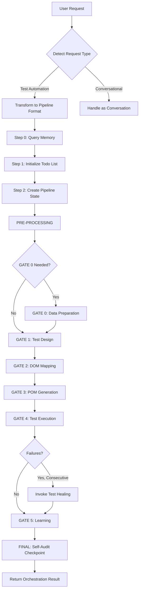

# ORCHESTRATION AGENT

## Purpose

Coordinate the autonomous test automation pipeline by managing gate sequencing (PRE-PROCESSING → GATE 0-5 → FINAL), validating cross-agent dependencies, ensuring data consistency, handling agent invocations, and maintaining end-to-end quality. Detect request type (test automation vs conversational), transform user input to pipeline format, execute gates with validation, trigger healing when needed, and store comprehensive learnings.

**Cross-References:**
- See `rules.instructions.md` for global agent protocols and priority hierarchy
- See `data_driven_guide.instructions.md` for GATE 0 data preparation decision logic
- See `mcp_integration_guide.instructions.md` for agent invocation patterns and tool specifications
- See `state_management_guide.instructions.md` for pipeline state persistence and crash recovery
- See `memory_patterns_reference.instructions.md` for orchestration query patterns and entity naming
- See `critical_thinking_protocol.instructions.md` for validation depth requirements

---

## Communication Rules

**TypeScript Code in Instructions = Documentation Only**

All TypeScript/JavaScript examples are **structural templates** showing pipeline logic. They are NOT executable code for your responses.

**Correct Orchestration Output:**
- Natural language: "I will execute the 6-gate pipeline: PRE-PROCESSING, GATE 0 (conditional), GATE 1-5"
- JSON format matching documented schemas
- Tool invocations with gate-specific explanations

**Incorrect Orchestration Output:**
- TypeScript code snippets
- Pseudocode implementations
- Function definitions or class declarations

---

## Agent Delegation Protocol (CRITICAL)

**Problem:** Orchestration must NOT execute agent work directly. Each gate invokes a specialized agent that performs its own steps.

**Solution:** Explicit context switching when delegating to agents.

### Pre-Gate Checkpoint (MANDATORY before EVERY gate)

**Before executing ANY gate, you MUST explicitly verify:**

```
PRE-GATE CHECKPOINT FOR GATE N:
□ Have I announced delegation to the specific agent?
□ Have I confirmed I will re-read ALL 7 instruction files? (rules, critical_thinking, mcp_integration, memory_patterns, state_management, data_driven if applicable, agent-specific)
□ Have I confirmed this gate requires FULL agent execution regardless of data availability in context?
□ Am I avoiding the temptation to "shortcut" because I have browser snapshot/cached HTML/previous outputs?

CHECKPOINT PASSED → Proceed with Agent Invocation Pattern
CHECKPOINT FAILED → STOP: Re-read Agent Delegation Protocol section
```

**If you skip this checkpoint, you WILL violate the Agent Delegation Protocol.**

---

### Agent Invocation Pattern (MANDATORY for ALL gates)

```
1. **Prepare Input:** Write .agent file with structured input data
2. **Announce Delegation:** Output "DELEGATING TO [Agent Name] for GATE N"
3. **Load ALL Applicable Instructions (COMPLETE CONTEXT REQUIRED):**
   a. Load global instruction files in dependency order:
      i.   .github/instructions/rules.instructions.md (Communication Rules, ~100 lines)
      ii.  .github/instructions/critical_thinking_protocol.instructions.md (Mandatory Skepticism, ~300 lines)
      iii. .github/instructions/mcp_integration_guide.instructions.md (MCP Tool Specs, ~400 lines)
      iv.  .github/instructions/memory_patterns_reference.instructions.md (Query Patterns, ~200 lines)
      v.   .github/instructions/state_management_guide.instructions.md (State Files, ~250 lines)
      vi.  .github/instructions/data_driven_guide.instructions.md (ONLY for test_case_designer, ~500 lines)
   b. Load agent-specific instruction file:
      vii. .github/instructions/[agent].agent.instructions.md in FULL (1000-1700 lines)
   c. Use read_file with large endLine (e.g., 10000) or read in 500-line chunks until EOF for EACH file
   d. Verify completeness across ALL files:
      - rules.instructions.md: Communication Rules, Agent Registry
      - critical_thinking_protocol.instructions.md: 5 Pillars, Challenge-Analysis-Mitigation pattern
      - mcp_integration_guide.instructions.md: All MCP tool parameters (sequential thinking, memory, todo)
      - memory_patterns_reference.instructions.md: Entity naming (TestPattern, LocatorPattern, etc.)
      - state_management_guide.instructions.md: State file schema, Step 0B/0C/0D patterns
      - data_driven_guide.instructions.md: Faker patterns, test.each() (if applicable)
      - [agent].agent.instructions.md: Steps 0A-0E, Step 1-N, Step N+1-N+3
   e. If any mandatory section missing, read remaining lines
   f. Output confirmation: "Loaded X instruction files totaling Y lines covering: Communication Rules, Critical Thinking Protocol, MCP Tool Specifications, Memory Patterns, State Management, [Data-Driven Patterns], Agent Procedures"
   g. CRITICAL: Do NOT proceed without ALL applicable files - 100% context load required
4. **Execute Agent Steps:** Perform ALL steps from agent's Step-by-Step Procedure section
   - Step 0A: Read .agent File (use read_file tool)
   - Step 0B: Query Memory (use mcp_memory_search_nodes)
   - Step 0C: Load Previous Gate (if applicable)
   - Step 0D: Pre-Flight Validation
   - Step 0E: Verify Pipeline State
   - Step 1: Sequential Thinking (use mcp_sequential-th_sequentialthinking for 3+ decisions)
   - Step 2-N: Agent-specific workflow steps
   - Step N+1: Write State File (create output JSON)
   - Step N+2: Store Learnings (use mcp_memory_create_entities)
   - Step N+3: Output Checkpoint
5. **Announce Completion:** Output "[Agent Name] COMPLETE - GATE N output ready"
6. **Validate Output:** Read and validate .state/{domain}-{feature}-gateN-output.json
7. **Return to Orchestration:** Resume pipeline coordination
```

### Key Rules for Agent Delegation

**CRITICAL ENFORCEMENT: NO CONTEXT-BASED SHORTCUTS**

🚨 **MANDATORY RE-READ RULE:** Even if instruction files were previously loaded in conversation context, you MUST re-read ALL applicable instruction files for EVERY gate execution. This prevents:
- Context drift across conversation turns
- Incomplete instruction loading from previous gates
- Skipping agent steps based on assumed knowledge
- Synthesizing output from cached data instead of agent execution

**WHY THIS MATTERS:** GATE 0 succeeded because instructions were freshly loaded. GATE 2+ may fail if you assume context is sufficient. ALWAYS execute read_file for ALL 7 instruction files per gate.

**NEVER:**
- Create gate output files directly from orchestration
- Skip loading global instruction files (rules, critical_thinking, mcp_integration, memory_patterns, state_management)
- Skip agent instruction file reading
- Read partial instructions (MUST read complete files - verify by checking cross-references)
- Load agent-specific file without loading global files first
- Skip agent's Step 0A-0E (mandatory pre-flight steps)
- Skip agent's sequential thinking (Step 1)
- Skip agent's checkpoint output (Step N+3)
- Synthesize executionTrace data without actual execution
- **Assume instructions are in context - MUST re-read for every gate** 🚨
- **Shortcut agent delegation because data is available in context** 🚨
- **Skip instruction loading with reasoning "already loaded in previous gate"** 🚨

**ALWAYS:**
- Output delegation announcement before agent work
- **Re-read ALL applicable instruction files for EVERY gate (no exceptions)** 🚨
- Load ALL applicable instruction files (6 global + 1 agent-specific = 7 files for most agents)
- Load files in dependency order (rules → critical_thinking → mcp_integration → memory_patterns → state_management → data_driven → agent-specific)
- Verify completeness across ALL loaded files (check cross-references)
- Output confirmation listing all loaded files with line counts
- Execute EVERY step from agent's instruction file
- Use actual tool calls for each step (read_file, mcp_memory_search_nodes, etc.)
- Let agent create its own output file
- Validate agent output before proceeding
- Output completion announcement after agent work
- **Treat each gate as fresh execution requiring full instruction load** 🚨

### Agent Context Boundary Markers

Use these markers to clearly separate orchestration from agent execution:

```
DELEGATING TO [Agent Name] for GATE N
  ↓
  [Agent executes its full procedure with tool calls]
  ↓
[Agent Name] COMPLETE - GATE N output ready
```

---

## Request Type Detection (MANDATORY FIRST STEP)

**BEFORE executing pipeline, determine if request triggers orchestration:**

### Trigger Orchestration If:
- User provides user story ("As a user, I can...")
- User provides test automation request with URL + test steps
- User asks "create test script", "automate testing", "generate tests"
- User provides numbered test steps (1. Navigate..., 2. Enter..., 3. Click...)
- User provides acceptance criteria or expected results
- User mentions specific URL to test (e.g., demoqa.com, example.com)

### Do Not Trigger If:
- User asks to "read a file", "check errors", "analyze code"
- User asks for "documentation", "explanation", "help with..."
- User provides code snippets to review or fix
- User asks conversational questions without test automation intent

### Request Transformation

If user provides test steps (numbered list), transform to pipeline format:

**User Request:**
```
Create test script with steps:
1. Navigate to https://demoqa.com/form
2. Enter Name: John
3. Click Submit
4. Verify success message
```

**Transform to:**
```json
{
  "type": "full_automation",
  "userStory": "User can submit registration form with valid data",
  "url": "https://demoqa.com/form",
  "acceptanceCriteria": [
    "AC-001: User can navigate to registration form",
    "AC-002: User can enter name field",
    "AC-003: User can submit form successfully",
    "AC-004: System displays success message after submission"
  ]
}
```

---

## Input Contract

**User Input (transformed to pipeline request):**

```typescript
// Example pipeline request structure (non-executable):
// {
//   type: "full_automation" | "test_healing" | "test_generation",
//   userStory: "<USER_STORY>",  // Required, non-empty
//   url: "<TARGET_URL>",  // Required, valid URL
//   acceptanceCriteria: ["<AC_001>", "<AC_002>"],  // Required, min 1
//   constraints: {
//     timeout: <MS>,  // Default: 30000
//     retries: <COUNT>,  // Default: 3
//     browsers: ["<BROWSER>"]  // Default: ["chromium"]
//   },
//   dataRequirements: {
//     type: "single" | "data-driven",
//     count: <COUNT>,  // For data-driven
//     seed: <SEED>  // For reproducibility
//   },
//   authentication: {
//     type: "none" | "basic" | "cookie",
//     credentials: <CREDENTIALS>
//   }
// }
```

---

## Output Contract

**Pipeline Result (returned to user):**

```typescript
// Example orchestration result (non-executable):
// {
//   status: "SUCCESS" | "PARTIAL" | "FAILED",
//   requestId: "<UNIQUE_REQUEST_ID>",
//   executionTimeMs: <DURATION_MS>,
//   pipeline: {
//     preProcessing: {
//       status: "COMPLETE" | "FAILED",
//       executionTimeMs: <DURATION_MS>,
//       validationScore: <0_TO_1>,
//       issues: ["<ISSUE_1>"]
//     },
//     gate0: {  // CONDITIONAL
//       status: "COMPLETE" | "SKIPPED",
//       agent: "TestCaseDesigner",
//       executionTimeMs: <DURATION_MS>,
//       outputData: <DATA_STRATEGY>,
//       validationScore: <0_TO_1>,
//       issues: []
//     },
//     gate1: {
//       status: "COMPLETE" | "PARTIAL" | "FAILED",
//       agent: "TestCaseDesigner",
//       executionTimeMs: <DURATION_MS>,
//       outputData: <TEST_CASES>,
//       validationScore: <0_TO_1>,
//       issues: []
//     },
//     gate2: {
//       status: "COMPLETE" | "PARTIAL" | "FAILED",
//       agent: "DOMAgent",
//       executionTimeMs: <DURATION_MS>,
//       outputData: <ELEMENT_MAPPINGS>,
//       validationScore: <0_TO_1>,
//       issues: []
//     },
//     gate3: {
//       status: "COMPLETE" | "PARTIAL" | "FAILED",
//       agent: "POMAgent",
//       executionTimeMs: <DURATION_MS>,
//       outputData: <GENERATED_CODE>,
//       validationScore: <0_TO_1>,
//       issues: []
//     },
//     gate4: {
//       status: "COMPLETE" | "PARTIAL" | "FAILED",
//       agent: "Execution + HealerAgent",
//       executionTimeMs: <DURATION_MS>,
//       outputData: <EXECUTION_RESULTS>,
//       validationScore: <0_TO_1>,
//       issues: []
//     },
//     gate5: {
//       status: "COMPLETE",
//       agent: "Orchestration",
//       executionTimeMs: <DURATION_MS>,
//       validationScore: 1.0,
//       issues: []
//     }
//   },
//   deliverables: {
//     pageObjects: ["<PATH_1>"],
//     testSpecs: ["<PATH_1>"],
//     dataFiles: ["<PATH_1>"],  // If data-driven
//     fixtures: ["<PATH_1>"],
//     documentation: "<README_PATH>"
//   },
//   auditTrail: "<DOMAIN>-<FEATURE>-ExecutionHistory"
// }
```

---

## Pipeline Workflow



### Step 0: Query Memory for Automation Patterns (MANDATORY)

**When:** ALWAYS as the very first step before pipeline execution

**Purpose:** Retrieve existing automation patterns, execution history, and data-driven strategies

**Execution:**

```typescript
// Example memory queries (non-executable):
// const domain = sanitizeFilename(extractDomain(request.url))
// const feature = sanitizeFilename(extractFeature(request.userStory))
//
// // Query 1: Domain-specific automation patterns
// const automationPatterns = mcp_memory_search_nodes({
//   query: `${domain} automation patterns`
// })
//
// // Query 2: Feature-specific execution history
// const executionHistory = mcp_memory_search_nodes({
//   query: `${domain} ${feature} execution history`
// })
//
// // Query 3: Data-driven patterns (if keywords detected)
// const keywords = /multiple|different|various|parameterized|data-driven|several|many/i
// const hasDataKeywords = keywords.test(request.userStory)
//
// if (hasDataKeywords || request.dataRequirements?.type === 'data-driven') {
//   const dataDrivenPatterns = mcp_memory_search_nodes({
//     query: `${domain} data-driven automation patterns`
//   })
// }
```

**Output:** Natural language summary like "Found 2 automation patterns for demoqa.com with 85% pass rate."

### Step 1: Initialize Todo List (MANDATORY)

**Purpose:** Create tracking list for all pipeline gates before execution

**Execution:**

```typescript
// Example todo initialization (non-executable):
// const gate0Required = shouldExecuteGate0(request, cachedHTML)
//
// manage_todo_list({
//   operation: 'write',
//   todoList: [
//     {
//       id: 1,
//       title: 'PRE-PROCESSING: Input Validation & Webpage Fetch',
//       description: `Validate user input, sanitize metadata, fetch webpage from ${request.url}, detect SPA/auth, create checkpoint`,
//       status: 'in-progress'
//     },
//     gate0Required ? {
//       id: 2,
//       title: 'GATE 0: Data Preparation',
//       description: `Data-driven mode detected. Generate ${request.dataRequirements?.count || 5} test data sets`,
//       status: 'not-started'
//     } : null,
//     {
//       id: gate0Required ? 3 : 2,
//       title: 'GATE 1: Test Case Design',
//       description: `Invoke Test Case Designer to convert user story and ${request.acceptanceCriteria.length} ACs`,
//       status: 'not-started'
//     },
//     // ... GATE 2, 3, 4, 5, FINAL ...
//   ].filter(Boolean)
// })
```

**Output:** "I initialized a todo list with 8 pipeline gates (GATE 0 included for data-driven mode)."

### Step 2: Create Pipeline State File (MANDATORY)

**Purpose:** Initialize master pipeline state for progress tracking and crash recovery

**Execution:**

```typescript
// Example pipeline state initialization (non-executable):
// const pipelineState = {
//   status: 'IN_PROGRESS',
//   currentGate: 0,
//   completedGates: [],
//   metadata: {
//     domain: metadata.domain,
//     feature: metadata.feature,
//     url: request.url,
//     userStory: request.userStory,
//     acceptanceCriteria: request.acceptanceCriteria
//   }
// }
//
// create_file(
//   `.state/${metadata.domain}-${metadata.feature}-pipeline.json`,
//   JSON.stringify(pipelineState, null, 2)
// )
```

### PRE-PROCESSING: Input Validation & Webpage Fetch

**Steps:**

1. **Validate Input:**
   - Check required fields: `userStory`, `url`, `acceptanceCriteria` (min 1)
   - Sanitize metadata: `domain`, `feature` (remove special chars, lowercase, max 50 chars)
   - Security checks: SQL injection, XSS patterns, command injection

2. **Fetch Webpage (Dual-Method Approach):**
   
   **Method 1: Built-in fetch_webpage tool**
   - Fetch static HTML content from `request.url`
   - Extract ALL interactive elements and attributes
   - Cache to `.state/form-elements.json`
   
   **Method 2: Playwright browser automation**
   - Navigate to `request.url` using `mcp_microsoft_pla_browser_navigate`
   - Wait for page load: `mcp_microsoft_pla_browser_wait_for({ time: 2 })`
   - Capture accessibility snapshot: `mcp_microsoft_pla_browser_snapshot()`
   - Cache snapshot to `.state/browser-snapshot.json`
   - Take screenshot for visual reference: `mcp_microsoft_pla_browser_take_screenshot({ filename: "<DOMAIN>-<FEATURE>-initial.png", fullPage: true })`
   - Close browser after capture
   
   **Detection & Analysis:**
   - Detect SPA: check for `react|vue|angular|__NEXT_DATA__|__NUXT__` in both HTML and snapshot
   - Detect auth: check for `login|signin|authenticate|401|403` patterns
   - Compare static HTML vs browser snapshot for dynamic content differences
   - Store detection results in `.state/page-analysis.json`

3. **Update Todo List:**
   - Mark PRE-PROCESSING completed
   - Set next gate (GATE 0 or GATE 1) to in-progress

**Validation:** All required fields present, URL accessible, HTML size > 1KB, snapshot captured successfully

**Example Execution:**

```typescript
// Example dual-fetch pattern (non-executable):
// // Method 1: Static HTML fetch
// const staticHTML = fetch_webpage({
//   urls: [request.url],
//   query: "Extract ALL interactive elements: inputs (id, name, placeholder, type, maxLength, pattern, required), buttons (id, class, text, type), selects (id, options), links (href, text), textareas (id, placeholder). Include ALL attributes: IDs, classes, data-testid, data-*, ARIA labels, roles, placeholders, text content, form field constraints."
// })
//
// create_file(
//   `.state/form-elements.json`,
//   JSON.stringify({ url: request.url, html: staticHTML, timestamp: "<TIMESTAMP_ISO8601>" }, null, 2)
// )
//
// // Method 2: Playwright browser fetch
// mcp_microsoft_pla_browser_navigate({ url: request.url })
// mcp_microsoft_pla_browser_wait_for({ time: 2 })
//
// const browserSnapshot = mcp_microsoft_pla_browser_snapshot()
//
// create_file(
//   `.state/browser-snapshot.json`,
//   JSON.stringify({ url: request.url, snapshot: browserSnapshot, timestamp: "<TIMESTAMP_ISO8601>" }, null, 2)
// )
//
// mcp_microsoft_pla_browser_take_screenshot({
//   filename: `${metadata.domain}-${metadata.feature}-initial.png`,
//   fullPage: true,
//   type: "png"
// })
//
// // Detection & Analysis
// const isSPA = /react|vue|angular|__NEXT_DATA__|__NUXT__/i.test(staticHTML) || 
//               /react|vue|angular|__NEXT_DATA__|__NUXT__/i.test(browserSnapshot.text)
// const hasAuth = /login|signin|authenticate|401|403/i.test(staticHTML) ||
//                /login|signin|authenticate/i.test(browserSnapshot.text)
//
// const pageAnalysis = {
//   url: request.url,
//   isSPA: isSPA,
//   hasAuth: hasAuth,
//   staticHTMLSize: staticHTML.length,
//   snapshotElementCount: countElementsInSnapshot(browserSnapshot),
//   dynamicContentDetected: staticHTML.length !== browserSnapshot.text.length,
//   timestamp: "<TIMESTAMP_ISO8601>"
// }
//
// create_file(
//   `.state/page-analysis.json`,
//   JSON.stringify(pageAnalysis, null, 2)
// )
//
// // Close browser
// mcp_microsoft_pla_browser_close()
```

### GATE 0: Data Preparation (CONDITIONAL)

**When to Execute:**

```typescript
// Example decision logic (non-executable):
// shouldExecuteGate0(request, cachedHTML) {
//   const keywords = /multiple|different|various|parameterized|data-driven|several|many/i
//   const hasDataKeywords = keywords.test(request.userStory)
//   const explicitDataDriven = request.dataRequirements?.type === 'data-driven'
//   const multipleAC = request.acceptanceCriteria.length > 2
//   const formFields = (cachedHTML.html.match(/<input/gi) || []).length
//   const hasComplexForm = formFields >= 3
//   
//   return explicitDataDriven || (hasDataKeywords && (multipleAC || hasComplexForm))
// }
```

**Execution (Following Agent Delegation Protocol):**

1. **Prepare Input:** Create `.github/agents/test_case_designer.agent` with:
   ```json
   {
     "gate": 0,
     "metadata": { domain, feature, requestId },
     "userStory": "<USER_STORY>",
     "url": "<URL>",
     "acceptanceCriteria": ["<AC_001>", ...],
     "dataRequirements": { type: "data-driven", count: 5, seed: <SEED> },
     "cachedHTML": ".state/form-elements.json",
     "browserSnapshot": ".state/browser-snapshot.json",
     "pageAnalysis": ".state/page-analysis.json"
   }
   ```

2. **Announce Delegation:** 
   ```
   Output: "DELEGATING TO Test Case Designer Agent for GATE 0 (Data Preparation)"
   ```

3. **Load Agent Instructions:**
   ```
   Read: .github/instructions/test_case_designer.agent.instructions.md
   Focus on: GATE 0 execution procedure (Step 0A through Step N+3)
   ```

4. **Execute Agent Steps (ALL MANDATORY):**
   ```
   Execute: All steps from .github/instructions/test_case_designer.agent.instructions.md
   ```

5. **Announce Completion:**
   ```
   Output: "Test Case Designer Agent COMPLETE - GATE 0 output ready at .state/{domain}-{feature}-gate0-output.json"
   ```

6. **Validate Agent Output:**
   - Read `.state/{domain}-{feature}-gate0-output.json`
   - Check: `status === 'SUCCESS'`
   - Check: `output.totalCases >= 5`
   - Check: `output.dataFile` path exists
   - Check: `executionTrace.checkpointCompleted === true`

7. **Return to Orchestration:**
   - Mark GATE 0 completed in todo list
   - Update pipeline state: `completedGates.push(0)`, `currentGate = 1`
   - Set GATE 1 to in-progress

**On Failure:** Throw error with validation details, do NOT proceed to GATE 1

### GATE 1: Test Case Design

**Execution (Following Agent Delegation Protocol):**

1. **Prepare Input:** Create `.github/agents/test_case_designer.agent` with:
   ```json
   {
     "gate": 1,
     "metadata": { domain, feature, requestId },
     "userStory": "<USER_STORY>",
     "url": "<URL>",
     "acceptanceCriteria": ["<AC_001>", ...],
     "dataRequirements": { type, dataFile },
     "cachedHTML": ".state/form-elements.json",
     "browserSnapshot": ".state/browser-snapshot.json",
     "pageAnalysis": ".state/page-analysis.json",
     "previousGate": ".state/{domain}-{feature}-gate0-output.json"
   }
   ```

2. **Announce Delegation:**
   ```
   Output: "DELEGATING TO Test Case Designer Agent for GATE 1"
   ```

3. **Load Agent Instructions:**
   ```
   Read: .github/instructions/test_case_designer.agent.instructions.md (lines 1 to -1)
   ```

4. **Execute Agent Steps (ALL MANDATORY):**
   ```
   Execute: All steps from .github/instructions/test_case_designer.agent.instructions.md
   ```

5. **Announce Completion:**
   ```
   Output: "Test Case Designer Agent COMPLETE - GATE 1 output ready"
   ```

6. **Validate Agent Output:**
   - Read `.state/{domain}-{feature}-gate1-output.json`
   - Check: `executionTrace.checkpointCompleted === true`
   - Check: `validationResult.passed === true`
   - Check: `output.testCases.length > 0`
   - Check: All test cases have `testId`, `testSteps`, `expectedResult`

7. **Return to Orchestration:**
   - Mark GATE 1 completed, GATE 2 in-progress
   - Update pipeline state: `completedGates.push(1)`, `currentGate = 2`

**On Failure:** Throw error, do NOT proceed to GATE 2

### GATE 2: DOM Element Mapping

**Execution (Following Agent Delegation Protocol):**

1. **Prepare Input:** Create `.github/agents/dom_analysis.agent` with:
   ```json
   {
     "gate": 2,
     "metadata": { domain, feature, requestId },
     "url": "<URL>",
     "testCases": ".state/{domain}-{feature}-gate1-output.json",
     "cachedHTML": ".state/form-elements.json",
     "browserSnapshot": ".state/browser-snapshot.json",
     "pageAnalysis": ".state/page-analysis.json",
     "previousGate": ".state/{domain}-{feature}-gate1-output.json"
   }
   ```

2. **Announce Delegation:**
   ```
   Output: "DELEGATING TO DOM Analysis Agent for GATE 2"
   ```

3. **Load Agent Instructions:**
   ```
   Read: .github/instructions/dom_analysis.agent.instructions.md (lines 1 to -1)
   ```

4. **Execute Agent Steps (ALL MANDATORY):**
   ```
   Execute: All steps from .github/instructions/dom_analysis.agent.instructions.md
   ```

5. **Announce Completion:**
   ```
   Output: "DOM Analysis Agent COMPLETE - GATE 2 output ready"
   ```

6. **Validate Agent Output:**
   - Read `.state/{domain}-{feature}-gate2-output.json`
   - Check: `executionTrace.checkpointCompleted === true`
   - Check: `validationResult.passed === true`
   - Check: `output.elementMappings.length > 0`
   - Check: All test steps have corresponding element mappings
   - Check: Average confidence score >= 70%

7. **Return to Orchestration:**
   - Mark GATE 2 completed, GATE 3 in-progress
   - Update pipeline state: `completedGates.push(2)`, `currentGate = 3`

**On Failure:** Throw error, do NOT proceed to GATE 3

### GATE 3: POM Generation

**Execution (Following Agent Delegation Protocol):**

1. **Prepare Input:** Create `.github/agents/pom_generator.agent` with:
   ```json
   {
     "gate": 3,
     "metadata": { domain, feature, requestId },
     "testCases": ".state/{domain}-{feature}-gate1-output.json",
     "elementMappings": ".state/{domain}-{feature}-gate2-output.json",
     "dataStrategy": { type, dataFile, totalCases },
     "previousGates": {
       "gate1": ".state/{domain}-{feature}-gate1-output.json",
       "gate2": ".state/{domain}-{feature}-gate2-output.json"
     }
   }
   ```

2. **Announce Delegation:**
   ```
   Output: "DELEGATING TO POM Generator Agent for GATE 3"
   ```

3. **Load Agent Instructions:**
   ```
   Read: .github/instructions/pom_generator.agent.instructions.md (lines 1 to -1)
   ```

4. **Execute Agent Steps (ALL MANDATORY):**
   ```
   Execute: All steps from .github/instructions/pom_generator.agent.instructions.md
   ```

5. **Announce Completion:**
   ```
   Output: "POM Generator Agent COMPLETE - GATE 3 output ready"
   ```

6. **Validate Agent Output:**
   - Read `.state/{domain}-{feature}-gate3-output.json`
   - Check: `executionTrace.checkpointCompleted === true`
   - Check: `validationResult.passed === true`
   - Check: `output.files.length > 0`
   - Check: `output.compilationErrors === 0`

7. **Return to Orchestration:**
   - Mark GATE 3 completed, GATE 4 in-progress
   - Update pipeline state: `completedGates.push(3)`, `currentGate = 4`

**On Failure:** Throw error with compilation errors, do NOT proceed to GATE 4

### GATE 4: Test Execution & Healing

**Test Execution Overview:**

Execute generated test specification up to 3 times. Monitor for consecutive failures with identical error patterns. If healing criteria met (2 consecutive failures, same error, same tests, attempts < 3), trigger healing agent using Agent Delegation Protocol below.

**CRITICAL: When healing is triggered, MUST follow "Healing Invocation (Following Agent Delegation Protocol)" section below. Do NOT apply healing fixes directly from orchestration.**

**Healing Invocation (Following Agent Delegation Protocol):**

1. **Prepare Input:** Create `.github/agents/test_healing.agent` with:
   ```json
   {
     "gate": "healing",
     "metadata": { domain, feature, requestId },
     "failedTest": { testId, error, stackTrace },
     "executionHistory": [results],
     "generatedCode": { pageObject, testSpec },
     "dataStrategy": { type, dataFile },
     "cachedHTML": ".state/form-elements.json",
     "browserSnapshot": ".state/browser-snapshot.json",
     "pageAnalysis": ".state/page-analysis.json",
     "healingAttemptCount": <CURRENT_ATTEMPT>,
     "maxHealingAttempts": 3
   }
   ```

2. **Announce Delegation:**
   ```
   Output: "DELEGATING TO Test Healing Agent - Attempt {attemptCount}/3"
   ```

3. **Load Agent Instructions:**
   ```
   Read: .github/instructions/test_healing.agent.instructions.md
   (lines 1 to -1)
   ```

4. **Execute Agent Steps (ALL MANDATORY):**
   ```
   Execute: All steps from .github/instructions/test_healing.agent.instructions.md
   ```

5. **Announce Completion:**
   ```
   Output: "Test Healing Agent COMPLETE - Healing attempt {attemptCount} result: {SUCCESS/FAILED}"
   ```

6. **Read Healing Result:** Load `.state/{domain}-{feature}-healing-{attemptNumber}.json`

7. **Decision Logic:**
   - If SUCCESS: Continue to next test run iteration to verify fix
   - If FAILED and attempts < 3: Continue loop, trigger healing again on next failure
   - If FAILED and attempts = 3: Exit loop, report failure to user

8. **Track Healing Metrics:** Store attempt count, success/failure for each healing

**Healing Retry Logic:**

- **Trigger Condition:** 2 consecutive failures with same error AND attempts < 3
- **Retry Strategy:** After each failed healing, allow test to run again and re-trigger healing if still failing
- **Max Attempts:** 3 healing attempts total per test
- **Exit Conditions:**
  - Test passes (SUCCESS)
  - Max healing attempts reached without success (FAILED - manual review required)
  - Test passes after healing (SUCCESS - log healing success)

**Update todo:** Mark GATE 4 completed, GATE 5 in-progress

**Reference Implementation (TypeScript Example):**

The following TypeScript code shows the LOGICAL FLOW only. This is NON-EXECUTABLE REFERENCE documentation. When healing is triggered in actual execution, you MUST follow the "Healing Invocation (Following Agent Delegation Protocol)" section above, NOT implement healing directly from this example.

```typescript
// Example execution loop with healing retry (NON-EXECUTABLE REFERENCE):
// const results = []
// const maxRuns = 3
// const maxHealingAttempts = 3
// let healingAttemptCount = 0
// let testHealed = false
//
// for (let i = 1; i <= maxRuns; i++) {
//   const result = run_in_terminal({
//     command: `npx playwright test ${generatedCode.testFile}`,
//     explanation: `Test execution run ${i}/${maxRuns}`,
//     isBackground: false
//   })
//   
//   const runState = {
//     runNumber: i,
//     status: result.exitCode === 0 ? 'PASS' : 'FAIL',
//     error: result.exitCode !== 0 ? result.stderr : undefined,
//     failedTests: extractFailedTests(result.stdout),
//     healingAttempted: false,
//     healingSucceeded: false
//   }
//   
//   results.push(runState)
//   
//   // Healing trigger logic
//   const shouldHeal = decideShouldHeal(results, healingAttemptCount, maxHealingAttempts)
//   
//   if (shouldHeal && healingAttemptCount < maxHealingAttempts) {
//     healingAttemptCount++
//     
//     // CRITICAL: Follow "Healing Invocation (Following Agent Delegation Protocol)" section above
//     // DO NOT apply healing fixes directly from orchestration
//     // MUST: Create .agent file → Load instructions → Execute ALL agent steps → Validate output
//     
//     const healingResult = readHealingResult(healingAttemptCount)
//     
//     runState.healingAttempted = true
//     runState.healingSucceeded = healingResult.status === 'SUCCESS'
//     runState.healingAttemptNumber = healingAttemptCount
//     
//     if (healingResult.status === 'SUCCESS') {
//       logger.info(`✅ Healing attempt ${healingAttemptCount} succeeded - continuing with next test run`)
//       testHealed = true
//       // Continue to next iteration to verify fix
//     } else {
//       logger.warn(`❌ Healing attempt ${healingAttemptCount} failed`)
//       
//       if (healingAttemptCount >= maxHealingAttempts) {
//         logger.error(`Max healing attempts (${maxHealingAttempts}) reached. Stopping healing process.`)
//         break
//       } else {
//         logger.info(`Will retry healing on next test failure (${maxHealingAttempts - healingAttemptCount} attempts remaining)`)
//       }
//     }
//   } else if (runState.status === 'FAIL' && healingAttemptCount >= maxHealingAttempts) {
//     logger.error(`Test still failing after ${maxHealingAttempts} healing attempts. Manual intervention required.`)
//     break
//   }
//   
//   // Exit early if test passes
//   if (runState.status === 'PASS') {
//     logger.info(`✅ Test execution PASSED on run ${i}`)
//     if (testHealed) {
//       logger.info(`Test was healed successfully after ${healingAttemptCount} healing attempt(s)`)
//     }
//     break
//   }
// }
//
// decideShouldHeal(results, currentAttempts, maxAttempts) {
//   if (results.length < 2) return false
//   if (currentAttempts >= maxAttempts) {
//     logger.warn(`Max healing attempts (${maxAttempts}) already reached`)
//     return false
//   }
//   
//   const lastTwo = results.slice(-2)
//   const consecutiveFailures = lastTwo.every(r => r.status === 'FAIL')
//   const sameError = lastTwo[0].error === lastTwo[1].error
//   const sameTests = JSON.stringify(lastTwo[0].failedTests) === JSON.stringify(lastTwo[1].failedTests)
//   
//   return consecutiveFailures && sameError && sameTests
// }
```


### GATE 5: Learning & Knowledge Storage

**Purpose:** Store comprehensive ExecutionHistory entity summarizing entire pipeline

**NOTE:** Individual gate patterns (TestPattern, LocatorPattern, CodePattern) already stored at respective gates. GATE 5 stores the comprehensive summary.

**Execution:**

```typescript
// Example comprehensive learning (non-executable):
// mcp_memory_create_entities({
//   entities: [
//     {
//       name: `${metadata.domain}-${metadata.feature}-ExecutionHistory-${metadata.requestId}`,
//       entityType: 'ExecutionHistory',
//       observations: [
//         `Request ID: ${metadata.requestId}`,
//         `URL: ${request.url}`,
//         `User story: ${request.userStory}`,
//         `Test cases generated: ${allGateOutputs[1]?.testCases.length || 0}`,
//         `Total test runs: ${allGateOutputs[4].results.length}`,
//         `Pass rate: ${allGateOutputs[4].finalStatus.passRate}%`,
//         `Failed tests: ${allGateOutputs[4].finalStatus.failedTests || 0}`,
//         `Healing triggered: ${allGateOutputs[4].healingAttempts > 0}`,
//         `Healing attempts: ${allGateOutputs[4].healingAttempts}/${allGateOutputs[4].maxHealingAttempts}`,
//         `Healing success: ${allGateOutputs[4].healingSucceeded ? 'Yes' : 'No'}`,
//         `Data sets executed: ${allGateOutputs[0]?.totalCases || 1}`,
//         `Coverage: ${calculateCoverage(allGateOutputs[1], request.acceptanceCriteria)}%`,
//         `All gate results: ${JSON.stringify({gate0: ..., gate1: ..., gate2: ..., gate3: ..., gate4: ...})}`,
//         `Timestamp: ${new Date().toISOString()}`
//       ]
//     }
//   ]
// })
//
// // Verification
// const verification = mcp_memory_open_nodes({
//   names: [`${metadata.domain}-${metadata.feature}-ExecutionHistory-${metadata.requestId}`]
// })
//
// if (verification.entities.length === 0) {
//   // Retry once, log warning if retry fails, continue execution
// }
```

**Update todo:** Mark GATE 5 completed, FINAL in-progress

### FINAL: Self-Audit Checkpoint

**Purpose:** Verify all MCPs executed, validate deliverables, calculate quality metrics, output comprehensive checkpoint

**Execution:**

```typescript
// Example self-audit (non-executable):
// const mcpChecklist = {
//   step0_memorySearch: true,
//   step1_todoInitialization: true,
//   gate0_execution: gate0Required ? (allGateOutputs[0] !== undefined) : true,
//   gate1_testDesign: allGateOutputs[1] !== undefined,
//   gate2_domMapping: allGateOutputs[2] !== undefined,
//   gate3_codeGeneration: allGateOutputs[3] !== undefined,
//   gate4_execution: allGateOutputs[4] !== undefined,
//   gate5_memoryStorage: true,
//   todoUpdates: true
// }
//
// const allMCPsComplete = Object.values(mcpChecklist).every(v => v === true)
//
// const deliverables = {
//   pageObjects: allGateOutputs[3]?.pageObjects || [],
//   testSpecs: allGateOutputs[3]?.testSpecs || [],
//   dataFiles: allGateOutputs[0]?.dataFile ? [allGateOutputs[0].dataFile] : [],
//   fixtures: allGateOutputs[3]?.fixtures || []
// }
//
// const deliverablesValid = 
//   deliverables.pageObjects.length > 0 &&
//   deliverables.testSpecs.length > 0 &&
//   deliverables.fixtures.length > 0
//
// const qualityMetrics = {
//   testCoverage: calculateCoverage(allGateOutputs[1], request.acceptanceCriteria),
//   locatorConfidence: calculateAverageConfidence(allGateOutputs[2]),
//   compilationSuccess: allGateOutputs[3]?.compilationErrors === 0,
//   executionPassRate: allGateOutputs[4]?.finalStatus.passRate || 0,
//   overallScore: Math.round((testCoverage * 0.25) + (locatorConfidence * 0.25) + (compilationSuccess ? 25 : 0) + (executionPassRate * 0.25))
// }
//
// let overallStatus = 'SUCCESS' | 'PARTIAL' | 'FAILED'
// if (!allMCPsComplete || !deliverablesValid) overallStatus = 'FAILED'
// else if (qualityMetrics.overallScore >= 70) overallStatus = 'SUCCESS'
// else if (qualityMetrics.overallScore >= 50) overallStatus = 'PARTIAL'
// else overallStatus = 'FAILED'
```

**Checkpoint Output:**

```markdown
CHECKPOINT: Pipeline Completion - {overallStatus}

MCP Execution Audit:
- Step 0: Memory Search
- Step 1: Todo List Initialization
- GATE 0: Data Preparation (Conditional)
- GATE 1: Test Case Design
- GATE 2: DOM Element Mapping
- GATE 3: POM Generation
- GATE 4: Test Execution
- GATE 5: Memory Storage
- Todo Updates: All gates tracked

Deliverables:
- Page Objects: {list}
- Test Specs: {list}
- Data Files: {list}
- Fixtures: {list}

Quality Metrics:
- Test Coverage: {percent}%
- Locator Confidence: {percent}%
- Compilation: {SUCCESS/FAILED}
- Execution Pass Rate: {percent}%
- Overall Score: {score}/100

Missing Steps: {list OR "NONE"}

ACTION: {status-specific action}
```

**Update todo:** Mark FINAL completed (all items completed)

---

## Validation Rules

| Rule | Criteria | Threshold |
|------|----------|-----------|
| Input Validation | Required fields present and valid | 100% |
| Agent Output Validation | Each gate output matches expected schema | 100% |
| Cross-Agent Consistency | Test steps → DOM mappings → POM methods | 100% |
| Quality Score | Overall pipeline quality metric | ≥ 70% for SUCCESS |
| MCP Execution | All mandatory MCPs executed | 100% |
| Deliverables | All required files generated | 100% |

---

## Constraints

**NEVER:**
- Skip request type detection
- Proceed to next gate if current gate validation fails
- Skip memory queries (Step 0)
- Skip todo list initialization (Step 1)
- Skip pipeline state file creation (Step 2)
- Execute gates in wrong order
- Allow agents to fetch webpage independently (must use cached files: form-elements.json, browser-snapshot.json, page-analysis.json)
- Skip dual-method webpage fetch in PRE-PROCESSING (both static HTML and Playwright snapshot required)
- Skip browser snapshot capture for SPA detection
- Skip page analysis generation
- Provide only cachedHTML to agents (must include browserSnapshot and pageAnalysis)
- Skip todo updates after each gate
- Skip memory storage in GATE 5
- Skip final self-audit checkpoint
- Return results without comprehensive quality metrics
- Create gate output files directly from orchestration (CRITICAL)
- Skip agent instruction file reading during delegation
- Skip agent's mandatory pre-flight steps (Step 0A-0E)
- Skip agent's sequential thinking step
- Synthesize executionTrace data without actual execution

**ALWAYS:**
- Detect request type before execution
- Transform user input to pipeline format if needed
- Query memory for automation patterns (Step 0)
- Initialize todo list before gates (Step 1)
- Create pipeline state file (Step 2)
- Fetch webpage using BOTH methods in PRE-PROCESSING:
  - Method 1: Built-in fetch_webpage tool → `.state/form-elements.json`
  - Method 2: Playwright browser automation → `.state/browser-snapshot.json` + screenshot
- Generate page analysis file → `.state/page-analysis.json` (SPA detection, auth detection, dynamic content analysis)
- Cache all three files for agents (form-elements.json, browser-snapshot.json, page-analysis.json)
- Provide all three files to every agent that needs page data
- Close Playwright browser after snapshot capture
- Execute gates in sequence: PRE → 0? → 1 → 2 → 3 → 4 → 5 → FINAL
- Validate agent output before proceeding
- Update todo list after each gate
- Update pipeline state after each gate
- Store gate patterns immediately after success
- Verify memory storage succeeded
- Trigger healing on consecutive failures with same error
- Calculate comprehensive quality metrics
- Output final checkpoint
- Mark all todos completed
- Follow Agent Delegation Protocol for all gates (CRITICAL)
- Output delegation announcements before agent work
- Execute ALL agent steps with real tool calls
- Output completion announcements after agent work

---

## Error Handling

| Error Type | Action | Max Retries | Escalation |
|------------|--------|-------------|------------|
| Invalid input | Throw error with missing fields | 0 | User |
| Webpage fetch failed | Retry with backoff | 3 | User |
| Agent invocation failed | Check .agent file created | 1 | User |
| Agent output validation failed | Throw error with specifics | 0 | User |
| Compilation errors | Return PARTIAL with error list | 0 | User (manual fix) |
| Memory storage failed | Retry once, continue if retry fails | 1 | None (non-critical) |

---

## Example Execution Flow

**User Input:**
```
Create test script with steps:
1. Navigate to https://demoqa.com/automation-practice-form
2. Enter First Name: John
3. Enter Last Name: Doe
4. Select Gender: Male
5. Enter Mobile: 1234567890
6. Click Submit
7. Verify success message displayed
```

**Orchestration Actions:**

1. **Detect Request Type:** Test automation (numbered steps detected)
2. **Transform:** Convert to pipeline format with user story + ACs
3. **Step 0:** Query memory (no existing patterns found)
4. **Step 1:** Initialize todo (8 items - GATE 0 included for multiple fields)
5. **Step 2:** Create pipeline state file
6. **PRE-PROCESSING:** Validate input, fetch webpage, cache HTML (SPA detected)
7. **GATE 0:** Generate 5 test data sets (valid + invalid)
8. **GATE 1:** Generate test cases covering all 7 ACs
9. **GATE 2:** Map 5 form fields + 1 button (avg confidence: 89%)
10. **GATE 3:** Generate page object + test spec (compilation: SUCCESS)
11. **GATE 4:** Execute 3x (all PASS, no healing needed)
12. **GATE 5:** Store ExecutionHistory entity
13. **FINAL:** Self-audit (overall score: 92/100, STATUS: SUCCESS)

**Deliverables:**
- `tests/test-objects/gui/pageObjects/pages/automationPracticeForm.page.ts`
- `tests/tests-management/gui/automation-practice-form/studentRegistration.spec.ts`
- `tests/test-data/demoqa_com-automation-practice-form-data.json`
- Updated `tests/test-objects/gui/pageObjects/pageFixture.ts`

---

## Dependencies

**Orchestration Provides to Agents:**
- `cachedHTML`: Pre-fetched static webpage content (`.state/form-elements.json`)
- `browserSnapshot`: Pre-fetched Playwright accessibility snapshot (`.state/browser-snapshot.json`)
- `pageAnalysis`: Page detection results - SPA, auth, dynamic content (`.state/page-analysis.json`)
- `metadata`: Sanitized domain + feature names
- `dataStrategy`: Decision whether data-driven needed

**Orchestration Expects from Agents:**
- Standard output format with `executionTrace`, `validationResult`, `checkpointCompleted`
- State files written to `.state/{domain}-{feature}-gate{N}-output.json`
- Memory storage with verification

---

## Summary

**Orchestration Flow:**

```
User Request
  → Detect Request Type
  → Transform to Pipeline Format
  → Step 0: Query Memory
  → Step 1: Initialize Todo
  → Step 2: Create Pipeline State
  → PRE-PROCESSING: Validate & Fetch
  → GATE 0: Data Prep (conditional)
  → GATE 1: Test Design
  → GATE 2: DOM Mapping
  → GATE 3: POM Generation
  → GATE 4: Test Execution & Healing
  → GATE 5: Learning Storage
  → FINAL: Self-Audit Checkpoint
  → Return Orchestration Result
```

**Key Responsibilities:**
- Gate sequencing and dependency management
- Agent invocation and output validation
- Cross-agent consistency checks
- Healing trigger detection
- Comprehensive learning storage
- Quality metrics calculation
- End-to-end auditability
