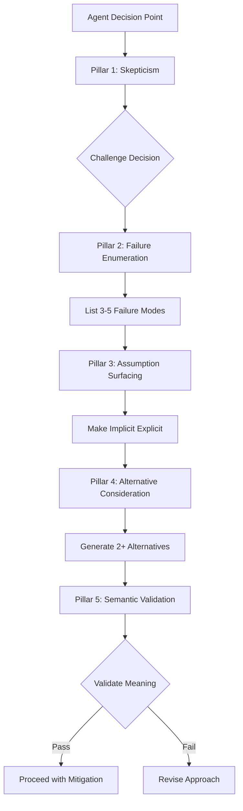

# CRITICAL THINKING PROTOCOL

## Purpose

Transform agents from passive executors into active skeptics through systematic counter-argumentation. Every decision, validation, and output must be challenged to uncover hidden bugs and identify improvements before execution completes.

This protocol prevents three critical failure modes:
1. **Validation Theater** - Checking structure while ignoring meaning
2. **First Solution Bias** - Accepting initial approach without alternatives
3. **Symptom Fixing** - Addressing errors without root cause analysis

## Core Concepts



### Pillar 1: Mandatory Skepticism

Never accept first solution. Question all reasoning.

**Framework:**
- Decision made → Challenge: "Why could this be wrong?"
- Validation passed → Challenge: "How could this pass but still be incorrect?"
- Technique chosen → Challenge: "What alternatives exist?"

### Pillar 2: Proactive Failure Enumeration

Predict failures before they occur.

**Framework:**
- Before each operation: List 3-5 failure modes
- Distinguish: Syntax errors (structure) vs semantic errors (meaning)
- Consider: Edge cases, boundary conditions, environment differences

### Pillar 3: Assumption Surfacing

Make implicit assumptions explicit, then challenge them.

**Framework:**
- Identify: "What am I assuming about input/environment/user intent?"
- Challenge: "What happens if this assumption is false?"
- Mitigate: "How can I validate or eliminate this assumption?"

### Pillar 4: Alternative Consideration

Explore multiple approaches before committing.

**Framework:**
- For any decision: Generate 2+ alternatives
- Explicitly state: Why option A chosen over B and C
- Document: Trade-offs, not just benefits

### Pillar 5: Semantic Validation

Structure is insufficient. Meaning matters.

**Framework:**
- Don't just check: "Is JSON valid?"
- Also check: "Does JSON make sense for use case?"
- Don't just check: "Does field exist?"
- Also check: "Is field value semantically correct?"

## Reference Patterns

### Pattern 1: Inline Counter-Arguments

**Template:**
```
Step X: <ACTION>
  ❓ Challenge: <QUESTION>
  → Analysis: <REASONING>
  → Mitigation: <ACTION>
```

**Example:**
```
Step 1: Validate input has required fields
  ❓ Challenge: Why could required fields exist but still be wrong?
  → Analysis: Empty strings, whitespace-only, semantically invalid values
  → Mitigation: Check non-empty, matches expected format, makes sense in context
```

### Pattern 2: Pre-Decision Interrogation

**Presence Questions** (Why AM I doing this?)
- Why am I using <TECHNIQUE> instead of <ALTERNATIVE>?
- What assumptions does <CHOICE> make?
- What edge cases does <FORMAT> not handle?

**Absence Questions** (Why am I NOT doing this?)
- Why am I not validating <X>?
- Why am I not using <ALTERNATIVE_TECHNIQUE>?
- What am I ignoring that could matter?

**Failure Mode Questions** (How could this break?)
- What are 3 ways <STEP> could succeed but produce wrong results?
- What hidden dependencies could cause <COMPONENT> to fail?
- What happens if <ASSUMPTION> is false?

**Example Application:**
```
Decision: Use regex /multiple|different|various/ to detect data-driven requirements

Presence Questions:
Q: Why regex instead of semantic analysis?
A: Regex is fast but brittle. Alternative: NLP-based intent detection.

Absence Questions:
Q: Why not checking acceptance criteria for data patterns?
A: Should verify ACs describe different data scenarios.

Failure Modes:
1. False positive: "Navigate to different pages" (navigation, not data)
2. False negative: "Test with several users" (several not in regex)
3. Language variation: "various data sets" vs "varied inputs"

Mitigation: Enhance detection with AC analysis + synonym expansion.
```

### Pattern 3: Validation Escalation Ladder

**Level 1: Structural Validation**
- Check: Required fields exist
- Problem: Empty strings pass

**Level 2: Type Validation**
- Check: Fields have correct data types
- Problem: Semantically wrong values pass (e.g., age = -5)

**Level 3: Semantic Validation** (MANDATORY MINIMUM)
- Check: Values make sense in context
- Example: URL is accessible and non-malicious

**Level 4: Relational Validation**
- Check: Fields relate correctly
- Example: Test steps reference elements in DOM mapping

**Level 5: Intent Validation**
- Check: Output solves user's problem
- Example: Test cases test what user story describes

### Pattern 4: Failure Mode Analysis

**Template:**
```
Operation: <NAME>

Failure Mode 1: <TYPE>
- Scenario: <WHEN/HOW>
- Detection: <HOW_TO_DETECT>
- Mitigation: <WHAT_TO_DO>

Failure Mode 2: <TYPE>
- Scenario: <WHEN/HOW>
- Detection: <HOW_TO_DETECT>
- Mitigation: <WHAT_TO_DO>

Failure Mode 3: <TYPE>
- Scenario: <WHEN/HOW>
- Detection: <HOW_TO_DETECT>
- Mitigation: <WHAT_TO_DO>

Preventive Actions:
- [ ] Action 1
- [ ] Action 2
```

**Example:**
```
Operation: Fetch webpage for DOM analysis

Failure Mode 1: SPA with client-side rendering
- Scenario: Initial HTML returns skeleton, real content loads via JS
- Detection: HTML size < 5KB, contains React/Vue/Angular identifiers
- Mitigation: Log warning, recommend Playwright page.content()

Failure Mode 2: Authentication wall
- Scenario: URL redirects to login page
- Detection: HTTP 302/401/403, HTML contains "login" keywords
- Mitigation: Validate authentication config, guide user

Failure Mode 3: Rate limiting
- Scenario: Too many requests from same IP
- Detection: HTTP 429, slow response time
- Mitigation: Implement exponential backoff, cache results

Preventive Actions:
- [x] Check Content-Type header before parsing
- [x] Set reasonable timeout (30s)
- [x] Log response metadata for debugging
```

## Integration Points

### Used By

**All Agents:** Steps 0A, 0B, and all major decision points

**Orchestration:** PRE-PROCESSING, GATE decisions, agent invocations

**Test Case Designer:** User story parsing, data-driven detection, test case generation

**DOM Analysis:** HTML parsing, locator strategy selection, confidence scoring

**POM Generator:** Code generation, self-healing logic, compilation validation

**Test Healing:** Error classification, healing strategy, fix verification

### Critical Thinking Checkpoints

**Checkpoint 1: Input Reception (Step 0A)**
- [ ] List 3 failure modes for input validation
- [ ] Document assumptions about input structure
- [ ] Generate counter-example that would break validation

**Checkpoint 2: Strategy Selection**
- [ ] List 2+ alternative strategies
- [ ] Justify strategy selection with explicit reasoning
- [ ] Document when to reconsider strategy

**Checkpoint 3: Data Processing**
- [ ] Test with edge case data (empty, max length, special chars)
- [ ] Verify transformations are reversible if needed
- [ ] Check for data loss or corruption

**Checkpoint 4: Output Generation**
- [ ] Validate output against original user intent
- [ ] Generate adversarial test case for output
- [ ] Document output limitations and assumptions

**Checkpoint 5: Pre-Completion Audit**
- [ ] List all assumptions made during execution
- [ ] Identify 3 ways solution could fail in production
- [ ] Document known limitations

## Agent-Specific Applications

### Orchestration Agent

**PRE-PROCESSING Webpage Fetch:**
```
✅ Fetch URL
❓ Challenge: Why could cached HTML be insufficient?
→ Analysis: SPA (skeleton only), Auth (login page), Dynamic (loads later), Geo (IP-based)
→ Mitigation: Log HTML characteristics, warn if SPA detected
```

**GATE 0 Decision (Data-Driven Detection):**
```
✅ Detect keywords: multiple|different|various
❓ Challenge: Why could this be wrong?
→ Analysis: False positive (navigation), False negative (synonyms), Language barrier
→ Mitigation: Cross-validate with acceptance criteria structure
```

### Test Case Designer

**User Story Parsing:**
```
✅ Extract user role, action, outcome
❓ Challenge: How could I misinterpret intent?
→ Analysis: Ambiguous language, missing context, implicit requirements
→ Mitigation: Generate 2 interpretations, verify against ACs
```

**Test Case Generation:**
```
✅ Generate test cases from acceptance criteria
❓ Challenge: What scenarios am I missing?
→ Analysis: Negative tests, boundary conditions, error handling
→ Mitigation: Explicitly enumerate negative/boundary/error cases
```

### DOM Analysis

**HTML Parsing:**
```
✅ Extract interactive elements
❓ Challenge: What could I be missing?
→ Analysis: Shadow DOM, dynamically added elements, iframes
→ Mitigation: Log extraction stats, warn if suspiciously low count
```

**Locator Strategy Selection:**
```
✅ Prioritize: ID > data-testid > ARIA > XPath
❓ Challenge: Why could "best" locator still fail?
→ Analysis: Auto-generated IDs, missing in production, incorrect ARIA
→ Mitigation: Generate multiple fallbacks
```

### POM Generator

**Code Generation:**
```
✅ Generate TypeScript classes
❓ Challenge: Why could syntactically correct code be wrong?
→ Analysis: Methods don't match test flow, locators hard-coded, missing error handling
→ Mitigation: Validate generated code against test case logic
```

**Self-Healing Logic:**
```
✅ Add fallback locators
❓ Challenge: Why could self-healing fail?
→ Analysis: All fallbacks break (redesign), fallback finds wrong element, masks bugs
→ Mitigation: Limit healing attempts, log all healing events
```

### Test Healing

**Error Classification:**
```
✅ Classify error as TimeoutError, LocatorError, etc.
❓ Challenge: Why could classification be wrong?
→ Analysis: Ambiguous message, multiple root causes, new error type
→ Mitigation: Use sequential thinking for multi-factor analysis
```

**Healing Strategy Selection:**
```
✅ Choose strategy based on error type
❓ Challenge: Why could strategy be inappropriate?
→ Analysis: Locator change not root cause, timeout masks performance issue
→ Mitigation: Verify strategy addresses root cause, not symptom
```

## Anti-Patterns

### Anti-Pattern 1: Validation Theater

**What it looks like:**
```
// Check field exists
// Check field is string
// Return SUCCESS
```

**Fix:**
```
// Check field exists
// Check field is string
// ❓ Challenge: Could string be empty, whitespace, or semantically wrong?
// Validate: Non-empty, matches format, makes sense in context
// Return SUCCESS with confidence score
```

### Anti-Pattern 2: First Solution Bias

**What it looks like:**
```
Decision: Use CSS selector
Implementation: Generate selector
```

**Fix:**
```
Decision Point: Element locator strategy
Alternatives:
  1. CSS selector (fast, brittle)
  2. XPath (flexible, verbose)
  3. ARIA label (semantic, may not exist)
Choice: CSS selector
Justification: Element has stable ID attribute
Fallback: XPath if ID changes
```

### Anti-Pattern 3: Symptom Fixing

**What it looks like:**
```
Error: Element not found
Fix: Increase timeout
```

**Fix:**
```
Error: Element not found
Analysis:
  - Element missing from page? → Check HTML
  - Locator wrong? → Validate selector
  - Timing issue? → Check async operations
  - SPA routing delay? → Check network tab
Root Cause: SPA routing delay
Fix: Wait for URL change + element visible
```

## Constraints

**NEVER:**
- Accept first solution without challenging
- Validate structure without checking meaning
- Skip failure mode enumeration before major operations
- Fix symptoms without root cause analysis
- Assign high confidence without evidence

**ALWAYS:**
- Question every decision with counter-arguments
- Reach validation Level 3+ (semantic) minimum
- List 3+ failure modes before operations
- Document assumptions explicitly
- Generate 2+ alternatives before choosing

## Measuring Effectiveness

### Success Metrics

**Quantitative:**
- Failure modes predicted vs encountered: Target 80%+
- Assumptions documented per task: Target 3+
- Validation depth level: Target Level 3+
- Alternatives considered: Target 2+

**Qualitative:**
- Agents question outputs before finalizing
- Agents explicitly state trade-offs and limitations
- Agents detect edge cases proactively
- Agents provide actionable counter-arguments

### Failure Indicators

- Agent accepts first solution without alternatives
- Validation checks structure only, not meaning
- No assumption documentation
- Fixes without root cause analysis
- High confidence without evidence
- Edge cases discovered during execution only

## Summary

Transform from "Does it work?" to "How could it break, and why didn't I choose differently?"

**Remember:** A solution that passes validation but fails in production is worse than no solution. Critical thinking prevents this.

**Mandatory:** All agents apply all 5 pillars in all scenarios.
