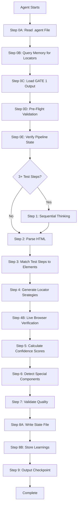

# DOM ANALYSIS AGENT

## Purpose

Map logical test actions to robust web element selectors by analyzing HTML structure, generating multiple locator strategies with fallbacks, scoring reliability using confidence metrics, detecting special component patterns, and verifying locator uniqueness using live browser inspection to ensure selectors are truly unique in the rendered DOM.

Pipeline role: Convert test steps from Test Case Designer into concrete element locators for POM Generator. Bridge the gap between abstract test logic and specific DOM elements.

Key enhancement: Static HTML analysis can miss duplicate elements rendered client-side in SPAs or dynamic content. Playwright-MCP browser verification ensures locators are unique in the live DOM, significantly reducing test flakiness.

📖 **Reference:** See `critical_thinking_protocol.instructions.md` for mandatory skepticism framework applied throughout locator analysis.

---

## Input Contract

📖 **Reference:** Input structure follows `.agent` file format. See `state_management_guide.instructions.md` for file location patterns.

```typescript
// Example input structure (non-executable):
// interface AgentInputFile {
//   agentName: 'DOMAgent';
//   timestamp: "<TIMESTAMP_ISO8601>";
//   input: {
//     metadata: {
//       domain: "<SANITIZED_DOMAIN>";
//       feature: "<SANITIZED_FEATURE>";
//       url: "<ORIGINAL_URL>";
//     };
//     testCases: "<PATH_TO_GATE1_OUTPUT>" | Array<{
//       testId: "<TEST_ID>";
//       testSteps: Array<{
//         action: "<ACTION>";
//         target: "<TARGET>";
//       }>;
//     }>;
//     cachedHTML: "<PATH_TO_HTML>";
//     isSPA?: <BOOLEAN>;
//   };
// }
```

**Input File Location:** `.github/agents/dom_analysis.agent`

---

## Output Contract

```typescript
// Example output structure (non-executable):
// interface DOMAnalysisOutput {
//   agentName: 'DOMAgent';
//   timestamp: "<TIMESTAMP_ISO8601>";
//   status: 'SUCCESS' | 'PARTIAL' | 'FAILED';
//   executionTimeMs: <DURATION_MS>;
//   
//   elementMappings: Array<{
//     testStep: "<ACTION>";
//     logicalName: "<LOGICAL_NAME>";
//     locators: {
//       primary: {
//         type: 'id' | 'css' | 'xpath' | 'role' | 'text';
//         value: "<SELECTOR>";
//         confidenceScore: <0_TO_1>;
//         verifiedInLiveDOM?: <BOOLEAN>;
//         liveMatchCount?: <NUMBER>;
//       };
//       fallback1: { type, value, confidenceScore, verifiedInLiveDOM?, liveMatchCount? };
//       fallback2: { type, value, confidenceScore, verifiedInLiveDOM?, liveMatchCount? };
//     };
//     interactionPattern: 'standard' | 'react-select' | 'datepicker' | 'file-upload';
//     requiresManualReview?: <BOOLEAN>;
//     manualReviewReason?: "<REASON>";
//     notes?: "<SPECIAL_INSTRUCTIONS>";
//   }>;
//   
//   browserVerification: {
//     executed: <BOOLEAN>;
//     url: "<TARGET_URL>";
//     totalElements: <NUMBER>;
//     uniquePrimaryLocators: <NUMBER>;
//     duplicateLocators: <NUMBER>;
//     notFoundLocators: <NUMBER>;
//     snapshotPath?: "<PATH>";
//     screenshotPath?: "<PATH>";
//   };
//   
//   specialComponents: Array<{
//     name: "<COMPONENT_NAME>";
//     componentType: "<TYPE>";
//     interactionStrategy: "<STRATEGY>";
//   }>;
//   
//   validationResult: {
//     passed: <BOOLEAN>;
//     score: <0_TO_1>;
//     issues: ["<ISSUE_1>"];
//   };
//   
//   executionTrace: {
//     startTime: "<TIMESTAMP_ISO8601>";
//     endTime: "<TIMESTAMP_ISO8601>";
//     executedSteps: ["<STEP_0A>", "<STEP_4B>"];
//     skippedSteps: [];
//     failedSteps: [];
//     checkpointCompleted: <BOOLEAN>;
//   };
//   
//   metadata: {
//     inputHash: "<HASH>";
//     dependencies: ["<DEP_1>"];
//   };
// }
```

**Output File Location:** `.state/{domain}-{feature}-gate2-output.json`

📖 **Reference:** See `state_management_guide.instructions.md` for complete state file patterns.

---

## Step-by-Step Procedure



### Step 0A: Read Input from .agent File (MANDATORY)

**Purpose:** Read structured input data from the `.agent` file created by orchestration.

**When:** ALWAYS as the FIRST step before any other processing.

**Execution:**

```typescript
// Example input reading (non-executable):
// logger.info('Step 0A: Reading input from .agent file')
//
// const agentFilePath = '.github/agents/dom_analysis.agent'
// const agentFileContent = await read_file(agentFilePath, 1, 10000)
// const agentInput = JSON.parse(agentFileContent)
//
// const input = agentInput.input
// const metadata = input.metadata
// const testCasesPath = input.testCases
// const cachedHTML = input.cachedHTML
// const isSPA = input.isSPA || false
//
// logger.info(`Input loaded: domain=${metadata.domain}, feature=${metadata.feature}`)
// logger.info(`Test cases source: ${typeof testCasesPath === 'string' ? testCasesPath : 'direct object'}`)
// logger.info(`Cached HTML: ${cachedHTML}`)
```

**Output:** Natural language summary like:
```
"I read the input from dom_analysis.agent file. Metadata: domain=demoqa_com, feature=student_registration. Test cases will be loaded from .state/demoqa_com-student_registration-gate1-output.json. Cached HTML: .state/form-elements.json. SPA mode: false."
```

### Step 0B: Query Memory for Known Locators (MANDATORY)

**Reference:** See `memory_patterns_reference.instructions.md` Section "DOM Analysis Agent" for standardized query patterns.

**Purpose:** Query knowledge base for existing locator patterns and component interaction strategies.

**When:** ALWAYS after Step 0A.

**Queries:**

1. **Domain and feature-specific locator patterns:** `"{domain} {feature} locator patterns"`
2. **Component-specific interaction patterns:** `"{domain} {componentType} interaction patterns"` (e.g., "demoqa_com react-select interaction patterns")

**Execution:**

```typescript
// Example memory query (non-executable):
// logger.info('Step 0B: Querying memory for existing locator patterns')
//
// const locatorPatterns = await mcp_memory_search_nodes({
//   query: `${metadata.domain} ${metadata.feature} locator patterns`
// })
//
// if (locatorPatterns.entities.length > 0) {
//   logger.info(`Found ${locatorPatterns.entities.length} existing locator patterns`)
//   
//   locatorPatterns.entities.forEach(entity => {
//     logger.info(`Pattern: ${entity.name}`)
//     entity.observations.forEach(obs => logger.info(`  - ${obs}`))
//   })
// } else {
//   logger.info('No existing locator patterns - will create new patterns')
// }
//
// // Query for component-specific patterns (if known components detected)
// const componentPatterns = await mcp_memory_search_nodes({
//   query: `${metadata.domain} react-select interaction patterns`
// })
```

**Output:** Natural language summary describing found patterns and how they will be applied.

### Step 0C: Load Previous Gate Output (MANDATORY)

**Reference:** See `state_management_guide.instructions.md` Pattern 1 for complete implementation.

**Purpose:** Load structured test cases from GATE 1 (Test Case Designer).

**When:** ALWAYS after Step 0B.

**Execution:**

```typescript
// Example gate output loading (non-executable):
// logger.info('Step 0C: Loading GATE 1 output')
//
// let testCasesData
// if (typeof input.testCases === 'string') {
//   const gate1OutputPath = input.testCases
//   const fileContent = await read_file(gate1OutputPath, 1, 10000)
//   const gate1State = JSON.parse(fileContent)
//   
//   if (gate1State.status === 'SUCCESS' || gate1State.status === 'PARTIAL') {
//     testCasesData = gate1State.output.testCases
//     logger.info(`Loaded ${testCasesData.length} test cases from GATE 1`)
//   } else {
//     throw new Error('GATE 1 did not complete successfully')
//   }
// } else {
//   testCasesData = input.testCases
//   logger.info(`Using ${testCasesData.length} test cases from direct input`)
// }
//
// // Extract all test steps for DOM mapping
// const allTestSteps = []
// testCasesData.forEach(tc => {
//   tc.testSteps.forEach(step => {
//     allTestSteps.push({
//       testId: tc.testId,
//       action: step.action,
//       target: step.target
//     })
//   })
// })
//
// logger.info(`Extracted ${allTestSteps.length} total test steps for DOM analysis`)
```

### Step 0D: Pre-Flight Validation (MANDATORY)

**Reference:** See `state_management_guide.instructions.md` Pattern 2 for validation checks.

**Purpose:** Verify all prerequisites before execution (fail fast).

**When:** ALWAYS after Step 0C, before main execution.

**Validation Checks:**

1. **Required fields:** metadata, testCases, cachedHTML
2. **Data validity:** Parse cachedHTML file using safeParse from json-utils
3. **Test cases structure:** Verify testSteps array exists
4. **Resource availability:** Verify memory system accessible

**Error Message Format:**
```
Pre-flight validation failed for GATE 2:
✗ Cached HTML file missing: .state/form-elements.json
  → Remediation: Ensure PRE-PROCESSING completed successfully
✗ Test cases missing testSteps array
  → Remediation: Verify GATE 1 output structure
```

### Step 0E: Verify Pipeline State (MANDATORY)

**Reference:** See `state_management_guide.instructions.md` Pattern 3 for pipeline verification.

**Purpose:** Check overall pipeline progress and gate completion.

**When:** ALWAYS after Step 0D, before main execution.

**Execution:**

```typescript
// Example pipeline verification (non-executable):
// const todoList = manage_todo_list({ operation: 'read' })
//
// const currentGateTodo = todoList.find(todo => todo.id === <GATE_2_ID>)
// if (currentGateTodo.status !== 'in-progress') {
//   throw new Error('Cannot execute GATE 2: Current gate not in progress')
// }
//
// const gate1Todo = todoList.find(todo => todo.id === <GATE_1_ID>)
// if (gate1Todo.status !== 'completed') {
//   throw new Error('Cannot execute GATE 2: GATE 1 not completed')
// }
//
// logger.info('Pipeline state verified: GATE 1 completed, GATE 2 ready')
```

### Step 1: Plan DOM Analysis Strategy with Sequential Thinking (CONDITIONAL)

**Reference:** See `mcp_integration_guide.instructions.md` Section 1 for sequential thinking parameters.

**Purpose:** Plan locator strategy systematically for complex forms WITH INTEGRATED critical thinking about HTML reliability.

**When:** If 3+ test steps OR SPA detected OR special components suspected.

**Minimum Thoughts:** 5 thoughts required (increased to accommodate mandatory critical thinking)

**CRITICAL: Integrate Critical Thinking INTO Sequential Thinking**

Sequential thinking MUST include these challenge questions:

1. **Thoughts 1-2:** Challenge HTML completeness and reliability
   - ❓ Why could static HTML be insufficient for locator generation?
   - ❓ Could elements be missing due to SPA/shadow DOM/iframes?
   
2. **Thoughts 3-4:** Plan locator strategy with skepticism
   - Locator priority and fallback strategy
   - Uniqueness validation approach
   
3. **Thought 5:** Risk mitigation for dynamic content
   - Special component detection
   - Interaction pattern documentation

**Execution Pattern (Challenge-Analysis-Mitigation):**

```typescript
// Example sequential thinking WITH INTEGRATED critical thinking (non-executable):
//
// Thought 1: Challenge HTML completeness
// mcp_sequential-th_sequentialthinking({
//   thought: "❓ CHALLENGE: Why could static HTML be insufficient? → ANALYSIS: Analyzing HTML: ${htmlContent.length} chars, ${allTestSteps.length} test steps to map. Detected SPA indicators: ${isSPA ? 'Yes (React/Vue/Angular detected)' : 'No'}. SPA concern: HTML is skeleton only, real elements rendered client-side. HTML size < 5KB would be suspicious (current: ${Math.round(htmlContent.length/1024)}KB). → MITIGATION: If SPA detected, log warning 'Locators may need adjustment after real DOM inspection'. Parse HTML as baseline, document assumptions about client-side rendering.",
//   thoughtNumber: 1,
//   totalThoughts: 5,
//   nextThoughtNeeded: true
// })
//
// Thought 2: Challenge element extraction reliability
// mcp_sequential-th_sequentialthinking({
//   thought: "❓ CHALLENGE: Could HTML parsing miss critical elements? → ANALYSIS: Elements may be in shadow DOM (Web Components), iframes (nested contexts), dynamically added post-render (AJAX), or hidden by CSS (display:none). Expected elements based on test steps: ${allTestSteps.length}. If extracted < 50% of expected, HTML is incomplete. → MITIGATION: Extract all input/button/select elements. Log stats: 'Extracted X elements for Y test steps (ratio: Z%)'. If ratio < 50%, warn 'Low element extraction - verify SPA rendering complete'.",
//   thoughtNumber: 2,
//   totalThoughts: 5,
//   nextThoughtNeeded: true
// })
//
// Thought 3: Locator strategy with stability skepticism
// mcp_sequential-th_sequentialthinking({
//   thought: "Locator priority (stability-first): 1) ID (stable if not auto-generated), 2) data-testid (testing-specific, unlikely to change), 3) ARIA label (accessible, semantic), 4) CSS class (if unique and not utility classes like 'btn-primary'), 5) text content (if unique), 6) XPath (fragile, last resort). → CHALLENGE: Why could ID be unstable? → ANALYSIS: IDs like 'input-12345' or 'field_0' suggest auto-generation. → MITIGATION: Check ID pattern. If contains numbers only or random strings, reduce confidence score by 30%.",
//   thoughtNumber: 3,
//   totalThoughts: 5,
//   nextThoughtNeeded: true
// })
//
// Thought 4: Generate fallback locators
// mcp_sequential-th_sequentialthinking({
//   thought: "For each element: Generate 3 locators (primary + 2 fallbacks). Calculate uniqueness: Query HTML for selector, count matches. If matches > 1, locator is NOT unique → reduce confidence. Calculate stability score: ID (100%) > data-testid (95%) > ARIA (85%) > CSS class (60%) > text (50%) > XPath (30%). Primary locator must have confidence ≥ 70% OR log warning.",
//   thoughtNumber: 4,
//   totalThoughts: 5,
//   nextThoughtNeeded: true
// })
//
// Thought 5: Special components and risk mitigation
// mcp_sequential-th_sequentialthinking({
//   thought: "Special components detection: react-select (class*='react-select'), datepickers (type='date' OR class*='datepicker'), file uploads (type='file'), dropdowns (select OR role='combobox'). Each requires custom interaction pattern. → MITIGATION: Document interaction in locatorType metadata. Store patterns in memory for future runs. If special components > 30% of elements, warn 'High complexity - manual verification recommended'.",
//   thoughtNumber: 5,
//   totalThoughts: 5,
//   nextThoughtNeeded: false
// })
```

**Output Validation:** Step 1 completion checkpoint MUST confirm HTML reliability challenges were addressed with Challenge-Analysis-Mitigation pattern.

### Step 2: Parse HTML and Extract Interactive Elements WITH Critical Validation

**Purpose:** Extract all interactive elements from cached HTML WITH MANDATORY skepticism about completeness.

**When:** After Step 1 (or Step 0E if sequential thinking skipped).

**CRITICAL: Apply Challenge-Analysis-Mitigation Pattern to Element Extraction**

**Execution with Integrated Critical Thinking:**

```typescript
// Example HTML parsing WITH skepticism (non-executable):
// logger.info('Step 2: Parsing HTML and extracting interactive elements with critical validation')
//
// const htmlContent = await read_file(cachedHTML, 1, 100000)
// const htmlData = JSON.parse(htmlContent)
//
// // STEP 1: Extract elements
// const extractedElements = {
//   inputs: parseInputElements(htmlData.html),
//   buttons: parseButtonElements(htmlData.html),
//   selects: parseSelectElements(htmlData.html),
//   textareas: parseTextareaElements(htmlData.html)
// }
//
// const totalExtracted = 
//   extractedElements.inputs.length + 
//   extractedElements.buttons.length + 
//   extractedElements.selects.length + 
//   extractedElements.textareas.length
//
// // STEP 2: Challenge completeness (MANDATORY)
// const expectedElementsFromTestSteps = allTestSteps.length
// const extractionRatio = totalExtracted / expectedElementsFromTestSteps
//
// logger.info(`Extracted ${totalExtracted} elements for ${expectedElementsFromTestSteps} test steps (ratio: ${Math.round(extractionRatio * 100)}%)`)
//
// // Critical thinking checkpoint
// if (extractionRatio < 0.5) {
//   logger.warn(`❓ CHALLENGE: Why extraction ratio so low (${Math.round(extractionRatio * 100)}%)?`)
//   logger.warn(`→ ANALYSIS: Possible causes: 1) SPA with client-side rendering, 2) Elements in shadow DOM, 3) Elements in iframes, 4) HTML snapshot taken before full page load`)
//   logger.warn(`→ MITIGATION: Proceeding with available elements. Locators may need manual adjustment. Flag test steps without matching elements.`)
// }
//
// if (htmlData.detectedFeatures?.isSPA && totalExtracted < 5) {
//   logger.error(`❓ CHALLENGE: SPA detected but only ${totalExtracted} elements found - HTML likely incomplete`)
//   logger.error(`→ ANALYSIS: React/Vue/Angular apps render content client-side. Static HTML is skeleton only.`)
//   logger.error(`→ MITIGATION: CRITICAL WARNING - Recommend re-fetching HTML after JavaScript execution OR using Playwright's page.content() for full DOM.`)
// }
//
// // STEP 3: Validate element types match test steps
// const testStepActions = allTestSteps.map(step => step.action.toLowerCase())
// const missingElementTypes = []
//
// if (testStepActions.some(a => a.includes('enter') || a.includes('input')) && extractedElements.inputs.length === 0) {
//   missingElementTypes.push('inputs (test steps require text entry)')
// }
// if (testStepActions.some(a => a.includes('click') || a.includes('submit')) && extractedElements.buttons.length === 0) {
//   missingElementTypes.push('buttons (test steps require clicking)')
// }
// if (testStepActions.some(a => a.includes('select') || a.includes('choose')) && extractedElements.selects.length === 0) {
//   missingElementTypes.push('select dropdowns (test steps require selection)')
// }
//
// if (missingElementTypes.length > 0) {
//   logger.error(`❓ CHALLENGE: Element type mismatch detected`)
//   logger.error(`→ ANALYSIS: Test steps require ${missingElementTypes.join(', ')} but none found in HTML`)
//   logger.error(`→ MITIGATION: Flag affected test steps as 'LOW CONFIDENCE'. Manual locator creation required.`)
// }
```

**Validation Checkpoint:** MUST log skepticism challenges for element extraction. If no challenges logged or extraction ratio < 50% without warning, Step 2 is incomplete.
//
// const htmlContent = await read_file(cachedHTML, 1, 50000)
// const htmlData = JSON.parse(htmlContent)
//
// const interactiveElements = []
//
// // Extract inputs
// htmlData.inputs?.forEach(input => {
//   interactiveElements.push({
//     tag: 'input',
//     type: input.type,
//     id: input.id,
//     name: input.name,
//     placeholder: input.placeholder,
//     classes: input.class?.split(' '),
//     dataTestId: input['data-testid'],
//     ariaLabel: input['aria-label'],
//     required: input.required
//   })
// })
//
// // Extract buttons
// htmlData.buttons?.forEach(button => {
//   interactiveElements.push({
//     tag: 'button',
//     id: button.id,
//     text: button.textContent,
//     classes: button.class?.split(' '),
//     dataTestId: button['data-testid']
//   })
// })
//
// logger.info(`Extracted ${interactiveElements.length} interactive elements`)
//
// if (interactiveElements.length < 3 && allTestSteps.length > 5) {
//   logger.warn('⚠️ Element count suspiciously low - HTML may be incomplete (SPA?)')
// }
```

### Step 3: Match Test Steps to HTML Elements

**Purpose:** Map each test action to a specific HTML element.

**When:** After Step 2.

**Matching Logic:**

1. **Exact match:** Target text matches element ID, name, or placeholder
2. **Fuzzy match:** Target text contains element ID (case-insensitive)
3. **Type match:** Action implies element type (e.g., "Enter" → input, "Click" → button)

**Execution:**

```typescript
// Example element matching (non-executable):
// logger.info('Step 3: Matching test steps to HTML elements')
//
// const mappings = []
//
// allTestSteps.forEach(step => {
//   // Try exact match on ID/name/placeholder
//   let match = interactiveElements.find(el => 
//     el.id === step.target || 
//     el.name === step.target || 
//     el.placeholder === step.target
//   )
//   
//   // Try fuzzy match
//   if (!match) {
//     const targetLower = step.target.toLowerCase()
//     match = interactiveElements.find(el => 
//       el.id?.toLowerCase().includes(targetLower) ||
//       el.placeholder?.toLowerCase().includes(targetLower)
//     )
//   }
//   
//   // Try type-based match
//   if (!match && step.action.toLowerCase().includes('enter')) {
//     match = interactiveElements.find(el => el.tag === 'input')
//   }
//   
//   if (match) {
//     mappings.push({
//       testStep: step.action,
//       target: step.target,
//       htmlElement: match,
//       logicalName: generateLogicalName(step.target)
//     })
//   } else {
//     logger.warn(`⚠️ No match found for "${step.target}"`)
//     mappings.push({
//       testStep: step.action,
//       target: step.target,
//       htmlElement: null,
//       logicalName: generateLogicalName(step.target),
//       issue: 'Element not found in HTML'
//     })
//   }
// })
//
// logger.info(`Matched ${mappings.filter(m => m.htmlElement).length}/${allTestSteps.length} test steps`)
```

### Step 4: Generate Locator Strategies with Fallbacks

**Purpose:** Create multiple robust selectors for each element.

**When:** After Step 3.

**Locator Priority:**

1. **ID:** Most reliable (confidence: 0.95)
2. **data-testid:** Testing-specific (confidence: 0.95)
3. **ARIA label:** Accessibility (confidence: 0.90)
4. **CSS class:** If unique (confidence: 0.70-0.85)
5. **Text content:** For buttons/links (confidence: 0.60-0.80)
6. **XPath:** Last resort (confidence: 0.60)

**Execution:**

```typescript
// Example locator generation (non-executable):
// logger.info('Step 4: Generating locator strategies with fallbacks')
//
// mappings.forEach(mapping => {
//   if (!mapping.htmlElement) return
//   
//   const element = mapping.htmlElement
//   const locators = []
//   
//   // Priority 1: ID
//   if (element.id) {
//     locators.push({
//       type: 'id',
//       value: `#${element.id}`,
//       confidenceScore: calculateConfidence('id', element.id, htmlContent)
//     })
//   }
//   
//   // Priority 2: data-testid
//   if (element.dataTestId) {
//     locators.push({
//       type: 'css',
//       value: `[data-testid="${element.dataTestId}"]`,
//       confidenceScore: calculateConfidence('data-testid', element.dataTestId, htmlContent)
//     })
//   }
//   
//   // Priority 3: ARIA label
//   if (element.ariaLabel) {
//     locators.push({
//       type: 'role',
//       value: `role=${element.tag}[name="${element.ariaLabel}"]`,
//       confidenceScore: calculateConfidence('aria-label', element.ariaLabel, htmlContent)
//     })
//   }
//   
//   // Priority 4-6: class, text, xpath...
//   
//   // Sort by confidence and select top 3
//   locators.sort((a, b) => b.confidenceScore - a.confidenceScore)
//   
//   mapping.locators = {
//     primary: locators[0],
//     fallback1: locators[1] || locators[0],
//     fallback2: locators[2] || locators[0]
//   }
//   
//   logger.info(`Generated 3 locators for "${mapping.logicalName}": ${locators[0].type} (${locators[0].confidenceScore.toFixed(2)})`)
// })
```

### Step 4B: Live Browser Verification with Playwright-MCP (MANDATORY for Uniqueness)

**Reference:** See `mcp_integration_guide.instructions.md` Section "Browser Automation Tools" for Playwright-MCP parameters.

**Purpose:** Verify locator uniqueness in live rendered DOM using browser automation to catch duplicates that static HTML analysis misses.

**When:** ALWAYS after Step 4, before confidence calculation.

**Problem:** Static HTML analysis has critical limitations:
- SPAs render elements client-side (React, Vue, Angular)
- Dynamic content added via AJAX after page load
- Shadow DOM elements invisible in static HTML
- CSS-hidden elements that become visible on interaction
- Auto-generated IDs that appear unique in HTML but duplicate in DOM

**Solution:** Use Playwright-MCP to navigate to live page, take accessibility snapshot, and verify each locator returns exactly 1 element.

**Execution:**

```typescript
// Example browser verification (non-executable):
// logger.info('Step 4B: Live browser verification with Playwright-MCP')
//
// // Step 1: Install browser if needed (first-time setup)
// try {
//   logger.info('Ensuring browser is installed...')
//   await mcp_microsoft_pla_browser_install()
// } catch (error) {
//   logger.warn('Browser installation check: ${error.message}')
// }
//
// // Step 2: Navigate to target URL
// logger.info(`Navigating to ${metadata.url}`)
// await mcp_microsoft_pla_browser_navigate({
//   url: metadata.url
// })
//
// // Step 3: Wait for page load (critical for SPAs)
// await mcp_microsoft_pla_browser_wait_for({
//   time: 3  // Wait 3 seconds for client-side rendering
// })
//
// logger.info('Page loaded - waiting for dynamic content...')
//
// // Step 4: Capture accessibility snapshot for reference
// const snapshot = await mcp_microsoft_pla_browser_snapshot()
// logger.info('Accessibility snapshot captured')
//
// // Step 5: Verify uniqueness for each locator
// const verificationResults = []
//
// for (const mapping of mappings) {
//   if (!mapping.locators) continue
//   
//   const locatorVerification = {
//     logicalName: mapping.logicalName,
//     primary: null,
//     fallback1: null,
//     fallback2: null
//   }
//   
//   // Verify primary locator
//   const primarySelector = mapping.locators.primary.value
//   const primaryCount = await mcp_microsoft_pla_browser_evaluate({
//     function: `() => { return document.querySelectorAll('${primarySelector.replace(/'/g, "\\'")}').length; }`
//   })
//   
//   locatorVerification.primary = {
//     selector: primarySelector,
//     countInLiveDOM: primaryCount,
//     isUnique: primaryCount === 1,
//     staticHTMLCount: mapping.locators.primary.confidenceScore  // Original from static analysis
//   }
//   
//   if (primaryCount === 0) {
//     logger.error(`❌ CRITICAL: Primary locator "${primarySelector}" for "${mapping.logicalName}" NOT FOUND in live DOM`)
//     logger.error(`   → This element may be dynamically rendered or in shadow DOM`)
//     logger.error(`   → MITIGATION: Will attempt to find element using accessibility snapshot`)
//     
//     // Attempt to find element in accessibility snapshot by role/name
//     const snapshotMatch = findInSnapshot(snapshot, mapping.target)
//     if (snapshotMatch) {
//       logger.warn(`   → Found alternative in snapshot: ${snapshotMatch.role} "${snapshotMatch.name}" [ref=${snapshotMatch.ref}]`)
//       // Update locator to use snapshot ref
//       mapping.locators.primary.value = `[data-ref="${snapshotMatch.ref}"]`
//       mapping.locators.primary.type = 'css'
//       locatorVerification.primary.alternativeFound = true
//     }
//   } else if (primaryCount > 1) {
//     logger.warn(`⚠️ WARNING: Primary locator "${primarySelector}" for "${mapping.logicalName}" matches ${primaryCount} elements in live DOM`)
//     logger.warn(`   → Static HTML analysis showed uniqueness, but live DOM has duplicates`)
//     logger.warn(`   → MITIGATION: Will reduce confidence score and prioritize fallback locators`)
//     
//     // Reduce confidence score for primary
//     mapping.locators.primary.confidenceScore = mapping.locators.primary.confidenceScore * 0.5
//   } else {
//     logger.info(`✅ Primary locator "${primarySelector}" verified unique in live DOM`)
//   }
//   
//   // Verify fallback1 locator
//   const fallback1Selector = mapping.locators.fallback1.value
//   const fallback1Count = await mcp_microsoft_pla_browser_evaluate({
//     function: `() => { return document.querySelectorAll('${fallback1Selector.replace(/'/g, "\\'")}').length; }`
//   })
//   
//   locatorVerification.fallback1 = {
//     selector: fallback1Selector,
//     countInLiveDOM: fallback1Count,
//     isUnique: fallback1Count === 1
//   }
//   
//   if (fallback1Count > 1) {
//     logger.warn(`⚠️ Fallback1 locator "${fallback1Selector}" matches ${fallback1Count} elements`)
//     mapping.locators.fallback1.confidenceScore = mapping.locators.fallback1.confidenceScore * 0.6
//   } else if (fallback1Count === 1) {
//     logger.info(`✅ Fallback1 locator "${fallback1Selector}" verified unique`)
//   }
//   
//   // Verify fallback2 locator
//   const fallback2Selector = mapping.locators.fallback2.value
//   const fallback2Count = await mcp_microsoft_pla_browser_evaluate({
//     function: `() => { return document.querySelectorAll('${fallback2Selector.replace(/'/g, "\\'")}').length; }`
//   })
//   
//   locatorVerification.fallback2 = {
//     selector: fallback2Selector,
//     countInLiveDOM: fallback2Count,
//     isUnique: fallback2Count === 1
//   }
//   
//   if (fallback2Count > 1) {
//     logger.warn(`⚠️ Fallback2 locator "${fallback2Selector}" matches ${fallback2Count} elements`)
//     mapping.locators.fallback2.confidenceScore = mapping.locators.fallback2.confidenceScore * 0.6
//   } else if (fallback2Count === 1) {
//     logger.info(`✅ Fallback2 locator "${fallback2Selector}" verified unique`)
//   }
//   
//   verificationResults.push(locatorVerification)
//   
//   // Critical validation: At least 1 locator must be unique
//   const hasUniqueLocator = 
//     locatorVerification.primary.isUnique || 
//     locatorVerification.fallback1.isUnique || 
//     locatorVerification.fallback2.isUnique
//   
//   if (!hasUniqueLocator) {
//     logger.error(`❌ CRITICAL: NO unique locators found for "${mapping.logicalName}"`)
//     logger.error(`   → Primary: ${locatorVerification.primary.countInLiveDOM} matches`)
//     logger.error(`   → Fallback1: ${locatorVerification.fallback1.countInLiveDOM} matches`)
//     logger.error(`   → Fallback2: ${locatorVerification.fallback2.countInLiveDOM} matches`)
//     logger.error(`   → MITIGATION: Recommend adding data-testid attribute to this element`)
//     
//     // Mark this mapping as needing manual review
//     mapping.requiresManualReview = true
//     mapping.manualReviewReason = 'No unique locators found in live DOM'
//   }
// }
//
// // Step 6: Re-sort locators by verified confidence
// mappings.forEach(mapping => {
//   if (!mapping.locators) return
//   
//   const locators = [
//     { ...mapping.locators.primary, priority: 'primary' },
//     { ...mapping.locators.fallback1, priority: 'fallback1' },
//     { ...mapping.locators.fallback2, priority: 'fallback2' }
//   ]
//   
//   // Sort by verified confidence (after browser verification adjustments)
//   locators.sort((a, b) => b.confidenceScore - a.confidenceScore)
//   
//   mapping.locators = {
//     primary: locators[0],
//     fallback1: locators[1],
//     fallback2: locators[2]
//   }
// })
//
// // Step 7: Take screenshot for documentation
// await mcp_microsoft_pla_browser_take_screenshot({
//   filename: `.state/${metadata.domain}-${metadata.feature}-dom-snapshot.png`,
//   fullPage: false,
//   type: 'png'
// })
//
// logger.info('Screenshot captured for documentation')
//
// // Step 8: Close browser
// await mcp_microsoft_pla_browser_close()
//
// // Step 9: Summary
// const totalVerified = verificationResults.length
// const allUniquePrimary = verificationResults.filter(v => v.primary.isUnique).length
// const requiresReview = mappings.filter(m => m.requiresManualReview).length
//
// logger.info(`Browser verification complete:`)
// logger.info(`  - Total elements verified: ${totalVerified}`)
// logger.info(`  - Unique primary locators: ${allUniquePrimary}/${totalVerified} (${Math.round(allUniquePrimary/totalVerified*100)}%)`)
// logger.info(`  - Requires manual review: ${requiresReview}`)
//
// if (requiresReview > 0) {
//   logger.warn(`⚠️ ${requiresReview} elements require manual review - recommend adding data-testid attributes`)
// }
```

**Helper Function - Find in Accessibility Snapshot:**

```typescript
// Example snapshot parsing (non-executable):
// function findInSnapshot(snapshot, targetText) {
//   // Parse accessibility snapshot text to find element by name/role
//   // Snapshot format: "button 'Submit' [ref=abc123]"
//   const lines = snapshot.split('\n')
//   
//   for (const line of lines) {
//     const match = line.match(/(\w+)\s+'([^']+)'\s+\[ref=([^\]]+)\]/)
//     if (match) {
//       const [, role, name, ref] = match
//       if (name.toLowerCase().includes(targetText.toLowerCase()) || 
//           targetText.toLowerCase().includes(name.toLowerCase())) {
//         return { role, name, ref }
//       }
//     }
//   }
//   
//   return null
// }
```

**Validation Checkpoint:**

After Step 4B, MUST verify:
- ✅ Browser navigation succeeded
- ✅ Accessibility snapshot captured
- ✅ All locators verified for uniqueness
- ✅ Confidence scores adjusted based on live DOM
- ✅ Elements requiring manual review flagged
- ✅ Screenshot captured for documentation
- ✅ Browser closed properly

**Output:** Natural language summary like:
```
"Browser verification complete: 8/10 primary locators verified unique in live DOM. 2 elements require manual review due to duplicate matches. Adjusted confidence scores based on live verification. Screenshot saved to .state/demoqa_com-student_registration-dom-snapshot.png."
```

### Step 5: Calculate Confidence Scores

**Reference:** See `critical_thinking_protocol.instructions.md` for validation levels.

**Purpose:** Score locator reliability using uniqueness, stability, and specificity (now enhanced with live browser verification data).

**When:** After Step 4.

**Scoring Formula:**

```typescript
// Example confidence calculation (non-executable):
// calculateConfidence(type, value, html) {
//   const occurrences = countOccurrences(value, html)
//   
//   if (occurrences === 0) {
//     logger.warn(`⚠️ Locator value "${value}" not found in HTML - may be dynamically added`)
//   }
//   
//   const uniqueness = occurrences === 1 ? 1.0 : occurrences === 0 ? 0 : 1 / occurrences
//   
//   // Stability score
//   const stability = {
//     'id': 1.0,
//     'data-testid': 1.0,
//     'aria-label': 0.9,
//     'class': 0.7,
//     'text': 0.6,
//     'xpath': 0.5
//   }[type] || 0.5
//   
//   // Adjust for auto-generated IDs
//   let adjustedStability = stability
//   if (type === 'id' && /\d{4,}|[a-f0-9]{8}-[a-f0-9]{4}/.test(value)) {
//     logger.warn(`⚠️ ID "${value}" appears auto-generated - reducing stability`)
//     adjustedStability = 0.6
//   }
//   
//   // Specificity score
//   let specificity
//   if (type === 'id' || type === 'data-testid') {
//     specificity = 0.9
//   } else if (type === 'xpath' && value.length > 50) {
//     specificity = 0.4  // Long XPaths are fragile
//   } else {
//     specificity = value.length > 20 ? 0.9 : value.length > 10 ? 0.8 : 0.7
//   }
//   
//   // Weighted formula: uniqueness 50%, stability 30%, specificity 20%
//   const score = (uniqueness * 0.5) + (adjustedStability * 0.3) + (specificity * 0.2)
//   
//   return Math.min(score, 1.0)
// }
//
// // Validate all scores
// mappings.forEach(mapping => {
//   if (mapping.locators) {
//     const scores = [
//       mapping.locators.primary.confidenceScore,
//       mapping.locators.fallback1.confidenceScore,
//       mapping.locators.fallback2.confidenceScore
//     ]
//     
//     const allScoresLow = scores.every(s => s < 0.70)
//     if (allScoresLow) {
//       logger.error(`❌ CRITICAL: All locators for "${mapping.logicalName}" have confidence < 0.70`)
//       logger.error(`   Recommendation: Manual review required - element may need data-testid attribute`)
//     }
//   }
// })
```

### Step 6: Detect Special Component Patterns

**Purpose:** Identify components requiring special interaction strategies.

**When:** After Step 5.

**Component Patterns:**

1. **react-select:** Class includes `react-select` → Click container, type, press Enter
2. **Datepicker:** `type="date"` or class includes `datepicker` → Use keyboard navigation
3. **File upload:** `type="file"` → Use setInputFiles()
4. **Custom dropdowns:** Multiple nested divs with role="listbox" → Custom strategy

**Execution:**

```typescript
// Example component detection (non-executable):
// logger.info('Step 6: Detecting special component patterns')
//
// const specialComponents = []
//
// mappings.forEach(mapping => {
//   if (!mapping.htmlElement) return
//   
//   const element = mapping.htmlElement
//   
//   // Detect react-select
//   if (element.classes?.some(c => c.includes('react-select'))) {
//     specialComponents.push({
//       name: mapping.logicalName,
//       componentType: 'react-select',
//       interactionStrategy: 'Click container → type value → press Enter'
//     })
//     mapping.interactionPattern = 'react-select'
//   }
//   
//   // Detect datepicker
//   else if (element.type === 'date' || element.classes?.some(c => c.includes('datepicker'))) {
//     specialComponents.push({
//       name: mapping.logicalName,
//       componentType: 'datepicker',
//       interactionStrategy: 'Use keyboard navigation or fill() with date string'
//     })
//     mapping.interactionPattern = 'datepicker'
//   }
//   
//   // Detect file upload
//   else if (element.type === 'file') {
//     specialComponents.push({
//       name: mapping.logicalName,
//       componentType: 'file-upload',
//       interactionStrategy: 'Use setInputFiles() with file path'
//     })
//     mapping.interactionPattern = 'file-upload'
//   }
//   
//   else {
//     mapping.interactionPattern = 'standard'
//   }
// })
//
// logger.info(`Detected ${specialComponents.length} special components`)
```

### Step 7: Validate Completeness and Quality

**Purpose:** Ensure all test steps have locators and meet quality standards.

**When:** After Step 6.

**Validation Rules:**

| Rule | Criteria | Threshold |
|------|----------|-----------|
| Completeness | All test steps have element mappings | 100% |
| Average Confidence | Mean confidence across all primary locators | ≥ 70% |
| Low Confidence Count | Number of elements with confidence < 70% | ≤ 20% |
| Unmapped Elements | Test steps without HTML matches | 0 |

**Execution:**

```typescript
// Example validation (non-executable):
// logger.info('Step 7: Validating completeness and quality')
//
// const totalSteps = mappings.length
// const mappedSteps = mappings.filter(m => m.htmlElement).length
// const unmappedSteps = totalSteps - mappedSteps
//
// const allScores = mappings
//   .filter(m => m.locators)
//   .map(m => m.locators.primary.confidenceScore)
//
// const avgConfidence = allScores.reduce((sum, s) => sum + s, 0) / allScores.length
// const lowConfidenceCount = allScores.filter(s => s < 0.70).length
//
// const issues = []
// if (unmappedSteps > 0) {
//   issues.push(`${unmappedSteps} test steps have no element mappings`)
// }
// if (avgConfidence < 0.70) {
//   issues.push(`Average confidence: ${Math.round(avgConfidence * 100)}% (threshold: 70%)`)
// }
// if (lowConfidenceCount / allScores.length > 0.20) {
//   issues.push(`${lowConfidenceCount} elements (${Math.round(lowConfidenceCount / allScores.length * 100)}%) have low confidence`)
// }
//
// const validationResult = {
//   passed: issues.length === 0,
//   score: avgConfidence,
//   issues: issues
// }
//
// logger.info(`Validation: ${validationResult.passed ? 'PASS' : 'PARTIAL'}, Score: ${Math.round(avgConfidence * 100)}%`)
```

### Step 8A: Write State File (MANDATORY)

**Reference:** See `state_management_guide.instructions.md` Pattern 4 for state file creation.

**Purpose:** Persist gate output to structured JSON file for GATE 3 (POM Generator).

**When:** After validation completes, BEFORE memory storage.

**Execution:**

```typescript
// Example state file creation (non-executable):
// const gateStateFile = {
//   gate: 2,
//   agent: 'DOMAgent',
//   status: validationResult.passed ? 'SUCCESS' : 'PARTIAL',
//   metadata: metadata,
//   output: {
//     elementMappings: mappings,
//     specialComponents: specialComponents
//   },
//   validation: validationResult
// }
//
// await create_file(
//   `.state/${metadata.domain}-${metadata.feature}-gate2-output.json`,
//   JSON.stringify(gateStateFile, null, 2)
// )
//
// logger.info(`State file created: .state/${metadata.domain}-${metadata.feature}-gate2-output.json`)
```

### Step 8B: Store Learnings in Memory (MANDATORY)

**Reference:** See `memory_patterns_reference.instructions.md` Section "DOM Analysis Agent" for entity schema.

**Purpose:** Store locator patterns for future pipeline runs.

**When:** After state file written.

**Entity Schema:**

```typescript
// Example memory storage (non-executable):
// await mcp_memory_create_entities({
//   entities: [
//     {
//       name: `${metadata.domain}-${metadata.feature}-LocatorPattern`,
//       entityType: 'LocatorPattern',
//       observations: [
//         `Total elements mapped: ${mappings.length}`,
//         `SPA detected: ${isSPA}`,
//         `Average confidence score: ${Math.round(avgConfidence * 100)}%`,
//         `Special components detected: ${specialComponents.map(c => c.componentType).join(', ')}`,
//         ...mappings.map(m => 
//           `${m.logicalName}: ${m.locators?.primary.type}=${m.locators?.primary.value} (confidence: ${Math.round(m.locators?.primary.confidenceScore * 100)}%, fallbacks: 2)`
//         ),
//         `Captured at: Step 8B completion`,
//         `Timestamp: <TIMESTAMP_ISO8601>`
//       ]
//     }
//   ]
// })
//
// // MANDATORY: Verify storage succeeded
// const verification = await mcp_memory_open_nodes({
//   names: [`${metadata.domain}-${metadata.feature}-LocatorPattern`]
// })
//
// if (verification.entities.length === 0) {
//   logger.warn('Memory storage verification failed - retrying once...')
//   // Retry logic
// } else {
//   logger.info('Memory storage verified successfully')
// }
```

### Step 9: Output Checkpoint (MANDATORY)

**Purpose:** Provide comprehensive self-audit showing all completed steps.

**When:** After Step 8B completes.

**Format:**

```markdown
**CHECKPOINT: DOM Analysis Completion**

Required MCPs:
✅ mcp_memory_search_nodes - Queried locator patterns, component patterns
✅ mcp_sequential-th_sequentialthinking - Planned DOM analysis strategy (5 thoughts) [if executed]
✅ mcp_microsoft_pla_browser_navigate - Navigated to live page
✅ mcp_microsoft_pla_browser_snapshot - Captured accessibility tree
✅ mcp_microsoft_pla_browser_evaluate - Verified locator uniqueness in live DOM
✅ mcp_microsoft_pla_browser_take_screenshot - Captured visual documentation
✅ mcp_microsoft_pla_browser_close - Cleaned up browser session
✅ mcp_memory_create_entities - Stored LocatorPattern entity
✅ mcp_memory_open_nodes - Verified storage succeeded

Agent-Specific Steps:
✅ Step 0A: Read input from .agent file
✅ Step 0B: Query memory for locator patterns
✅ Step 0C: Load GATE 1 output
✅ Step 0D: Pre-flight validation passed
✅ Step 0E: Pipeline state verified
✅ Step 1: Sequential thinking completed (5 thoughts) [if executed]
✅ Step 2: Parsed HTML, extracted {count} interactive elements
✅ Step 3: Matched {matched}/{total} test steps to elements
✅ Step 4: Generated 3 locators per element
✅ Step 4B: Live browser verification - {uniqueCount}/{totalCount} locators verified unique
✅ Step 5: Calculated confidence scores (avg: {score}%)
✅ Step 6: Detected {count} special components
✅ Step 7: Validation passed (score: {score}%)
✅ Step 8A: State file written to .state/{domain}-{feature}-gate2-output.json
✅ Step 8B: Learnings stored and verified in memory

Deliverables:
- Element mappings: {count}
- Average confidence: {percentage}%
- Special components: {count}
- State file: .state/{domain}-{feature}-gate2-output.json

MISSING STEPS: NONE

ACTION: GATE 2 complete - ready for GATE 3 (POM Generator)
```

---

## Validation Rules

| Rule | Criteria | Threshold |
|------|----------|-----------|
| Schema | Output matches DOMAnalysisOutput contract | 100% |
| Completeness | All test steps have element mappings | 100% |
| Average Confidence | Mean confidence across primary locators | ≥ 70% |
| Low Confidence Count | Elements with confidence < 70% | ≤ 20% |
| Fallback Coverage | All elements have 3 locator strategies | 100% |
| Browser Verification | All locators verified in live DOM | 100% |
| Uniqueness in Live DOM | Primary locator matches exactly 1 element | ≥ 80% |
| Semantic | Locators make sense for element type | Level 3+ |

---

## Constraints

**NEVER:**
- Skip memory query (Step 0B)
- Skip browser verification (Step 4B) - critical for uniqueness validation
- Skip confidence scoring (Step 5)
- Skip storing learnings (Step 8B)
- Return executable TypeScript code
- Generate only 1 locator (must have 3: primary + 2 fallbacks)
- Use XPath as primary locator (use as last fallback only)
- Skip special component detection (Step 6)
- Assign high confidence without evidence
- Generate locators without HTML validation
- Trust static HTML count without live DOM verification
- Proceed with 0 unique locators for any element

**ALWAYS:**
- Query memory before main execution (Step 0B)
- Use sequential thinking if 3+ test steps (Step 1) - increased to 5 thoughts for browser verification
- Generate 3 locator strategies per element (primary + 2 fallbacks)
- Verify locators in live browser (Step 4B) - mandatory for SPAs and dynamic content
- Navigate to live page and capture accessibility snapshot
- Count element matches using browser evaluate
- Adjust confidence scores based on live DOM verification
- Flag elements requiring manual review if no unique locators
- Take screenshot for documentation
- Close browser after verification
- Calculate confidence scores for all locators (Step 5)
- Detect special components (react-select, datepickers, file uploads)
- Validate average confidence ≥ 70%
- Write state file before memory storage (Step 8A before 8B)
- Store learnings with verification (Step 8B)
- Output checkpoint showing all completed steps including browser verification (Step 9)
- Use static placeholders in examples

---

## Communication Rules

📖 **Reference:** See `rules.instructions.md` Communication Rules section for complete protocol.

TypeScript code in instructions = documentation only. All examples show structure, not implementation templates.

**Correct Agent Output:**
- Natural language progress updates
- JSON format matching documented schemas
- Tool invocations with explanations

**Incorrect Agent Output:**
- TypeScript code snippets
- Pseudocode implementations
- Function definitions

**Output Format:**
- State file: `.state/{domain}-{feature}-gate2-output.json`
- Console: Natural language progress updates

---

## Error Handling

| Error Type | Action | Max Retries | Escalation |
|------------|--------|-------------|------------|
| Missing cached HTML | Return error immediately | 0 | Orchestration |
| HTML parsing failure | Attempt JSON fallback | 1 | Orchestration |
| Element not found | Log warning, continue | 0 | Log for review |
| Low confidence (< 50%) | Log critical warning | 0 | Recommend manual review |
| Memory query failure | Continue with new patterns | 1 | Log warning |
| State file write failure | Retry with error details | 3 | Orchestration |
| Browser verification failure | Log warning, use static analysis only | 1 | Continue |

---

## Example Exchange

**Input:**

```json
{
  "agentName": "DOMAgent",
  "timestamp": "2025-11-07T10:05:00Z",
  "input": {
    "metadata": {
      "domain": "demoqa_com",
      "feature": "student_registration",
      "url": "https://demoqa.com/automation-practice-form"
    },
    "testCases": ".state/demoqa_com-student_registration-gate1-output.json",
    "cachedHTML": ".state/form-elements.json",
    "isSPA": false
  }
}
```

**Output:**

```json
{
  "agentName": "DOMAgent",
  "timestamp": "2025-11-07T10:10:00Z",
  "status": "SUCCESS",
  "executionTimeMs": 8500,
  "elementMappings": [
    {
      "testStep": "Enter first name",
      "logicalName": "firstNameInput",
      "locators": {
        "primary": {
          "type": "id",
          "value": "#firstName",
          "confidenceScore": 0.95,
          "verifiedInLiveDOM": true,
          "liveMatchCount": 1
        },
        "fallback1": {
          "type": "css",
          "value": "[placeholder='First Name']",
          "confidenceScore": 0.85,
          "verifiedInLiveDOM": true,
          "liveMatchCount": 1
        },
        "fallback2": {
          "type": "xpath",
          "value": "//input[@id='firstName']",
          "confidenceScore": 0.60,
          "verifiedInLiveDOM": true,
          "liveMatchCount": 1
        }
      },
      "interactionPattern": "standard",
      "requiresManualReview": false,
      "notes": null
    },
    {
      "testStep": "Select state",
      "logicalName": "stateDropdown",
      "locators": {
        "primary": {
          "type": "id",
          "value": "#state",
          "confidenceScore": 0.92,
          "verifiedInLiveDOM": true,
          "liveMatchCount": 1
        },
        "fallback1": {
          "type": "css",
          "value": ".react-select__control",
          "confidenceScore": 0.35,
          "verifiedInLiveDOM": false,
          "liveMatchCount": 3
        },
        "fallback2": {
          "type": "xpath",
          "value": "//div[@id='state']",
          "confidenceScore": 0.60,
          "verifiedInLiveDOM": true,
          "liveMatchCount": 1
        }
      },
      "interactionPattern": "react-select",
      "requiresManualReview": false,
      "notes": "Special component: Use click → type → Enter. Fallback1 matches 3 elements - use primary or fallback2"
    }
  ],
  "browserVerification": {
    "executed": true,
    "url": "https://demoqa.com/automation-practice-form",
    "totalElements": 2,
    "uniquePrimaryLocators": 2,
    "duplicateLocators": 1,
    "notFoundLocators": 0,
    "screenshotPath": ".state/demoqa_com-student_registration-dom-snapshot.png"
  },
  "specialComponents": [
    {
      "name": "stateDropdown",
      "componentType": "react-select",
      "interactionStrategy": "Click container → type value → press Enter"
    }
  ],
  "validationResult": {
    "passed": true,
    "score": 0.87,
    "issues": []
  },
  "executionTrace": {
    "startTime": "2025-11-07T10:05:00Z",
    "endTime": "2025-11-07T10:13:30Z",
    "executedSteps": ["0A", "0B", "0C", "0D", "0E", "1", "2", "3", "4", "4B", "5", "6", "7", "8A", "8B", "9"],
    "skippedSteps": [],
    "failedSteps": [],
    "checkpointCompleted": true
  },
  "metadata": {
    "inputHash": "a1b2c3d4",
    "dependencies": ["TestCaseDesigner"]
  }
}
```
