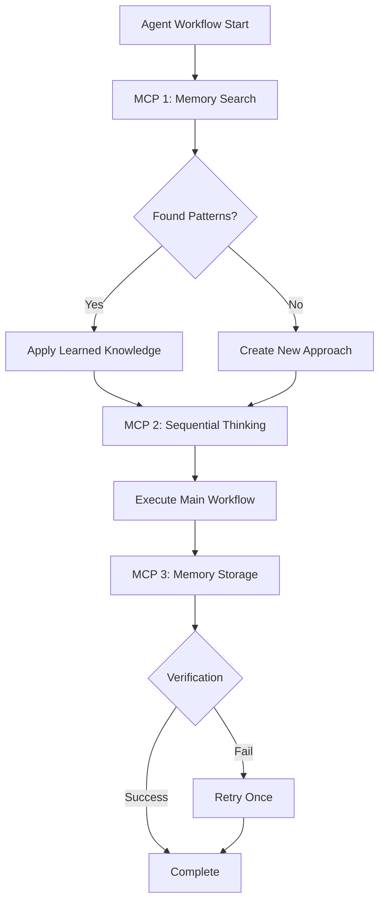

# MCP TOOLS INTEGRATION GUIDE

## Purpose

Provide exact parameter specifications and usage patterns for integrating MCP (Model Context Protocol) tools into agent workflows. Ensure consistent tool invocation across all agents with standardized patterns for sequential thinking, memory operations, and progress tracking.

## Core Concepts



### MCP Tool Categories

**Category 1: Cognitive Tools**
- Sequential Thinking - Multi-step reasoning and planning

**Category 2: Knowledge Management**
- Memory Search - Retrieve existing patterns
- Memory Create - Store new learnings
- Memory Add - Update existing patterns
- Memory Open - Fetch specific entities

**Category 3: Progress Tracking**
- Todo Management - Track multi-step workflows

**Category 4: System Tools**
- Webpage Fetch - Retrieve HTML content
- Error Check - Validate compilation
- Terminal Execute - Run tests and commands

**Category 5: Browser Automation Tools (Playwright MCP)**
- Browser Navigate - Navigate to URLs and manage page state
- Browser Snapshot - Capture accessibility tree for element analysis
- Browser Click - Perform click actions on elements
- Browser Type - Type text into input fields
- Browser Fill Form - Fill multiple form fields at once
- Browser Select Option - Select dropdown options
- Browser Evaluate - Execute JavaScript in page context
- Browser Wait - Wait for conditions or timeouts
- Browser Screenshot - Capture visual snapshots
- Browser Tabs - Manage multiple browser tabs
- Browser Install - Install browser dependencies

## Reference Patterns

### Pattern 1: Sequential Thinking

**When to Use:**
- Planning multi-step workflows (3+ steps)
- Analyzing failures or errors
- Making complex decisions with trade-offs
- Breaking down ambiguous requirements

**Parameters:**

| Parameter | Type | Required | Description |
|-----------|------|----------|-------------|
| `thought` | string | ✅ | Current thinking step (specific and actionable) |
| `nextThoughtNeeded` | boolean | ✅ | `true` if more analysis needed, `false` when done |
| `thoughtNumber` | integer | ✅ | Current step number (starts at 1) |
| `totalThoughts` | integer | ✅ | Estimated total steps (adjust dynamically) |
| `isRevision` | boolean | ❌ | `true` if revising previous thought |
| `revisesThought` | integer | ❌ | Which thought number being reconsidered |
| `branchFromThought` | integer | ❌ | Branch point for alternatives |
| `branchId` | string | ❌ | Branch identifier (e.g., "approach-A") |
| `needsMoreThoughts` | boolean | ❌ | `true` if need more steps |

**Example - DOM Analysis Agent (Locator Strategy Planning):**
```typescript
// Example invocation pattern (non-executable):
// mcp_sequential-th_sequentialthinking({
//   thought: "Analyzing DOM for TC_001. Steps: 1) Identify interactive elements, 2) Evaluate attribute uniqueness (id > data-testid > aria > class), 3) Plan fallback locators, 4) Handle special components (dropdowns, date pickers)",
//   thoughtNumber: 1,
//   totalThoughts: 4,
//   nextThoughtNeeded: true
// })
//
// mcp_sequential-th_sequentialthinking({
//   thought: "Examining HTML structure: Found <input id='email'> with unique ID - confidence 0.95. Found <button class='btn btn-primary'> with shared classes - need fallback using text content or role",
//   thoughtNumber: 2,
//   totalThoughts: 4,
//   nextThoughtNeeded: true
// })
//
// mcp_sequential-th_sequentialthinking({
//   thought: "Planning fallbacks: Email - primary: #email (ID), fallback1: [placeholder='Email'] (attribute), fallback2: input[type='email'] (CSS). Button - primary: .btn-primary (class), fallback1: button:has-text('Submit') (text), fallback2: [role='button'] (ARIA)",
//   thoughtNumber: 3,
//   totalThoughts: 4,
//   nextThoughtNeeded: true
// })
//
// mcp_sequential-th_sequentialthinking({
//   thought: "Special component detected: react-select at #state. Requires: click container -> wait -> fillAndEnter input. Will search memory for DemoQA react-select patterns before generating locators",
//   thoughtNumber: 4,
//   totalThoughts: 4,
//   nextThoughtNeeded: false
// })
```

**Example - Test Healing Agent (Error Analysis):**
```typescript
// Example invocation pattern (non-executable):
// mcp_sequential-th_sequentialthinking({
//   thought: "Test failed with 'locator.click: Timeout 30000ms exceeded. Locator: #login'. Analyzing: 1) Is locator correct? 2) Is element visible? 3) Is there timing issue? 4) Is element in iframe/shadow DOM?",
//   thoughtNumber: 1,
//   totalThoughts: 5,
//   nextThoughtNeeded: true
// })
//
// mcp_sequential-th_sequentialthinking({
//   thought: "Hypothesis 1: Locator incorrect. Will re-fetch webpage to find actual button ID. Looking for <button> with 'login' or 'submit' text",
//   thoughtNumber: 2,
//   totalThoughts: 5,
//   nextThoughtNeeded: true
// })
//
// mcp_sequential-th_sequentialthinking({
//   thought: "Re-fetch reveals: Button ID is #loginButton (not #login). Locator mismatch error. Healing: Update page object from #login to #loginButton",
//   thoughtNumber: 3,
//   totalThoughts: 5,
//   nextThoughtNeeded: true
// })
//
// mcp_sequential-th_sequentialthinking({
//   thought: "Creating backup: copy loginPage.ts to loginPage.backup.ts, then update locator. If re-run fails, restore from backup",
//   thoughtNumber: 4,
//   totalThoughts: 5,
//   nextThoughtNeeded: true
// })
//
// mcp_sequential-th_sequentialthinking({
//   thought: "Fix complete. Will re-run test to verify. If passes, store pattern: 'DemoQA login button uses #loginButton ID' for future reference",
//   thoughtNumber: 5,
//   totalThoughts: 5,
//   nextThoughtNeeded: false
// })
```

### Pattern 2: Memory Search

**When to Use:** ALWAYS as Step 0 before main execution

**Parameters:**

| Parameter | Type | Required | Description |
|-----------|------|----------|-------------|
| `query` | string | ✅ | Search query (entity names, types, observations) |

**Query Pattern Templates:**

| Agent | Query Template |
|-------|---------------|
| Test Case Designer | `"<DOMAIN> <FEATURE> test patterns"` |
| DOM Analysis | `"<DOMAIN> locator patterns"`, `"<COMPONENT_TYPE> interaction patterns"` |
| POM Generator | `"<FEATURE> page object patterns"`, `"self-healing wrapper patterns"` |
| Test Healing | `"<ERROR_TYPE> solution patterns <DOMAIN>"` |
| Orchestration | `"<DOMAIN> automation patterns"`, `"<DOMAIN> <FEATURE> execution history"` |

**Example - Test Case Designer:**
```typescript
// Example query pattern (non-executable):
// const patterns = mcp_memory_search_nodes({
//   query: "demoqa_com registration test patterns"
// })
//
// if (patterns.entities.length > 0) {
//   // Apply learned test structure
//   patterns.entities.forEach(entity => {
//     // entity.name, entity.type, entity.observations[]
//   })
// } else {
//   // Create new test design
// }
```

**Example - DOM Analysis:**
```typescript
// Example query pattern (non-executable):
// const locatorPatterns = mcp_memory_search_nodes({
//   query: "demoqa_com form locators"
// })
//
// const componentPatterns = mcp_memory_search_nodes({
//   query: "react-select dropdown interaction"
// })
//
// if (locatorPatterns.entities.length > 0) {
//   locatorPatterns.entities.forEach(entity => {
//     // Apply learned locator strategies
//   })
// }
```

### Pattern 3: Memory Create

**When to Use:** After successful completion or learning

**Parameters:**

| Parameter | Type | Required | Description |
|-----------|------|----------|-------------|
| `entities` | array | ✅ | Array of entity objects to create |
| `entities[].name` | string | ✅ | Unique entity identifier (<DOMAIN>-<FEATURE>-<PATTERN_TYPE>) |
| `entities[].entityType` | string | ✅ | Classification (TestPattern, LocatorPattern, CodePattern, ErrorSolution, ExecutionHistory) |
| `entities[].observations` | string[] | ✅ | Facts and learnings about this entity |

**Example - Test Case Designer (After Generating Tests):**
```typescript
// Example storage pattern (non-executable):
// mcp_memory_create_entities({
//   entities: [
//     {
//       name: "<DOMAIN>-<FEATURE>-TestPattern",
//       entityType: "TestPattern",
//       observations: [
//         "User story: <USER_STORY>",
//         "Test cases generated: <COUNT>",
//         "Data-driven: <YES_OR_NO>",
//         "Coverage: <PERCENTAGE>% of acceptance criteria",
//         "Fields tested: <FIELD_LIST>",
//         "Test IDs: <ID_RANGE>",
//         "Captured at: <TIMESTAMP_ISO8601>"
//       ]
//     }
//   ]
// })
//
// // MANDATORY: Verify storage succeeded
// const verification = mcp_memory_open_nodes({
//   names: ["<DOMAIN>-<FEATURE>-TestPattern"]
// })
//
// if (verification.entities.length === 0) {
//   // Retry once
//   // If still fails, log warning but continue
// }
```

**Example - DOM Analysis (After Mapping Elements):**
```typescript
// Example storage pattern (non-executable):
// mcp_memory_create_entities({
//   entities: [
//     {
//       name: "<DOMAIN>-<FEATURE>-<ELEMENT_NAME>-Locator",
//       entityType: "LocatorPattern",
//       observations: [
//         "Element: <ELEMENT_NAME> <ELEMENT_TYPE>",
//         "HTML tag: <TAG>",
//         "Primary locator: <LOCATOR> (<STRATEGY>, confidence: <SCORE>)",
//         "Fallback1: <LOCATOR> (<STRATEGY>, confidence: <SCORE>)",
//         "Fallback2: <LOCATOR> (<STRATEGY>, confidence: <SCORE>)",
//         "Uniqueness: <HIGH_MEDIUM_LOW>",
//         "Stability: <HIGH_MEDIUM_LOW>",
//         "Captured at: <TIMESTAMP_ISO8601>"
//       ]
//     },
//     {
//       name: "<DOMAIN>-<COMPONENT_NAME>-ComponentPattern",
//       entityType: "ComponentPattern",
//       observations: [
//         "Component: <COMPONENT_TYPE>",
//         "Container locator: <LOCATOR>",
//         "Input locator: <LOCATOR>",
//         "Interaction pattern: <STEPS>",
//         "Options appear in: <LOCATOR>",
//         "Working example: <CODE_SNIPPET>",
//         "Common error: <ERROR_DESCRIPTION>",
//         "Captured at: <TIMESTAMP_ISO8601>"
//       ]
//     }
//   ]
// })
```

**Example - Test Healing (After Successful Healing):**
```typescript
// Example storage pattern (non-executable):
// mcp_memory_create_entities({
//   entities: [
//     {
//       name: "<DOMAIN>-<ERROR_SIGNATURE>-ErrorSolution",
//       entityType: "ErrorSolution",
//       observations: [
//         "Error: <ERROR_MESSAGE>",
//         "Root cause: <ANALYSIS>",
//         "Detection: <HOW_IDENTIFIED>",
//         "Solution: <FIX_APPLIED>",
//         "Verification: <TEST_RESULT>",
//         "Pattern: <GENERALIZATION>",
//         "Captured at: <TIMESTAMP_ISO8601>",
//         "Healing attempts: <COUNT>"
//       ]
//     }
//   ]
// })
```

### Pattern 4: Todo Management

**When to Use:**
- Multi-gate orchestration workflows
- Complex agent processes with 5+ steps
- When user needs progress visibility

**Parameters:**

| Parameter | Type | Required | Description |
|-----------|------|----------|-------------|
| `operation` | enum | ✅ | `'write'` to update, `'read'` to retrieve |
| `todoList` | array | ✅ (write) | Complete list of todos |
| `todoList[].id` | number | ✅ | Unique sequential ID |
| `todoList[].title` | string | ✅ | Concise action (3-7 words) |
| `todoList[].description` | string | ✅ | Detailed context and requirements |
| `todoList[].status` | enum | ✅ | `'not-started'`, `'in-progress'`, `'completed'` |

**Example - Orchestration Agent (At Pipeline Start):**
```typescript
// Example todo initialization (non-executable):
// manage_todo_list({
//   operation: 'write',
//   todoList: [
//     {
//       id: 1,
//       title: 'PRE-PROCESSING: Input validation',
//       description: 'Validate user story, URL, acceptance criteria. Security checks. Sanitize filenames.',
//       status: 'in-progress'
//     },
//     {
//       id: 2,
//       title: 'PRE-PROCESSING: Fetch webpage',
//       description: 'Fetch <URL> once. Detect SPA. Check auth. Cache HTML.',
//       status: 'not-started'
//     },
//     {
//       id: 3,
//       title: 'GATE 0: Data preparation',
//       description: 'IF data-driven: Generate test data with Faker. Create JSON file.',
//       status: 'not-started'
//     },
//     {
//       id: 4,
//       title: 'GATE 1: Test case design',
//       description: 'Invoke TestCaseDesigner. Generate test cases. Validate 80%+ coverage.',
//       status: 'not-started'
//     },
//     {
//       id: 5,
//       title: 'GATE 2: DOM element mapping',
//       description: 'Invoke DOMAgent. Generate primary + 2 fallback locators. Score confidence.',
//       status: 'not-started'
//     },
//     {
//       id: 6,
//       title: 'GATE 3: Code generation',
//       description: 'Invoke POMAgent. Generate page objects with self-healing. Validate compilation.',
//       status: 'not-started'
//     },
//     {
//       id: 7,
//       title: 'GATE 4: Test execution',
//       description: 'Run tests 3x. Trigger healing if needed. Re-run after healing.',
//       status: 'not-started'
//     },
//     {
//       id: 8,
//       title: 'GATE 5: Learning and storage',
//       description: 'Store all patterns in memory. Update knowledge base.',
//       status: 'not-started'
//     }
//   ]
// })
```

**Example - After Each Gate:**
```typescript
// Example todo update (non-executable):
// const currentTodos = manage_todo_list({ operation: 'read' })
//
// const updatedTodos = currentTodos.todoList.map(todo => {
//   if (todo.id === <CURRENT_GATE_ID>) {
//     return { ...todo, status: 'completed' }
//   }
//   if (todo.id === <CURRENT_GATE_ID> + 1) {
//     return { ...todo, status: 'in-progress' }
//   }
//   return todo
// })
//
// manage_todo_list({
//   operation: 'write',
//   todoList: updatedTodos
// })
```

### Pattern 5: Webpage Fetch

**When to Use:** Centralized in orchestration (pre-processing), fallback in healing

**Parameters:**

| Parameter | Type | Required | Description |
|-----------|------|----------|-------------|
| `urls` | string[] | ✅ | Array of URLs to fetch |
| `query` | string | ✅ | Detailed extraction instructions |

**Example - Orchestration Pre-Processing:**
```typescript
// Example fetch pattern (non-executable):
// const html = fetch_webpage({
//   urls: ["<TARGET_URL>"],
//   query: "Extract ALL interactive elements: inputs (id, name, placeholder, type, maxLength, pattern, required), buttons (id, class, text, type), selects (id, options), links (href, text), textareas (id, placeholder). Include ALL attributes: IDs, classes, data-testid, data-*, ARIA labels, roles, placeholders, text content, form field constraints."
// })
```

**Example - Test Healing Re-Fetch:**
```typescript
// Example re-fetch pattern (non-executable):
// const html = fetch_webpage({
//   urls: ["<TARGET_URL>"],
//   query: "Find alternatives for failed locator '<FAILED_LOCATOR>'. Look for elements matching text: '<TEXT>', role: '<ROLE>', nearby elements, parent/child relationships. Extract ALL possible selector strategies."
// })
```

### Pattern 6: Error Check

**When to Use:** After code generation, before test execution

**Parameters:**

| Parameter | Type | Required | Description |
|-----------|------|----------|-------------|
| `filePaths` | string[] | ❌ | Specific files to check (omit for all) |

**Example - POM Generator:**
```typescript
// Example error check pattern (non-executable):
// const errors = get_errors([
//   'tests/test-objects/pages/<PAGE_NAME>.page.ts',
//   'tests/test-objects/pageFixture.ts',
//   'tests/tests-management/gui/<FEATURE>/<TEST_NAME>.spec.ts'
// ])
//
// if (errors.length > 0) {
//   // Fix errors before proceeding
//   // throw new CompilationError('<MESSAGE>', errors)
// }
```

### Pattern 7: Terminal Execute

**When to Use:** Test execution, verification runs

**Parameters:**

| Parameter | Type | Required | Description |
|-----------|------|----------|-------------|
| `command` | string | ✅ | Shell command to execute |
| `explanation` | string | ✅ | One-sentence description for user |
| `isBackground` | boolean | ✅ | `false` for blocking (get output), `true` for background |

**Example - Test Execution:**
```typescript
// Example execution pattern (non-executable):
// const result1 = run_in_terminal({
//   command: "npx playwright test <TEST_FILE> --reporter=json",
//   explanation: "Test execution run 1/3 for <TEST_FILE>",
//   isBackground: false
// })
//
// const status1 = result1.exitCode === 0 ? 'PASS' : 'FAIL'
//
// const result2 = run_in_terminal({
//   command: "npx playwright test <TEST_FILE> --reporter=json",
//   explanation: "Test execution run 2/3 for <TEST_FILE>",
//   isBackground: false
// })
//
// const status2 = result2.exitCode === 0 ? 'PASS' : 'FAIL'
//
// if (status1 === 'FAIL' && status2 === 'FAIL') {
//   const sameError = result1.stderr === result2.stderr
//   if (sameError) {
//     // Trigger healing
//   }
// }
```

### Pattern 8: Browser Navigate

**When to Use:** Navigate to URLs, detect page state, go back in history

**Parameters:**

| Parameter | Type | Required | Description |
|-----------|------|----------|-------------|
| `url` | string | ✅ | Target URL to navigate to |

**Example - DOM Analysis (Navigate to Test Page):**
```typescript
// Example navigation pattern (non-executable):
// mcp_microsoft_pla_browser_navigate({
//   url: "<TARGET_URL>"
// })
//
// // Wait for page load
// mcp_microsoft_pla_browser_wait_for({
//   time: 2
// })
```

**Example - Test Healing (Navigate to Re-analyze):**
```typescript
// Example re-navigation pattern (non-executable):
// // Navigate to failed page
// mcp_microsoft_pla_browser_navigate({
//   url: "<FAILED_PAGE_URL>"
// })
//
// // Take snapshot to find correct locators
// const snapshot = mcp_microsoft_pla_browser_snapshot()
```

### Pattern 9: Browser Snapshot

**When to Use:** Capture accessibility tree for element analysis (better than screenshot for automation)

**Parameters:** None required

**Example - DOM Analysis (Capture Page Structure):**
```typescript
// Example snapshot pattern (non-executable):
// // Navigate first
// mcp_microsoft_pla_browser_navigate({
//   url: "<TARGET_URL>"
// })
//
// // Capture accessibility snapshot
// const snapshot = mcp_microsoft_pla_browser_snapshot()
//
// // Snapshot returns structured accessibility tree with:
// // - Element roles (button, textbox, link, etc.)
// // - Element names/labels
// // - Element refs (for interaction)
// // - Hierarchical structure
//
// // Parse snapshot to find elements:
// // snapshot.text contains formatted accessibility tree like:
// // "button 'Submit' [ref=abc123]"
// // "textbox 'Email' [ref=def456]"
```

**Example - Test Healing (Re-analyze After Failure):**
```typescript
// Example healing snapshot pattern (non-executable):
// // Navigate to failed page
// mcp_microsoft_pla_browser_navigate({
//   url: "<FAILED_PAGE_URL>"
// })
//
// // Capture current state
// const currentSnapshot = mcp_microsoft_pla_browser_snapshot()
//
// // Compare with expected elements
// // Find alternative locators from accessibility tree
```

### Pattern 10: Browser Click

**When to Use:** Perform click actions on buttons, links, checkboxes

**Parameters:**

| Parameter | Type | Required | Description |
|-----------|------|----------|-------------|
| `element` | string | ✅ | Human-readable element description |
| `ref` | string | ✅ | Exact element reference from snapshot |
| `button` | enum | ❌ | Click button: `'left'`, `'right'`, `'middle'` (default: `'left'`) |
| `doubleClick` | boolean | ❌ | Perform double-click instead of single |
| `modifiers` | string[] | ❌ | Modifier keys: `['Alt']`, `['Control']`, `['Shift']`, `['Meta']` |

**Example - DOM Analysis (Verify Element Clickable):**
```typescript
// Example click verification pattern (non-executable):
// // Get snapshot first
// const snapshot = mcp_microsoft_pla_browser_snapshot()
//
// // Find submit button ref from snapshot
// // Example: "button 'Submit' [ref=abc123]"
// const submitRef = "abc123"  // Extracted from snapshot
//
// // Click to verify interactivity
// mcp_microsoft_pla_browser_click({
//   element: "Submit button",
//   ref: submitRef
// })
//
// // Verify click result (check for navigation, modal, etc.)
```

**Example - Test Healing (Test Alternative Click Strategies):**
```typescript
// Example healing click pattern (non-executable):
// // Try clicking with different strategies
// const snapshot = mcp_microsoft_pla_browser_snapshot()
//
// // Find element by text content
// const buttonRef = extractRefFromSnapshot(snapshot, "button", "Login")
//
// if (buttonRef) {
//   mcp_microsoft_pla_browser_click({
//     element: "Login button",
//     ref: buttonRef
//   })
// } else {
//   // Try alternative: find by role
//   const roleButtonRef = extractRefByRole(snapshot, "button")
// }
```

### Pattern 11: Browser Type

**When to Use:** Type text into input fields, textareas

**Parameters:**

| Parameter | Type | Required | Description |
|-----------|------|----------|-------------|
| `element` | string | ✅ | Human-readable element description |
| `ref` | string | ✅ | Exact element reference from snapshot |
| `text` | string | ✅ | Text to type |
| `slowly` | boolean | ❌ | Type one character at a time (triggers key handlers) |
| `submit` | boolean | ❌ | Press Enter after typing |

**Example - DOM Analysis (Verify Input Field):**
```typescript
// Example type verification pattern (non-executable):
// const snapshot = mcp_microsoft_pla_browser_snapshot()
//
// // Find email input ref: "textbox 'Email' [ref=def456]"
// const emailRef = "def456"
//
// // Type test data
// mcp_microsoft_pla_browser_type({
//   element: "Email input field",
//   ref: emailRef,
//   text: "test@example.com"
// })
//
// // Verify field accepts input (check value, validation messages)
```

**Example - Test Execution (Fill Form Field):**
```typescript
// Example form filling pattern (non-executable):
// // Type with submit for search fields
// mcp_microsoft_pla_browser_type({
//   element: "Search input",
//   ref: searchRef,
//   text: "<SEARCH_TERM>",
//   submit: true  // Triggers search
// })
//
// // Type slowly to trigger autocomplete
// mcp_microsoft_pla_browser_type({
//   element: "City autocomplete",
//   ref: cityRef,
//   text: "New York",
//   slowly: true  // Triggers dropdown suggestions
// })
```

### Pattern 12: Browser Fill Form

**When to Use:** Fill multiple form fields efficiently in one operation

**Parameters:**

| Parameter | Type | Required | Description |
|-----------|------|----------|-------------|
| `fields` | array | ✅ | Array of field objects to fill |
| `fields[].name` | string | ✅ | Human-readable field name |
| `fields[].type` | enum | ✅ | Field type: `'textbox'`, `'checkbox'`, `'radio'`, `'combobox'`, `'slider'` |
| `fields[].ref` | string | ✅ | Exact field reference from snapshot |
| `fields[].value` | string | ✅ | Value to fill (text for textbox, `'true'`/`'false'` for checkbox, option text for combobox) |

**Example - DOM Analysis (Verify Multi-Field Form):**
```typescript
// Example multi-field fill pattern (non-executable):
// const snapshot = mcp_microsoft_pla_browser_snapshot()
//
// // Extract all form field refs from snapshot
// const fields = [
//   { name: "First Name", type: "textbox", ref: "ref001", value: "John" },
//   { name: "Last Name", type: "textbox", ref: "ref002", value: "Doe" },
//   { name: "Gender", type: "radio", ref: "ref003", value: "Male" },
//   { name: "Subscribe", type: "checkbox", ref: "ref004", value: "true" }
// ]
//
// mcp_microsoft_pla_browser_fill_form({
//   fields: fields
// })
//
// // Verify all fields filled correctly
```

**Example - Test Execution (Data-Driven Form Filling):**
```typescript
// Example data-driven fill pattern (non-executable):
// // Load test data
// const testData = JSON.parse(read_file("<DATA_FILE>"))
//
// testData.forEach((dataSet, index) => {
//   // Navigate to form
//   mcp_microsoft_pla_browser_navigate({ url: "<FORM_URL>" })
//   
//   // Fill all fields from data set
//   const fields = [
//     { name: "Email", type: "textbox", ref: emailRef, value: dataSet.email },
//     { name: "Password", type: "textbox", ref: passRef, value: dataSet.password },
//     { name: "Remember Me", type: "checkbox", ref: rememberRef, value: dataSet.rememberMe.toString() }
//   ]
//   
//   mcp_microsoft_pla_browser_fill_form({ fields: fields })
// })
```

### Pattern 13: Browser Select Option

**When to Use:** Select options from dropdown menus

**Parameters:**

| Parameter | Type | Required | Description |
|-----------|------|----------|-------------|
| `element` | string | ✅ | Human-readable element description |
| `ref` | string | ✅ | Exact dropdown reference from snapshot |
| `values` | string[] | ✅ | Array of option values to select (single or multiple) |

**Example - DOM Analysis (Verify Dropdown Options):**
```typescript
// Example dropdown selection pattern (non-executable):
// const snapshot = mcp_microsoft_pla_browser_snapshot()
//
// // Find dropdown ref: "combobox 'Country' [ref=ghi789]"
// const countryRef = "ghi789"
//
// // Select option to verify dropdown works
// mcp_microsoft_pla_browser_select_option({
//   element: "Country dropdown",
//   ref: countryRef,
//   values: ["United States"]
// })
//
// // Verify selection (check selected value, form state)
```

**Example - Component Pattern (Multi-Select Dropdown):**
```typescript
// Example multi-select pattern (non-executable):
// // For multi-select dropdowns
// mcp_microsoft_pla_browser_select_option({
//   element: "Skills multi-select",
//   ref: skillsRef,
//   values: ["JavaScript", "TypeScript", "Python"]  // Multiple selections
// })
```

### Pattern 14: Browser Evaluate

**When to Use:** Execute JavaScript in page context, extract computed values, manipulate DOM

**Parameters:**

| Parameter | Type | Required | Description |
|-----------|------|----------|-------------|
| `function` | string | ✅ | JavaScript function as string: `'() => { /* code */ }'` or `'(element) => { /* code */ }'` |
| `element` | string | ❌ | Human-readable element description (if evaluating on specific element) |
| `ref` | string | ❌ | Element reference (required if `element` provided) |

**Example - DOM Analysis (Extract Element Properties):**
```typescript
// Example property extraction pattern (non-executable):
// // Get computed styles
// const styles = mcp_microsoft_pla_browser_evaluate({
//   function: "() => { const btn = document.querySelector('#submit'); return window.getComputedStyle(btn).display; }"
// })
//
// // Extract form validation state
// const isValid = mcp_microsoft_pla_browser_evaluate({
//   function: "() => { const form = document.querySelector('form'); return form.checkValidity(); }"
// })
//
// // Get element attributes on specific element
// const attrs = mcp_microsoft_pla_browser_evaluate({
//   element: "Email input",
//   ref: emailRef,
//   function: "(element) => { return { id: element.id, name: element.name, type: element.type, required: element.required }; }"
// })
```

**Example - Test Healing (Diagnose Failure):**
```typescript
// Example diagnostic evaluation pattern (non-executable):
// // Check if element exists in DOM
// const exists = mcp_microsoft_pla_browser_evaluate({
//   function: "() => { return document.querySelector('<FAILED_SELECTOR>') !== null; }"
// })
//
// // Check element visibility
// const isVisible = mcp_microsoft_pla_browser_evaluate({
//   element: "Failed element",
//   ref: failedRef,
//   function: "(element) => { const rect = element.getBoundingClientRect(); return rect.width > 0 && rect.height > 0 && window.getComputedStyle(element).visibility !== 'hidden'; }"
// })
//
// // Get actual element ID (if different from expected)
// const actualId = mcp_microsoft_pla_browser_evaluate({
//   function: "() => { const btn = document.querySelector('button[type=submit]'); return btn ? btn.id : null; }"
// })
```

### Pattern 15: Browser Wait

**When to Use:** Wait for conditions, timeouts, or text to appear/disappear

**Parameters:**

| Parameter | Type | Required | Description |
|-----------|------|----------|-------------|
| `time` | number | ❌ | Seconds to wait (for fixed delays) |
| `text` | string | ❌ | Text to wait for to appear |
| `textGone` | string | ❌ | Text to wait for to disappear |

**Example - DOM Analysis (Wait for Dynamic Content):**
```typescript
// Example wait pattern (non-executable):
// // Wait for page load
// mcp_microsoft_pla_browser_navigate({ url: "<URL>" })
// mcp_microsoft_pla_browser_wait_for({ time: 2 })
//
// // Wait for loading spinner to disappear
// mcp_microsoft_pla_browser_wait_for({
//   textGone: "Loading..."
// })
//
// // Wait for success message
// mcp_microsoft_pla_browser_wait_for({
//   text: "Registration successful"
// })
```

**Example - Test Execution (Wait for Async Operations):**
```typescript
// Example async wait pattern (non-executable):
// // Submit form
// mcp_microsoft_pla_browser_click({
//   element: "Submit button",
//   ref: submitRef
// })
//
// // Wait for processing
// mcp_microsoft_pla_browser_wait_for({
//   textGone: "Processing..."
// })
//
// // Wait for confirmation
// mcp_microsoft_pla_browser_wait_for({
//   text: "Success"
// })
```

### Pattern 16: Browser Screenshot

**When to Use:** Capture visual snapshots for debugging, verification (use snapshot for automation)

**Parameters:**

| Parameter | Type | Required | Description |
|-----------|------|----------|-------------|
| `filename` | string | ❌ | File name (default: `page-{timestamp}.png`) |
| `type` | enum | ❌ | Image format: `'png'` (default), `'jpeg'` |
| `fullPage` | boolean | ❌ | Capture full scrollable page (cannot use with element) |
| `element` | string | ❌ | Human-readable element description (for element screenshot) |
| `ref` | string | ❌ | Element reference (required if `element` provided) |

**Example - Test Healing (Capture Failure State):**
```typescript
// Example screenshot pattern (non-executable):
// // Capture full page on failure
// mcp_microsoft_pla_browser_take_screenshot({
//   filename: "<DOMAIN>-<FEATURE>-failure.png",
//   fullPage: true,
//   type: "png"
// })
//
// // Capture specific failed element
// mcp_microsoft_pla_browser_take_screenshot({
//   filename: "<ELEMENT>-failure.png",
//   element: "Failed submit button",
//   ref: failedRef
// })
```

**Example - DOM Analysis (Visual Verification):**
```typescript
// Example visual capture pattern (non-executable):
// // Capture viewport for analysis
// mcp_microsoft_pla_browser_take_screenshot({
//   filename: "form-initial-state.png"
// })
//
// // Fill form
// mcp_microsoft_pla_browser_fill_form({ fields: fields })
//
// // Capture filled state
// mcp_microsoft_pla_browser_take_screenshot({
//   filename: "form-filled-state.png"
// })
```

### Pattern 17: Browser Tabs

**When to Use:** Manage multiple browser tabs (list, create, close, switch)

**Parameters:**

| Parameter | Type | Required | Description |
|-----------|------|----------|-------------|
| `action` | enum | ✅ | Operation: `'list'`, `'new'`, `'close'`, `'select'` |
| `index` | number | ❌ | Tab index for `'close'` or `'select'` (omit for `'close'` to close current) |

**Example - Test Execution (Multi-Tab Workflow):**
```typescript
// Example tab management pattern (non-executable):
// // List current tabs
// const tabs = mcp_microsoft_pla_browser_tabs({
//   action: "list"
// })
//
// // Open new tab
// mcp_microsoft_pla_browser_tabs({
//   action: "new"
// })
//
// // Navigate in new tab
// mcp_microsoft_pla_browser_navigate({ url: "<SECOND_URL>" })
//
// // Switch back to first tab
// mcp_microsoft_pla_browser_tabs({
//   action: "select",
//   index: 0
// })
//
// // Close second tab
// mcp_microsoft_pla_browser_tabs({
//   action: "close",
//   index: 1
// })
```

### Pattern 18: Browser Install

**When to Use:** Install browser dependencies if missing

**Parameters:** None required

**Example - Test Healing (Resolve Browser Issues):**
```typescript
// Example browser installation pattern (non-executable):
// // If browser not found error occurs
// mcp_microsoft_pla_browser_install()
//
// // Retry navigation after install
// mcp_microsoft_pla_browser_navigate({ url: "<URL>" })
```

## Integration Points

### Used By All Agents

**Step 0A: Memory Search** - Query existing patterns before execution

**Step 0B: Sequential Thinking** - Plan approach for complex operations (3+ steps)

**Step N: Main Workflow** - Execute agent-specific logic

**Step N+1: Memory Storage** - Store learnings with verification

**Step N+2: Checkpoint** - Output self-audit

### Orchestration-Specific

**PRE-PROCESSING:** Memory search for domain patterns, todo list initialization

**Each GATE:** Todo list update (mark completed, next in-progress)

**GATE 5:** Comprehensive memory storage (all learnings)

**END:** Todo list complete (all marked completed)

## Implementation Checklist

### For Each Agent

- [ ] Step 0A: Memory Search (query existing patterns)
- [ ] Step 0B: Sequential Thinking (plan approach, minimum 3 thoughts)
- [ ] Step N: Main Execution (existing workflow)
- [ ] Step N+1: Memory Storage (create entities with learnings)
- [ ] Step N+2: Checkpoint (verify all MCPs used)

### For Orchestration

- [ ] PRE-PROCESSING: Memory Search (domain patterns)
- [ ] PRE-PROCESSING: Todo List Init (8 gates)
- [ ] Each GATE: Todo Update (mark completed, next in-progress)
- [ ] GATE 5: Comprehensive Memory Storage (all learnings)
- [ ] END: Todo List Complete (all marked completed)

## Enforcement Rules

### Rule 1: Memory-First (MANDATORY)

MUST call `mcp_memory_search_nodes` as Step 0 before main execution.

**Penalty:** Agent execution incomplete, must restart.

### Rule 2: Planning (MANDATORY for 3+ steps)

MUST call `mcp_sequential-th_sequentialthinking` before complex operations. Minimum 3 thoughts required.

**Penalty:** Decision-making lacks transparency and auditability.

### Rule 3: Learning (MANDATORY after success)

MUST call `mcp_memory_create_entities` after successful completion with verification.

**Penalty:** Knowledge lost, future runs cannot benefit from learnings.

### Rule 4: Checkpoint (MANDATORY after major steps)

MUST output self-audit checklist showing completed MCPs.

**Template:**
```markdown
**CHECKPOINT: <PHASE_NAME>**

Required MCPs:
✅ mcp_memory_search_nodes - Queried <PATTERN_TYPE>
✅ mcp_sequential-th_sequentialthinking - Planned approach (3 thoughts)
✅ <OTHER_TOOL> - <STATUS>

MISSING STEPS: <LIST_OR_NONE>

ACTION: <PROCEEDING_OR_GOING_BACK>
```

**Penalty:** Execution not auditable, may have skipped steps.

## Constraints

**NEVER:**
- Skip memory queries (Step 0A)
- Skip sequential thinking for complex operations (3+ steps)
- Skip storing learnings after success
- Skip verification after memory storage
- Use dynamic timestamps or UUIDs in code examples

**ALWAYS:**
- Query memory before main execution
- Use minimum 3 thoughts in sequential thinking
- Store learnings with verification
- Output checkpoint after major steps
- Use static placeholders in examples (`<DOMAIN>`, `<FEATURE>`, `<TIMESTAMP_ISO8601>`)

## Examples

### Complete Agent MCP Integration

```typescript
// Example complete agent workflow (non-executable):
//
// // Step 0A: Memory Query
// const patterns = mcp_memory_search_nodes({
//   query: "<DOMAIN> <FEATURE> <PATTERN_TYPE> patterns"
// })
//
// if (patterns.entities.length > 0) {
//   // Apply learned knowledge
// }
//
// // Step 0B: Sequential Thinking (if 3+ steps)
// mcp_sequential-th_sequentialthinking({
//   thought: "<ANALYSIS>",
//   thoughtNumber: 1,
//   totalThoughts: 3,
//   nextThoughtNeeded: true
// })
//
// mcp_sequential-th_sequentialthinking({
//   thought: "<SOLUTION>",
//   thoughtNumber: 2,
//   totalThoughts: 3,
//   nextThoughtNeeded: true
// })
//
// mcp_sequential-th_sequentialthinking({
//   thought: "<VERIFICATION>",
//   thoughtNumber: 3,
//   totalThoughts: 3,
//   nextThoughtNeeded: false
// })
//
// // Step 1-N: Main Workflow
// // ... agent-specific logic ...
//
// // Step N+1: Memory Storage
// mcp_memory_create_entities({
//   entities: [{
//     name: "<DOMAIN>-<FEATURE>-<PATTERN_TYPE>",
//     entityType: "<PATTERN_TYPE>",
//     observations: ["<OBSERVATION_1>", "<OBSERVATION_2>"]
//   }]
// })
//
// // Verification
// const verification = mcp_memory_open_nodes({
//   names: ["<DOMAIN>-<FEATURE>-<PATTERN_TYPE>"]
// })
//
// if (verification.entities.length === 0) {
//   // Retry once
// }
//
// // Step N+2: Checkpoint
// // Output self-audit markdown
```

