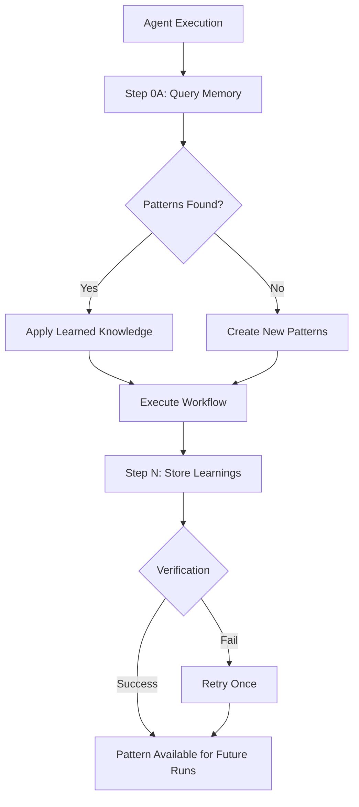

# MEMORY PATTERNS REFERENCE

## Purpose

Define standardized query and entity naming patterns for all agents in the QA automation pipeline. Following these patterns ensures consistent memory storage and retrieval across production runs, enabling incremental learning and crash recovery.

## Core Concepts



### Naming Convention

**Entity Names:** `{domain}-{feature}-{EntityType}-{version?}`

**Query Format:** `{domain} {feature} {entity-type} patterns`

**Metadata Extraction:**
```typescript
// Example metadata extraction (non-executable):
// const domain = sanitizeFilename(extractDomain(url))
// const feature = sanitizeFilename(extractFeature(userStory))
```

### Incremental Storage Strategy

Store patterns after each gate completion (not just at end):

```
PRE-PROCESSING → Query existing patterns
GATE 1 → Store TestPattern immediately
GATE 2 → Store LocatorPattern immediately  
GATE 3 → Store CodePattern immediately
GATE 4 (if healing) → Store ErrorSolution
GATE 5 → Store comprehensive ExecutionHistory
```

**Benefits:**
- Resilient to crashes (partial learnings preserved)
- Enables incremental learning (future runs benefit from partial completions)
- Better observability (track which gates completed)

## Reference Patterns

## Reference Patterns

### Pattern 1: Orchestration Agent

**File:** `.github/copilot-instructions.md`

**Query Templates:**

| Query # | Pattern | Example | Purpose |
|---------|---------|---------|---------|
| 1 | `{domain} {feature} automation patterns` | `demoqa_com student_registration automation patterns` | Find existing automation for domain+feature |
| 2 | `{domain} {feature} execution history` | `demoqa_com student_registration execution history` | Find previous test runs and results |
| 3 | `{domain} {feature} data-driven patterns` | `demoqa_com student_registration data-driven patterns` | Find data-driven test strategies (conditional) |

**Entities Created:**

| Entity Name | Created After | Purpose |
|-------------|---------------|---------|
| `{domain}-{feature}-TestPattern` | GATE 1 | Store test design strategies |
| `{domain}-{feature}-LocatorPattern` | GATE 2 | Store locator strategies |
| `{domain}-{feature}-CodePattern` | GATE 3 | Store code generation patterns |
| `{domain}-{feature}-ExecutionHistory-{requestId}` | GATE 5 | Comprehensive pipeline summary |

### Pattern 2: Test Case Designer Agent

**File:** `.github/instructions/test_case_designer.agent.instructions.md`

**Query Template:**

| Query # | Pattern | Example | Purpose |
|---------|---------|---------|---------|
| 1 | `{domain} {feature} test patterns` | `demoqa_com student_registration test patterns` | Find existing test case designs |

**Entity Created:** `{domain}-{feature}-TestPattern` (Step 6 after completion)

**Entity Observations:**
- User story
- Test cases generated (count)
- Data-driven strategy (yes/no)
- Coverage percentage
- Acceptance criteria count
- Test steps total count
- Captured at: Step 6 completion
- Timestamp (ISO 8601)

### Pattern 3: DOM Analysis Agent

**File:** `.github/instructions/dom_analysis.agent.instructions.md`

**Query Templates:**

| Query # | Pattern | Example | Purpose |
|---------|---------|---------|---------|
| 1 | `{domain} {feature} locator patterns` | `demoqa_com student_registration locator patterns` | Find existing locator strategies |
| 2 | `{domain} {componentType} interaction patterns` | `demoqa_com react-select interaction patterns` | Find component-specific patterns |

**Entity Created:** `{domain}-{feature}-LocatorPattern` (Step 5 after completion)

**Entity Observations:**
- Total elements mapped (count)
- SPA detected (boolean)
- Average confidence score (%)
- Special components detected (comma-separated)
- Per-element mappings: `{logicalName}: {locatorType}={value} (confidence: X%, fallbacks: Y)`
- Captured at: Step 5 completion
- Timestamp (ISO 8601)

### Pattern 4: POM Generator Agent

**File:** `.github/instructions/pom_generator.agent.instructions.md`

**Query Template:**

| Query # | Pattern | Example | Purpose |
|---------|---------|---------|---------|
| 1 | `{domain} {feature} code patterns` | `demoqa_com student_registration code patterns` | Find existing code generation patterns |

**Entity Created:** `{domain}-{feature}-CodePattern` (Step 9 after completion)

**Entity Observations:**
- Files generated (count)
- Page objects (count)
- Test specs (count)
- Test pattern (e.g., "data-driven", "single")
- Framework (e.g., "playwright")
- Language (e.g., "typescript")
- Self-healing enabled (boolean)
- Component reuse (count)
- Compilation errors (should be 0)
- Captured at: Step 9 completion
- Timestamp (ISO 8601)

### Pattern 5: Test Healing Agent

**File:** `.github/instructions/test_healing.agent.instructions.md`

**Query Templates:**

| Query # | Pattern | Example | Purpose |
|---------|---------|---------|---------|
| 1 | `{domain} {errorType} error solutions` | `demoqa_com TimeoutError error solutions` | Find domain-specific error solutions |
| 2 | `{domain} {feature} healing patterns` | `demoqa_com student_registration healing patterns` | Find feature-specific healing strategies |
| 3 | `{errorType} healing strategies` | `TimeoutError healing strategies` | Find generic healing approaches (fallback) |

**Entity Created:** `{domain}-{errorSignature}-ErrorSolution` (Step 6 after healing attempt)

**Entity Observations:**
- Error type (e.g., "TimeoutError")
- Error signature (extracted pattern)
- Error message (full text)
- Failed step (test step description)
- Failed locator (if applicable)
- Root cause (identified cause)
- Healing strategy applied (e.g., "wait-strategy")
- Healing successful (yes/no)
- Changes applied (count + summary)
- Verification status (PASS/FAIL/NOT_VERIFIED)
- Execution history pattern (consistent/intermittent/unknown)
- Attempts used (X of 3)
- Rollback performed (yes/no)
- Captured at: Step 6 completion
- Timestamp (ISO 8601)

### Pattern 6: Entity Type Reference

| Entity Type | Used By | Purpose | Storage Timing |
|-------------|---------|---------|----------------|
| `TestPattern` | Test Case Designer, Orchestration | Test design strategies | After GATE 1 / Agent Step 6 |
| `LocatorPattern` | DOM Analysis, Orchestration | Element locator strategies | After GATE 2 / Agent Step 5 |
| `CodePattern` | POM Generator, Orchestration | Code generation patterns | After GATE 3 / Agent Step 9 |
| `ErrorSolution` | Test Healing | Error resolution strategies | After healing attempt (Step 6) |
| `ExecutionHistory` | Orchestration | Comprehensive pipeline summary | After GATE 5 |

## Integration Points

**Used By:** All agents in Step 0A (memory query) and Step N+1 (memory storage)

**Provides:**
- Standardized query patterns for retrieving existing knowledge
- Consistent entity naming for storing new learnings
- Observation schemas for each entity type
- Incremental storage strategy for crash recovery

**Dependencies:**
- `mcp_integration_guide.instructions.md` - MCP tool specifications
- `rules.instructions.md` - Global enforcement rules

## Examples

### Example 1: Production Run Query Sequence

**User Story:** "Student submits registration form"  
**URL:** `https://demoqa.com/automation-practice-form`  
**Extracted Metadata:**
- domain: `demoqa_com`
- feature: `student_registration`

**Queries Executed:**

```typescript
// Orchestration Step 0 (non-executable):
// mcp_memory_search_nodes({ query: "demoqa_com student_registration automation patterns" })
// mcp_memory_search_nodes({ query: "demoqa_com student_registration execution history" })
// mcp_memory_search_nodes({ query: "demoqa_com student_registration data-driven patterns" })

// Test Case Designer Step 0 (non-executable):
// mcp_memory_search_nodes({ query: "demoqa_com student_registration test patterns" })

// DOM Analysis Step 0 (non-executable):
// mcp_memory_search_nodes({ query: "demoqa_com student_registration locator patterns" })
// mcp_memory_search_nodes({ query: "demoqa_com react-select interaction patterns" })

// POM Generator Step 0 (non-executable):
// mcp_memory_search_nodes({ query: "demoqa_com student_registration code patterns" })

// Test Healing Step 0 (if triggered, non-executable):
// mcp_memory_search_nodes({ query: "demoqa_com TimeoutError error solutions" })
// mcp_memory_search_nodes({ query: "demoqa_com student_registration healing patterns" })
// mcp_memory_search_nodes({ query: "TimeoutError healing strategies" })
```

### Example 2: Entity Creation Sequence

**Entities Created During Pipeline:**

```typescript
// After GATE 1 (non-executable):
// Entity: "demoqa_com-student_registration-TestPattern"
// Type: "TestPattern"

// After GATE 2 (non-executable):
// Entity: "demoqa_com-student_registration-LocatorPattern"
// Type: "LocatorPattern"

// After GATE 3 (non-executable):
// Entity: "demoqa_com-student_registration-CodePattern"
// Type: "CodePattern"

// After GATE 4 if healing (non-executable):
// Entity: "demoqa_com-timeouterror_login-ErrorSolution"
// Type: "ErrorSolution"

// After GATE 5 (non-executable):
// Entity: "demoqa_com-student_registration-ExecutionHistory-<UNIQUE_REQUEST_ID>"
// Type: "ExecutionHistory"
```

## Constraints

**NEVER:**
- Mix spaces and hyphens in queries (queries use spaces, entities use hyphens)
- Omit domain or feature from queries (always include both for precise matching)
- Store sensitive data (passwords, API keys, PII)
- Create duplicate entities (use `mcp_memory_add_observations` to update existing)
- Skip timestamp or "Captured at" fields

**ALWAYS:**
- Use `sanitizeFilename()` on domain and feature
- Use space separator in queries: `{domain} {feature} {type} patterns`
- Use hyphen separator in entity names: `{domain}-{feature}-{Type}`
- Include timestamp in ISO 8601 format in all observations
- Include "Captured at: {phase} completion" to track when learning occurred
- Query memory (Step 0A) before agent execution
- Store patterns immediately after successful completion
- Verify storage succeeded with `mcp_memory_open_nodes`

