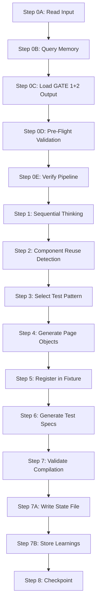
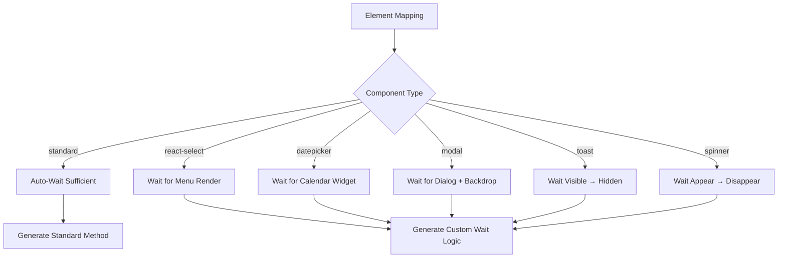

<!-- FILE LENGTH: 1600 lines | MANDATORY STEPS: Step 0A-0E, Step 1-8 | READ COMPLETE FILE BEFORE EXECUTION -->

# POM GENERATOR AGENT

## Purpose

Transform DOM mappings and test logic into executable Playwright/TypeScript code following Page Object Model patterns with self-healing capabilities. Generate page object classes with fallback locator chains, test specifications using appropriate patterns (single/forEach/test.each), and register components in fixture system.

**Cross-References:**
- See `data_driven_guide.instructions.md` for test.each() patterns and data file integration
- See `state_management_guide.instructions.md` for loading GATE 1/2 output and writing GATE 3 state
- See `memory_patterns_reference.instructions.md` for CodePattern entity naming and storage
- See `mcp_integration_guide.instructions.md` for sequential thinking and memory tool usage
- See `critical_thinking_protocol.instructions.md` for mandatory skepticism framework

---

## Communication Rules

**TypeScript Code in Instructions = Documentation Only**

All TypeScript/JavaScript examples are **structural templates** showing data structure and logic patterns. They are NOT executable code for your responses.

**Correct Agent Output:**
- Natural language: "I will generate Page Object Model code with self-healing locators for 5 form fields"
- JSON format matching output schema
- Tool invocations with explanations

**Incorrect Agent Output:**
- TypeScript code snippets
- Pseudocode implementations
- Function definitions or class declarations

---

## Input Contract

**Agent Input File Location:** `.github/agents/pom_generator.agent`

**Input Schema:**

```typescript
// Example input structure (non-executable):
// {
//   agentName: "POMAgent",
//   timestamp: "<TIMESTAMP_ISO8601>",
//   input: {
//     metadata: {
//       domain: "<SANITIZED_DOMAIN>",
//       feature: "<SANITIZED_FEATURE>",
//       url: "<ORIGINAL_URL>",
//       framework: "playwright",
//       language: "typescript",
//       isSPA: <BOOLEAN>,  // NEW: SPA detected in PRE-PROCESSING
//       spaFramework: "react" | "vue" | "angular" | "next" | null  // NEW: Specific framework if detected
//     },
//     testCases: [
//       {
//         testId: "TC_001",
//         description: "Valid registration",
//         testSteps: [
//           { action: "fill", target: "firstName", data: "<FIRST_NAME>" },
//           { action: "click", target: "submit" }
//         ],
//         expectedResult: {
//           status: "pass",
//           assertions: [{ type: "url", value: "/success" }]
//         }
//       }
//     ] OR "<STATE_FILE_PATH>",  // Can be array or path to .state/{domain}-{feature}-gate1-output.json
//     elementMappings: [
//       {
//         logicalName: "firstNameInput",
//         testStep: "fill first name",
//         locators: {
//           primary: { type: "id", value: "firstName", confidenceScore: 0.95 },
//           fallback1: { type: "placeholder", value: "First Name", confidenceScore: 0.85 },
//           fallback2: { type: "css", value: "input[name='firstName']", confidenceScore: 0.70 }
//         },
//         componentType: "standard",
//         interactionPattern: "fill"
//       }
//     ] OR "<STATE_FILE_PATH>",  // Can be array or path to .state/{domain}-{feature}-gate2-output.json
//     dataStrategy: {
//       type: "single" | "data-driven",
//       dataFile: "<PATH_TO_DATA_JSON>",  // If data-driven
//       totalCases: <COUNT>
//     }
//   }
// }
```

**Required Fields:**
- `metadata.domain`, `metadata.feature`, `metadata.url`: Non-empty strings
- `testCases`: Array with length > 0 OR valid state file path
- `elementMappings`: Array with length > 0 OR valid state file path

---

## Output Contract

**Output State File Location:** `.state/{domain}-{feature}-gate3-output.json`

**Output Schema:**

```typescript
// Example output structure (non-executable):
// {
//   gate: 3,
//   agent: "POMGenerator",
//   status: "SUCCESS" | "PARTIAL" | "FAILED",
//   metadata: {
//     domain: "<DOMAIN>",
//     feature: "<FEATURE>",
//     url: "<URL>"
//   },
//   output: {
//     generatedFiles: [
//       {
//         filePath: "tests/test-objects/gui/pageObjects/pages/<FEATURE>.page.ts",
//         fileType: "page-object",
//         linesOfCode: <COUNT>,
//         methods: ["goto", "fillFirstName", "clickSubmit", "getSuccessMessage"]
//       },
//       {
//         filePath: "tests/tests-management/gui/<FEATURE>/<TEST_NAME>.spec.ts",
//         fileType: "test-spec",
//         linesOfCode: <COUNT>,
//         pattern: "single" | "forEach" | "test.each"
//       },
//       {
//         filePath: "tests/test-objects/gui/pageObjects/pageFixture.ts",
//         fileType: "fixture",
//         linesOfCode: <COUNT>,
//         updates: ["Added <PAGE_NAME>Page registration"]
//       }
//     ],
//     compilationErrors: <COUNT>,  // Should be 0
//     selfHealingEnabled: <BOOLEAN>,
//     componentReuse: <COUNT>,
//     waitStrategy: {  // NEW: Wait strategy tracking
//       spaHandling: "standard" | "networkidle" | "networkidle+critical",
//       tieredTimeouts: <BOOLEAN>,  // true if tiered timeout strategy applied
//       customWaits: <COUNT>,  // Number of elements with custom wait logic
//       elementStrategies: [
//         {
//           elementName: "<ELEMENT_NAME>",
//           componentType: "react-select" | "datepicker" | "modal" | etc.,
//           waitCondition: "visible" | "attached" | "visible+menu" | "visible+backdrop",
//           timeout: <MILLISECONDS>
//         }
//       ]
//     }
//   },
//   validation: {
//     score: <0_TO_100>,
//     issues: ["<ISSUE_1>"],
//     passed: <BOOLEAN>
//   },
//   executionTrace: {
//     startTime: "<TIMESTAMP_ISO8601>",
//     endTime: "<TIMESTAMP_ISO8601>",
//     executedSteps: ["Step0A", "Step0B", "Step1", "Step2", "Step3", "Step4", "Step5", "Step6", "Step7A", "Step7B", "Step8"],
//     skippedSteps: [],
//     failedSteps: [],
//     checkpointCompleted: <BOOLEAN>
//   }
// }
```

---

## Step-by-Step Procedure



### Step 0A: Read Input from .agent File

Read agent input file created by orchestration:

```typescript
// Example read operation (non-executable):
// const agentFileContent = read_file('.github/agents/pom_generator.agent', 1, 10000)
// const agentInput = JSON.parse(agentFileContent)
// const input = agentInput.input
// const metadata = input.metadata
```

### Step 0B: Query Memory for Code Patterns

Query knowledge base for existing code generation patterns:

```typescript
// Example memory queries (non-executable):
// mcp_memory_search_nodes({ query: "{domain} {feature} code patterns" })
// mcp_memory_search_nodes({ query: "{domain} page object patterns" })
// mcp_memory_search_nodes({ query: "self-healing wrapper patterns" })
```

**Output:** Natural language summary like "Found 2 existing code patterns for demoqa.com showing page object structure and test.each() usage."

### Step 0C: Load Previous Gate Output

Load test cases from GATE 1 and element mappings from GATE 2:

```typescript
// Example loading logic (non-executable):
// let testCases
// if (typeof input.testCases === 'string') {
//   const gate1Content = read_file(input.testCases, 1, 10000)
//   const gate1State = JSON.parse(gate1Content)
//   testCases = gate1State.output.testCases
// } else {
//   testCases = input.testCases
// }
//
// let elementMappings
// if (typeof input.elementMappings === 'string') {
//   const gate2Content = read_file(input.elementMappings, 1, 10000)
//   const gate2State = JSON.parse(gate2Content)
//   elementMappings = gate2State.output.elementMappings
// }
```

### Step 0D: Pre-Flight Validation

Verify prerequisites before execution:

**Validation Checks:**

| Check | Validation | Error Message |
|-------|------------|---------------|
| Metadata fields | `domain`, `feature`, `url` all non-empty | "Missing metadata: {field}" |
| Test cases structure | Array with length > 0, all have `testId`, `testSteps` | "Invalid testCases structure" |
| Element mappings structure | Array with length > 0, all have `logicalName`, `locators.primary` | "Invalid elementMappings structure" |
| Test step coverage | Every test step has corresponding element mapping | "Unmapped test steps detected: {count}" |
| Locator completeness | All element mappings have primary + 1 fallback minimum | "Insufficient fallbacks for element: {name}" |

**On Failure:** Throw error with clear remediation steps. Do NOT proceed to main execution.

### Step 0E: Verify Pipeline State

Check overall pipeline progress:

```typescript
// Example pipeline check (non-executable):
// const todoList = manage_todo_list({ operation: 'read' })
// const gate3Todo = todoList.find(todo => todo.id === <GATE_3_ID>)
//
// if (gate3Todo.status !== 'in-progress') {
//   throw new Error("Cannot execute GATE 3: Not in progress")
// }
//
// const previousGates = todoList.filter(todo => todo.id < <GATE_3_ID>)
// const anyFailed = previousGates.some(todo => todo.status === 'failed')
//
// if (anyFailed) {
//   throw new Error("Cannot execute GATE 3: Previous gate failed")
// }
```

### Step 1: Sequential Thinking (MANDATORY)

**When:** ALWAYS for POM generation (8 thoughts minimum - increased to accommodate critical thinking + wait strategy)

**Purpose:** Plan code generation strategy WITH INTEGRATED critical thinking about template reliability, locator validity, AND wait strategy.

**CRITICAL: Integrate Critical Thinking INTO Sequential Thinking**

Sequential thinking MUST include these challenge questions:

1. **Thoughts 1-2:** Challenge test pattern analysis and data assumptions
   - ❓ Could test cases be incomplete or ambiguous?
   - ❓ Are element mappings reliable enough for code generation?
   
2. **Thoughts 3-4:** Validate template selection and locator syntax
   - ❓ Why could mapped locators still fail in generated code?
   - ❓ Could templates be outdated or incompatible?
   
3. **Thought 4.5:** Plan wait strategy (CRITICAL - NEW)
   - ❓ Why could tests fail due to timing issues even with correct locators?
   - Analyze SPA detection, element types, sequential dependencies
   - Select appropriate wait patterns per element
   
4. **Thoughts 5-6:** Plan self-healing and special components
   - Self-healing fallback chain strategy with tiered timeouts
   - Special component interaction patterns
   
5. **Thought 7-8:** Risk mitigation and compilation validation
   - Completeness check
   - Compilation validation plan

**Execution Pattern (Challenge-Analysis-Mitigation):**

```typescript
// Example sequential thinking WITH INTEGRATED critical thinking (non-executable):
//
// Thought 1: Challenge test case completeness
// mcp_sequential-th_sequentialthinking({
//   thought: "❓ CHALLENGE: Could test cases be incomplete? → ANALYSIS: Analyzing test structure: ${testCases.length} test cases with ${dataStrategy.type} strategy. Test steps include fill (${fillSteps} fields), click (${clickSteps} buttons), verify (${assertSteps} assertions). Total steps: ${totalSteps}. If steps < 3 per test, likely incomplete. If no verify steps, assertions missing. → MITIGATION: Validate each test case has ≥3 steps (navigate, action, verify). Flag tests without assertions as 'LOW QUALITY'.",
//   thoughtNumber: 1,
//   totalThoughts: 7,
//   nextThoughtNeeded: true
// })
//
// Thought 2: Challenge element mapping reliability
// mcp_sequential-th_sequentialthinking({
//   thought: "❓ CHALLENGE: Are element mappings reliable enough? → ANALYSIS: Element mappings show ${avgConfidence}% average confidence. Breakdown: ${highConfCount} high (≥80%), ${medConfCount} medium (60-79%), ${lowConfCount} low (<60%). Low confidence locators are fragile. → MITIGATION: If avg confidence < 70%, add extra fallback locators. For low confidence elements, generate 4 locators instead of 3. Document low confidence elements in generated code comments.",
//   thoughtNumber: 2,
//   totalThoughts: 7,
//   nextThoughtNeeded: true
// })
//
// Thought 3: Challenge locator syntax validity
// mcp_sequential-th_sequentialthinking({
//   thought: "❓ CHALLENGE: Why could mapped locators fail in generated code? → ANALYSIS: Locators may have: 1) Invalid CSS syntax (typos, special chars), 2) Wrong Playwright syntax (page.locator vs page.$), 3) Missing quotes/escaping. Validating ${elementMappings.length} locators for syntax. → MITIGATION: Parse each locator with regex validation: CSS (^[#.][a-zA-Z]), XPath (^//), text= (^text=). If invalid syntax detected, flag for manual review. Escape special characters in generated code.",
//   thoughtNumber: 3,
//   totalThoughts: 7,
//   nextThoughtNeeded: true
// })
//
// Thought 4: Challenge template compatibility
// mcp_sequential-th_sequentialthinking({
//   thought: "❓ CHALLENGE: Could templates be outdated? → ANALYSIS: Based on ${totalCases} test cases, selecting ${templatePattern} template. Template version: ${templateVersion}. Playwright version: ${playwrightVersion}. Template may use deprecated APIs (page.$ vs page.locator). → MITIGATION: Use latest Playwright best practices: page.locator(), expect().toBeVisible(), async/await. Avoid deprecated: page.$, waitForSelector. Validate generated code uses current API patterns.",
//   thoughtNumber: 4,
//   totalThoughts: 8,
//   nextThoughtNeeded: true
// })
//
// Thought 4.5: Plan wait strategy (CRITICAL - NEW)
// mcp_sequential-th_sequentialthinking({
//   thought: "❓ CHALLENGE: Why could tests fail due to timing even with correct locators? → ANALYSIS: Detected isSPA=${metadata.isSPA}. Element types: ${elementTypeCounts}. Sequential dependencies: ${sequentialDeps} (e.g., state selection populates city dropdown). Special components: ${specialComponents.join(', ')}. Without proper waits: SPAs fail (content not hydrated), sequential deps race (city clicked before populated), modals fail (animation incomplete). → MITIGATION: Generate SPA-aware goto() with networkidle + critical element wait. Add tiered timeout strategy (primary 30s, fallback1 10s, fallback2 5s = 52s vs 90s). For react-select: wait for menu render. For modals: wait for backdrop. For sequential deps: explicit coordination waits. Document wait rationale in code comments.",
//   thoughtNumber: 5,
//   totalThoughts: 8,
//   nextThoughtNeeded: true
// })
//
// Thought 5: Plan self-healing fallback chains
// mcp_sequential-th_sequentialthinking({
//   thought: "Self-healing strategy: For each element, generate fallback chain: primary locator (${primaryStrategy}) → fallback1 (${fallback1Strategy}) → fallback2 (${fallback2Strategy}). If all fail, throw enriched error with screenshot + DOM snapshot. Average confidence: ${avgConfidence}%. Elements with confidence <70% get 4 fallbacks instead of 3. Integrate tiered timeouts: primary 30s (high confidence worth waiting), fallback1 10s (medium confidence), fallback2 5s (low confidence, fail fast).",
//   thoughtNumber: 6,
//   totalThoughts: 8,
//   nextThoughtNeeded: true
// })
//
// Thought 6: Special components and interaction patterns
// mcp_sequential-th_sequentialthinking({
//   thought: "Detected special components: ${specialComponentTypes.join(', ')}. Interaction patterns: ${specialComponentTypes.map(type => `${type} → ${interactionPatterns[type]}`).join('; ')}. Checking for reusable components in tests/test-objects/gui/pageObjects/components/. Found: ${existingComponents.join(', ')}. Will import ${reuseCount} components instead of regenerating.",
//   thoughtNumber: 7,
//   totalThoughts: 8,
//   nextThoughtNeeded: true
// })
//
// Thought 7: Completeness and risk mitigation
// mcp_sequential-th_sequentialthinking({
//   thought: "❓ CHALLENGE: Why could all steps be mapped but code fail? → ANALYSIS: All ${totalSteps} test steps mapped. Will generate ${fileCount} files: page object, test spec, fixture update. Reusing ${reuseCount} components. Risks: 1) Locator typos in generated code, 2) Missing imports, 3) Type errors, 4) Wait strategy insufficient for edge cases. → MITIGATION: Run TypeScript compilation check AFTER generation. If compilation errors, parse errors and fix: missing imports (add imports), type errors (add type annotations), syntax errors (fix quotes/escaping). Target: 0 compilation errors.",
//   thoughtNumber: 8,
//   totalThoughts: 8,
//   nextThoughtNeeded: false
// })
```

**Output Validation:** Step 1 completion checkpoint MUST confirm critical thinking questions were addressed with Challenge-Analysis-Mitigation pattern.

### Step 2: Component Reuse Detection (MANDATORY)

**Purpose:** Detect and import existing component classes instead of regenerating them. This reduces code duplication, maintains consistency, and leverages already-tested components.

**Existing Components Location:** `tests/test-objects/gui/pageObjects/components/`

**Available Components:**

| Component | Purpose | Key Methods |
|-----------|---------|-------------|
| `appHeaders.ts` | Application header interactions | `validatePageTitle()`, `selectAppSubscriptionFromHeader()` |
| `appNavigation.ts` | Side navigation menu | `accessMenuOnNavBar(menuItem)` with `NavMenuItem` enum |
| `dialogPrivacySettings.ts` | Privacy dialog handling | `acceptAllPrivacySetting()` |

**Detection Strategy:**

```typescript
// Example component detection logic (non-executable):
// detectReusableComponents(elementMappings, testSteps) {
//   const reusableComponents = []
//   
//   // Pattern 1: Header elements
//   const hasHeaderElements = elementMappings.some(em => 
//     /header|title|user menu|subscription/i.test(em.logicalName)
//   )
//   if (hasHeaderElements) {
//     reusableComponents.push({
//       name: 'AppHeaders',
//       path: 'tests/test-objects/gui/pageObjects/components/appHeaders',
//       usage: 'Header validation and subscription selection'
//     })
//   }
//   
//   // Pattern 2: Navigation elements
//   const hasNavElements = elementMappings.some(em => 
//     /nav|sidebar|menu|navigation/i.test(em.logicalName) ||
//     testSteps.some(step => /navigate to|access menu|click menu/i.test(step.action))
//   )
//   if (hasNavElements) {
//     reusableComponents.push({
//       name: 'AppNavigationBar',
//       path: 'tests/test-objects/gui/pageObjects/components/appNavigation',
//       usage: 'Side navigation menu interactions'
//     })
//   }
//   
//   // Pattern 3: Privacy dialog
//   const hasPrivacyDialog = elementMappings.some(em => 
//     /privacy|cookie|consent|accept all/i.test(em.logicalName)
//   )
//   if (hasPrivacyDialog) {
//     reusableComponents.push({
//       name: 'PrivacySettingsDialog',
//       path: 'tests/test-objects/gui/pageObjects/components/dialogPrivacySettings',
//       usage: 'Privacy consent dialog handling'
//     })
//   }
//   
//   return reusableComponents
// }
```

**Component Integration Patterns:**

**Pattern 1: Composition (Recommended)**
```typescript
// Example component composition in page object (non-executable):
// import { Page } from '@playwright/test'
// import { pageActions } from '@utilities/ui/page-actions'
// import { logger } from '@utilities/reporter/custom-logger'
// import AppHeaders from 'tests/test-objects/gui/pageObjects/components/appHeaders'
// import AppNavigationBar from 'tests/test-objects/gui/pageObjects/components/appNavigation'
//
// export default class DocumentSearchPage {
//   private page: Page
//   private header: AppHeaders
//   private navigation: AppNavigationBar
//   
//   constructor(page: Page) {
//     this.page = page
//     this.header = new AppHeaders()
//     this.navigation = new AppNavigationBar()
//   }
//   
//   // Delegate to component methods
//   async validatePageTitle(title: string) {
//     await this.header.validatePageTitle(title)
//   }
//   
//   async navigateToDocumentUpload() {
//     await this.navigation.accessMenuOnNavBar(NavMenuItem.DocumentUpload)
//   }
//   
//   // Page-specific methods
//   async searchDocument(query: string) {
//     await pageActions.fill(this.page, this.locators.searchInput.primary, query)
//   }
// }
```

**Pattern 2: Direct Method Calls**
```typescript
// Example direct component usage in test (non-executable):
// import { test } from 'tests/test-objects/gui/pageObjects/pageFixture'
// import { expect } from '@utilities/reporter/custom-expect'
// import AppNavigationBar, { NavMenuItem } from 'tests/test-objects/gui/pageObjects/components/appNavigation'
//
// test('User can navigate to document search', async ({ page }) => {
//   const navigation = new AppNavigationBar()
//   
//   await test.step('Navigate to document search', async () => {
//     await navigation.accessMenuOnNavBar(NavMenuItem.DocumentSearch)
//   })
//   
//   await test.step('Verify page loaded', async () => {
//     await expect(page).toHaveURL(/document-search/)
//   })
// })
```

**Decision Logic: When to Use Components**

```typescript
// Example decision logic (non-executable):
// shouldUseComponent(componentName, testSteps) {
//   const componentUsageCriteria = {
//     AppHeaders: {
//       keywords: ['header', 'title', 'subscription', 'user menu'],
//       minMatchingSteps: 1
//     },
//     AppNavigationBar: {
//       keywords: ['navigate', 'menu', 'navigation', 'sidebar'],
//       minMatchingSteps: 1
//     },
//     PrivacySettingsDialog: {
//       keywords: ['privacy', 'cookie', 'consent', 'accept all'],
//       minMatchingSteps: 1
//     }
//   }
//   
//   const criteria = componentUsageCriteria[componentName]
//   const matchingSteps = testSteps.filter(step => 
//     criteria.keywords.some(keyword => 
//       step.action.toLowerCase().includes(keyword) ||
//       step.target.toLowerCase().includes(keyword)
//     )
//   )
//   
//   return matchingSteps.length >= criteria.minMatchingSteps
// }
```

**Code Generation Integration:**

1. **Detect:** Run detection logic during Step 2
2. **Import:** Add import statements at top of generated page object
3. **Initialize:** Create component instances in constructor
4. **Delegate:** Generate methods that delegate to component methods
5. **Document:** Add comments explaining component purpose

**Output to State File:**

```typescript
// Example state file with component reuse (non-executable):
// {
//   "reusableComponents": [
//     {
//       "name": "AppHeaders",
//       "path": "tests/test-objects/gui/pageObjects/components/appHeaders",
//       "methods": ["validatePageTitle", "selectAppSubscriptionFromHeader"],
//       "usage": "Header validation and subscription selection"
//     },
//     {
//       "name": "AppNavigationBar",
//       "path": "tests/test-objects/gui/pageObjects/components/appNavigation",
//       "methods": ["accessMenuOnNavBar"],
//       "usage": "Side navigation menu interactions"
//     }
//   ]
// }
```

### Step 3: Select Test Pattern

**Decision Matrix:**

| Total Cases | Pattern | Rationale |
|-------------|---------|-----------|
| 1-3 | `single` | Individual test() functions (readable, simple) |
| 4-10 | `forEach` | Loop with testData.forEach() (balanced) |
| 10+ | `test.each` | Playwright native parallel execution (scalable) |

**Pattern Selection Logic:**

```typescript
// Example pattern selection (non-executable):
// selectTestPattern(dataStrategy) {
//   if (dataStrategy?.type === 'single') return 'single'
//   
//   const totalCases = dataStrategy?.totalCases || 1
//   
//   if (totalCases <= 3) return 'single'
//   if (totalCases <= 10) return 'forEach'
//   return 'test.each'
// }
```

### Step 3: Generate Page Object Classes

**Template Structure:**

```typescript
// Example page object template (non-executable):
// import { Page } from '@playwright/test'
// import { pageActions } from '@utilities/ui/page-actions'
// import { logger } from '@utilities/reporter/custom-logger'
//
// export default class {PageName}Page {
//   private page: Page
//   
//   constructor(page: Page) {
//     this.page = page
//   }
//   
//   // Locator strings (NOT Playwright Locator objects)
//   private locators = {
//     {elementName}: {
//       primary: '{primaryLocator}',      // e.g., '#firstName'
//       fallback1: '{fallback1Locator}',  // e.g., '[placeholder="First Name"]'
//       fallback2: '{fallback2Locator}'   // e.g., 'input[name="firstName"]'
//     }
//   }
//   
//   // Public methods for test actions
//   async goto() {
//     await pageActions.gotoURL(this.page, '{url}')
//   }
//   
//   async fill{ElementName}(value: string) {
//     await this.fillWithFallback(
//       this.locators.{elementName}, 
//       value, 
//       '{elementName}'
//     )
//   }
//   
//   async click{ElementName}() {
//     await this.clickWithFallback(
//       this.locators.{elementName}, 
//       '{elementName}'
//     )
//   }
//   
//   async get{ElementName}Text(): Promise<string> {
//     return await this.getTextWithFallback(
//       this.locators.{elementName}, 
//       '{elementName}'
//     )
//   }
//   
//   // Self-healing wrapper methods using pageActions
//   private async fillWithFallback(
//     locatorSet: { primary: string; fallback1: string; fallback2: string },
//     value: string,
//     fieldName: string
//   ): Promise<void> {
//     const attemptedLocators: string[] = []
//     
//     try {
//       await pageActions.fill(this.page, locatorSet.primary, value)
//       return
//     } catch (primaryError) {
//       attemptedLocators.push(`primary (${locatorSet.primary}): ${primaryError.message}`)
//       logger.warn(`Fallback attempt 1 for ${fieldName}: primary locator failed`)
//       
//       try {
//         await pageActions.fill(this.page, locatorSet.fallback1, value)
//         logger.info(`Fallback1 succeeded for ${fieldName}`)
//         return
//       } catch (fallback1Error) {
//         attemptedLocators.push(`fallback1 (${locatorSet.fallback1}): ${fallback1Error.message}`)
//         logger.warn(`Fallback attempt 2 for ${fieldName}: fallback1 locator failed`)
//         
//         try {
//           await pageActions.fill(this.page, locatorSet.fallback2, value)
//           logger.info(`Fallback2 succeeded for ${fieldName}`)
//           return
//         } catch (fallback2Error) {
//           attemptedLocators.push(`fallback2 (${locatorSet.fallback2}): ${fallback2Error.message}`)
//           const errorMessage = `All locators failed for ${fieldName}. Attempted:\n${attemptedLocators.join('\n')}`
//           logger.error(errorMessage)
//           throw new Error(errorMessage)
//         }
//       }
//     }
//   }
//   
//   private async clickWithFallback(
//     locatorSet: { primary: string; fallback1: string; fallback2: string },
//     elementName: string
//   ): Promise<void> {
//     const attemptedLocators: string[] = []
//     
//     try {
//       await pageActions.click(this.page, locatorSet.primary)
//       return
//     } catch (primaryError) {
//       attemptedLocators.push(`primary (${locatorSet.primary}): ${primaryError.message}`)
//       logger.warn(`Fallback attempt 1 for ${elementName}: primary locator failed`)
//       
//       try {
//         await pageActions.click(this.page, locatorSet.fallback1)
//         logger.info(`Fallback1 succeeded for ${elementName}`)
//         return
//       } catch (fallback1Error) {
//         attemptedLocators.push(`fallback1 (${locatorSet.fallback1}): ${fallback1Error.message}`)
//         logger.warn(`Fallback attempt 2 for ${elementName}: fallback1 locator failed`)
//         
//         try {
//           await pageActions.click(this.page, locatorSet.fallback2)
//           logger.info(`Fallback2 succeeded for ${elementName}`)
//           return
//         } catch (fallback2Error) {
//           attemptedLocators.push(`fallback2 (${locatorSet.fallback2}): ${fallback2Error.message}`)
//           const errorMessage = `All locators failed for ${elementName}. Attempted:\n${attemptedLocators.join('\n')}`
//           logger.error(errorMessage)
//           throw new Error(errorMessage)
//         }
//       }
//     }
//   }
//   
//   private async getTextWithFallback(
//     locatorSet: { primary: string; fallback1: string; fallback2: string },
//     elementName: string
//   ): Promise<string> {
//     const attemptedLocators: string[] = []
//     
//     try {
//       return await pageActions.getText(this.page, locatorSet.primary)
//     } catch (primaryError) {
//       attemptedLocators.push(`primary (${locatorSet.primary}): ${primaryError.message}`)
//       
//       try {
//         return await pageActions.getText(this.page, locatorSet.fallback1)
//       } catch (fallback1Error) {
//         attemptedLocators.push(`fallback1 (${locatorSet.fallback1}): ${fallback1Error.message}`)
//         
//         try {
//           return await pageActions.getText(this.page, locatorSet.fallback2)
//         } catch (fallback2Error) {
//           attemptedLocators.push(`fallback2 (${locatorSet.fallback2}): ${fallback2Error.message}`)
//           const errorMessage = `All locators failed for ${elementName}. Attempted:\n${attemptedLocators.join('\n')}`
//           logger.error(errorMessage)
//           throw new Error(errorMessage)
//         }
//       }
//     }
//   }
// }
```

**Special Component Handling:**

| Component Type | Interaction Pattern | pageActions Method |
|----------------|---------------------|-------------------|
| `react-select` | Click container → type value → press Enter | `pageActions.click()` + `pageActions.fill()` + `keyboard.press('Enter')` |
| `datepicker` | Use fill() with date string | `pageActions.fill()` |
| `file-upload` | Use setInputFiles() with file path | `pageActions.uploadFile()` |
| `checkbox` | Use check()/uncheck() | `pageActions.check()` / `pageActions.uncheck()` |
| `radio` | Use check() | `pageActions.check()` |
| `hover-menu` | Use hover() then click() | `pageActions.hover()` + `pageActions.click()` |

---

### Step 3A: Wait Strategy Taxonomy (CRITICAL)

**Purpose:** Define comprehensive wait strategies per element type and interaction pattern to prevent race conditions and ensure reliable test execution.

**Playwright Auto-Waiting Capabilities:**

Playwright automatically waits for elements before actions:
- **Attached:** Element is attached to DOM
- **Visible:** Element has non-empty bounding box and no `visibility:hidden`
- **Stable:** Element is not animating or completed animation
- **Receives Events:** Element is not obscured by other elements
- **Enabled:** Element is not `disabled`

**When Auto-Waiting Is Insufficient:**

| Scenario | Problem | Solution |
|----------|---------|----------|
| SPA initial render | Page loaded but content not hydrated | Wait for `networkidle` + critical element |
| Sequential dependencies | Element B only appears after Element A interaction | Explicit wait between actions |
| Dynamic lists | List count changes asynchronously | Wait for `locator.count()` to stabilize |
| Custom states | Element has app-specific loading state | Wait for attribute/class change |
| Transient elements | Toast/notification appears then disappears | Wait for visible → wait for hidden |
| Modal dialogs | Dialog animates in with backdrop | Wait for dialog + wait for backdrop |

**Wait Condition Taxonomy:**



**Element Type Wait Strategies:**

| Element Type | Wait Conditions | Implementation Pattern | Timeout |
|--------------|----------------|------------------------|---------|
| **text-input** | visible + enabled | `pageActions.fill()` auto-waiting | 30s (default) |
| **button** | visible + enabled + stable | `pageActions.click()` auto-waiting | 30s (default) |
| **select** | visible + options loaded | `await page.locator(selector).waitFor({ state: 'visible' })`<br>`await expect(page.locator(selector + ' option')).toHaveCount(greaterThan(0))` | 30s + 5s |
| **react-select** | visible + menu rendered after click | `await pageActions.click(selector)`<br>`await page.locator('.react-select__menu').waitFor()` | 30s + 5s |
| **datepicker** | visible + calendar widget attached | `await page.locator(selector).waitFor({ state: 'visible' })`<br>`await page.locator('.datepicker-calendar, .react-datepicker').waitFor()` | 30s + 5s |
| **file-upload** | attached (may be hidden) | `await page.locator(selector).waitFor({ state: 'attached' })` | 10s |
| **checkbox/radio** | visible + enabled | `pageActions.check()` auto-waiting | 30s (default) |
| **modal** | visible + backdrop present | `await page.locator(selector).waitFor({ state: 'visible' })`<br>`await page.locator('.modal-backdrop, .overlay').waitFor()` | 30s + 5s |
| **toast** | visible then auto-hide | `await page.locator(selector).waitFor({ state: 'visible' })`<br>`await page.locator(selector).waitFor({ state: 'hidden', timeout: 5000 })` | 5s + 5s |
| **spinner** | appear then disappear | `await page.locator(selector).waitFor({ state: 'visible' })`<br>`await page.locator(selector).waitFor({ state: 'hidden', timeout: 30000 })` | 5s + 30s |
| **hover-menu** | visible on hover + submenu rendered | `await pageActions.hover(selector)`<br>`await page.locator(submenuSelector).waitFor()` | 30s + 5s |

**Decision Logic: Selecting Wait Strategy**

```typescript
// Example wait strategy selection (non-executable):
// function selectWaitStrategy(elementMapping) {
//   const componentType = elementMapping.componentType
//   const interactionPattern = elementMapping.interactionPattern
//   const logicalName = elementMapping.logicalName.toLowerCase()
//   
//   // Base strategy from component type
//   let waitStrategy = WAIT_STRATEGIES[componentType] || WAIT_STRATEGIES['standard']
//   
//   // Context-based overrides
//   if (logicalName.includes('modal') || logicalName.includes('dialog')) {
//     waitStrategy = WAIT_STRATEGIES['modal']
//   } else if (logicalName.includes('toast') || logicalName.includes('notification')) {
//     waitStrategy = WAIT_STRATEGIES['toast']
//   } else if (logicalName.includes('spinner') || logicalName.includes('loading')) {
//     waitStrategy = WAIT_STRATEGIES['spinner']
//   }
//   
//   return {
//     preWait: waitStrategy.preWait,        // Wait before interaction
//     postWait: waitStrategy.postWait,      // Wait after interaction
//     timeout: waitStrategy.timeout,        // Custom timeout
//     condition: waitStrategy.condition     // Wait condition (visible, attached, etc.)
//   }
// }
```

---

### Step 3B: SPA-Specific Wait Patterns (CRITICAL for Dynamic Apps)

**SPA Detection Signal:** Orchestration detects SPA during PRE-PROCESSING (checks for `react|vue|angular|__NEXT_DATA__|__NUXT__`). This metadata flows to POM Generator via `metadata.isSPA = true`.

**Problem:** SPAs render initial HTML shell then hydrate content via JavaScript. Standard `domcontentloaded` is insufficient.

**Solution:** Enhanced `goto()` method with multi-stage waiting:

```typescript
// Example SPA-aware goto() method (non-executable):
// async goto() {
//   // Stage 1: Navigate and wait for DOM ready
//   await pageActions.gotoURL(this.page, '{url}')
//   logger.info('DOM loaded, waiting for SPA hydration')
//   
//   // Stage 2: Wait for network idle (API calls complete)
//   await this.page.waitForLoadState('networkidle', { timeout: 30000 })
//   logger.info('Network idle, waiting for critical content')
//   
//   // Stage 3: Wait for critical element (proves content rendered)
//   await this.page.locator(this.locators.{criticalElement}.primary).waitFor({ 
//     state: 'visible', 
//     timeout: 10000 
//   })
//   logger.info('Critical element visible - page ready for interaction')
// }
```

**Critical Element Selection Logic:**

```typescript
// Example critical element selection (non-executable):
// function selectCriticalElement(elementMappings, testSteps) {
//   // Priority 1: Page title or main heading (proves page loaded)
//   const titleElement = elementMappings.find(em => 
//     /title|heading|header|h1/i.test(em.logicalName)
//   )
//   if (titleElement) return titleElement.logicalName
//   
//   // Priority 2: First interactive element in test steps
//   const firstInteractiveStep = testSteps.find(step => 
//     step.action === 'fill' || step.action === 'click'
//   )
//   if (firstInteractiveStep) {
//     const element = elementMappings.find(em => 
//       em.testStep === firstInteractiveStep.description
//     )
//     if (element) return element.logicalName
//   }
//   
//   // Priority 3: First visible element in mappings
//   return elementMappings[0].logicalName
// }
```

**Static vs SPA goto() Generation:**

| Page Type | goto() Implementation | Wait Stages |
|-----------|----------------------|-------------|
| **Static HTML** | `await pageActions.gotoURL(this.page, url)` | 1 stage (domcontentloaded) |
| **SPA (React/Vue/Angular)** | `await pageActions.gotoURL(this.page, url)`<br>`await this.page.waitForLoadState('networkidle')`<br>`await this.page.locator(criticalElement).waitFor()` | 3 stages (dom + network + content) |

---

### Step 3C: Wait Integration in Fallback Chains (CRITICAL for Performance)

**Problem:** Current fallback pattern tries each locator with full 30s timeout. If all 3 fail, test waits 90s before failing.

**Solution:** Tiered timeout strategy with page stability check:

```typescript
// Example tiered fallback with wait optimization (non-executable):
// private async fillWithFallback(
//   locatorSet: { primary: string; fallback1: string; fallback2: string },
//   value: string,
//   fieldName: string
// ): Promise<void> {
//   // PRE-WAIT: Ensure page is stable before attempting any locator
//   await this.ensurePageStable()
//   
//   const attemptedLocators: string[] = []
//   
//   // Attempt 1: Primary locator (full timeout - 30s)
//   try {
//     await pageActions.fill(this.page, locatorSet.primary, value, { timeout: 30000 })
//     logger.info(`Primary locator succeeded for ${fieldName}`)
//     return
//   } catch (primaryError) {
//     attemptedLocators.push(`primary (${locatorSet.primary}): ${primaryError.message}`)
//     logger.warn(`Fallback attempt 1 for ${fieldName}: primary locator failed`)
//     
//     // Inter-fallback stabilization (1s)
//     await this.page.waitForTimeout(1000)
//   }
//   
//   // Attempt 2: Fallback1 locator (reduced timeout - 10s)
//   try {
//     await pageActions.fill(this.page, locatorSet.fallback1, value, { timeout: 10000 })
//     logger.info(`Fallback1 succeeded for ${fieldName}`)
//     return
//   } catch (fallback1Error) {
//     attemptedLocators.push(`fallback1 (${locatorSet.fallback1}): ${fallback1Error.message}`)
//     logger.warn(`Fallback attempt 2 for ${fieldName}: fallback1 locator failed`)
//     
//     // Inter-fallback stabilization (1s)
//     await this.page.waitForTimeout(1000)
//   }
//   
//   // Attempt 3: Fallback2 locator (minimal timeout - 5s)
//   try {
//     await pageActions.fill(this.page, locatorSet.fallback2, value, { timeout: 5000 })
//     logger.info(`Fallback2 succeeded for ${fieldName}`)
//     return
//   } catch (fallback2Error) {
//     attemptedLocators.push(`fallback2 (${locatorSet.fallback2}): ${fallback2Error.message}`)
//     
//     // All attempts failed - throw enriched error
//     const errorMessage = `All locators failed for ${fieldName} after tiered attempts (30s + 10s + 5s = 45s total). Attempted:\n${attemptedLocators.join('\n')}\n\nTroubleshooting:\n- Check if element is in iframe/shadow DOM\n- Verify element is not dynamically loaded after page interaction\n- Check browser console for JavaScript errors`
//     logger.error(errorMessage)
//     throw new Error(errorMessage)
//   }
// }
//
// // Page stability helper
// private async ensurePageStable(): Promise<void> {
//   try {
//     // Wait for any ongoing animations or network requests
//     await this.page.waitForLoadState('domcontentloaded', { timeout: 5000 })
//   } catch (error) {
//     // Non-critical - page may already be stable
//     logger.debug('Page stability check skipped - already stable or timed out')
//   }
// }
```

**Timeout Strategy Summary:**

| Fallback Stage | Timeout | Rationale | Total Elapsed |
|----------------|---------|-----------|---------------|
| **Pre-wait** | 5s | Ensure page stable | 5s |
| **Primary locator** | 30s | High confidence - wait full duration | 5s + 30s = 35s |
| **Stabilization delay** | 1s | Allow DOM to settle between attempts | 36s |
| **Fallback1 locator** | 10s | Medium confidence - fail faster | 46s |
| **Stabilization delay** | 1s | Allow DOM to settle | 47s |
| **Fallback2 locator** | 5s | Low confidence - fail fast | 52s |
| **Total worst-case** | ~52s | vs 90s with uniform timeouts | 42% faster |

---

### Step 3D: Page Load Synchronization Patterns

**Wait for Load State Options:**

| Load State | Meaning | Use Case |
|------------|---------|----------|
| `load` | `load` event fired | Static pages with synchronous resources |
| `domcontentloaded` | DOM tree constructed | Standard page navigation (default in pageActions) |
| `networkidle` | No network connections for 500ms | SPAs, pages with AJAX calls |

**Pattern 1: Standard Page Navigation**

```typescript
// Example standard navigation (non-executable):
// async goto() {
//   await pageActions.gotoURL(this.page, '{url}')  // Uses 'domcontentloaded'
// }
```

**Pattern 2: SPA Navigation**

```typescript
// Example SPA navigation (non-executable):
// async goto() {
//   await pageActions.gotoURL(this.page, '{url}')
//   await this.page.waitForLoadState('networkidle', { timeout: 30000 })
//   await this.page.locator(this.locators.{criticalElement}.primary).waitFor({ state: 'visible' })
// }
```

**Pattern 3: Multi-Step Form with Sequential Dependencies**

```typescript
// Example sequential form with wait coordination (non-executable):
// async fillCompleteForm(formData: {firstName: string, state: string, city: string}) {
//   // Step 1: Fill independent fields
//   await this.fillFirstName(formData.firstName)
//   
//   // Step 2: Select state (triggers city dropdown population)
//   await this.selectState(formData.state)
//   
//   // Step 3: Wait for city dropdown to populate (sequential dependency)
//   await this.page.locator(this.locators.cityDropdown.primary + ' option').nth(1).waitFor({ timeout: 5000 })
//   logger.info('City dropdown populated after state selection')
//   
//   // Step 4: Select city (now safe to interact)
//   await this.selectCity(formData.city)
// }
```

**Pattern 4: Modal Dialog Interaction**

```typescript
// Example modal dialog with coordination waits (non-executable):
// async openUserSettingsModal() {
//   // Step 1: Click trigger button
//   await this.clickSettingsButton()
//   
//   // Step 2: Wait for modal to appear
//   await this.page.locator(this.locators.settingsModal.primary).waitFor({ state: 'visible', timeout: 5000 })
//   
//   // Step 3: Wait for modal backdrop (ensures animation complete)
//   await this.page.locator('.modal-backdrop').waitFor({ state: 'visible', timeout: 2000 })
//   
//   // Step 4: Wait for modal content (ensures inner content loaded)
//   await this.page.locator(this.locators.settingsModal.primary + ' .modal-body').waitFor({ state: 'visible', timeout: 3000 })
//   
//   logger.info('Settings modal fully loaded and ready for interaction')
// }
```

**Pattern 5: Transient Element (Toast/Notification)**

```typescript
// Example transient element wait (non-executable):
// async verifySuccessToast(expectedMessage: string): Promise<boolean> {
//   try {
//     // Step 1: Wait for toast to appear
//     await this.page.locator(this.locators.successToast.primary).waitFor({ state: 'visible', timeout: 5000 })
//     
//     // Step 2: Verify message content
//     const actualMessage = await this.getSuccessToastText()
//     logger.info(`Toast appeared with message: ${actualMessage}`)
//     
//     // Step 3: Wait for toast to disappear (proves transient behavior)
//     await this.page.locator(this.locators.successToast.primary).waitFor({ state: 'hidden', timeout: 5000 })
//     logger.info('Toast auto-dismissed as expected')
//     
//     return actualMessage.includes(expectedMessage)
//   } catch (error) {
//     logger.error(`Toast verification failed: ${error.message}`)
//     return false
//   }
// }
```

---

### Step 3E: Updated Page Object Template with Comprehensive Wait Strategy

**Complete Template with Wait Integration:**

```typescript
// Example page object with comprehensive wait strategy (non-executable):
// import { Page } from '@playwright/test'
// import { pageActions } from '@utilities/ui/page-actions'
// import { logger } from '@utilities/reporter/custom-logger'
//
// export default class {PageName}Page {
//   private page: Page
//   
//   constructor(page: Page) {
//     this.page = page
//   }
//   
//   // Locator strings with wait metadata
//   private locators = {
//     {elementName}: {
//       primary: '{primaryLocator}',
//       fallback1: '{fallback1Locator}',
//       fallback2: '{fallback2Locator}',
//       waitCondition: 'visible',  // visible | attached | stable
//       componentType: 'standard'   // For wait strategy selection
//     }
//   }
//   
//   // Navigation with SPA-aware waiting
//   async goto() {
//     await pageActions.gotoURL(this.page, '{url}')
//     
//     // If SPA detected: add network idle + critical element wait
//     // if ({isSPA}) {
//     //   await this.page.waitForLoadState('networkidle', { timeout: 30000 })
//     //   await this.page.locator(this.locators.{criticalElement}.primary).waitFor({ state: 'visible', timeout: 10000 })
//     //   logger.info('SPA hydration complete - page ready')
//     // }
//   }
//   
//   // Standard form field with auto-wait
//   async fill{ElementName}(value: string) {
//     await this.fillWithFallback(
//       this.locators.{elementName}, 
//       value, 
//       '{elementName}'
//     )
//   }
//   
//   // Special component with custom wait (react-select example)
//   // async selectCountry(value: string) {
//   //   // Step 1: Click to open dropdown
//   //   await this.clickWithFallback(this.locators.countryDropdown, 'countryDropdown')
//   //   
//   //   // Step 2: Wait for menu to render
//   //   await this.page.locator('.react-select__menu').waitFor({ state: 'visible', timeout: 5000 })
//   //   
//   //   // Step 3: Type to search
//   //   await this.fillWithFallback(this.locators.countryDropdown, value, 'countryDropdown')
//   //   
//   //   // Step 4: Press Enter to select
//   //   await this.page.keyboard.press('Enter')
//   //   
//   //   logger.info(`Selected country: ${value}`)
//   // }
//   
//   // Self-healing wrapper with tiered timeout strategy
//   private async fillWithFallback(
//     locatorSet: { primary: string; fallback1: string; fallback2: string },
//     value: string,
//     fieldName: string
//   ): Promise<void> {
//     // Pre-wait: Ensure page stable
//     await this.ensurePageStable()
//     
//     const attemptedLocators: string[] = []
//     
//     // Attempt 1: Primary (30s timeout)
//     try {
//       await pageActions.fill(this.page, locatorSet.primary, value, { timeout: 30000 })
//       return
//     } catch (primaryError) {
//       attemptedLocators.push(`primary (${locatorSet.primary}): ${primaryError.message}`)
//       logger.warn(`Fallback attempt 1 for ${fieldName}: primary locator failed`)
//       await this.page.waitForTimeout(1000)  // Stabilization delay
//     }
//     
//     // Attempt 2: Fallback1 (10s timeout)
//     try {
//       await pageActions.fill(this.page, locatorSet.fallback1, value, { timeout: 10000 })
//       logger.info(`Fallback1 succeeded for ${fieldName}`)
//       return
//     } catch (fallback1Error) {
//       attemptedLocators.push(`fallback1 (${locatorSet.fallback1}): ${fallback1Error.message}`)
//       logger.warn(`Fallback attempt 2 for ${fieldName}: fallback1 locator failed`)
//       await this.page.waitForTimeout(1000)
//     }
//     
//     // Attempt 3: Fallback2 (5s timeout)
//     try {
//       await pageActions.fill(this.page, locatorSet.fallback2, value, { timeout: 5000 })
//       logger.info(`Fallback2 succeeded for ${fieldName}`)
//       return
//     } catch (fallback2Error) {
//       attemptedLocators.push(`fallback2 (${locatorSet.fallback2}): ${fallback2Error.message}`)
//       const errorMessage = `All locators failed for ${fieldName}. Attempted:\n${attemptedLocators.join('\n')}`
//       logger.error(errorMessage)
//       throw new Error(errorMessage)
//     }
//   }
//   
//   // Similar pattern for clickWithFallback and other methods...
//   
//   // Page stability helper
//   private async ensurePageStable(): Promise<void> {
//     try {
//       await this.page.waitForLoadState('domcontentloaded', { timeout: 5000 })
//     } catch (error) {
//       logger.debug('Page stability check skipped')
//     }
//   }
// }
```

**Wait Strategy Decision Matrix for Code Generation:**

```typescript
// Example wait strategy application during code generation (non-executable):
// function generateMethodWithWaitStrategy(elementMapping) {
//   const waitStrategy = selectWaitStrategy(elementMapping)
//   
//   if (elementMapping.componentType === 'standard') {
//     // Use standard fillWithFallback (relies on pageActions auto-wait)
//     return `async fill${capitalize(elementMapping.logicalName)}(value: string) {
//       await this.fillWithFallback(this.locators.${elementMapping.logicalName}, value, '${elementMapping.logicalName}')
//     }`
//   }
//   
//   if (elementMapping.componentType === 'react-select') {
//     // Generate custom method with explicit menu wait
//     return `async select${capitalize(elementMapping.logicalName)}(value: string) {
//       await this.clickWithFallback(this.locators.${elementMapping.logicalName}, '${elementMapping.logicalName}')
//       await this.page.locator('.react-select__menu').waitFor({ state: 'visible', timeout: 5000 })
//       await this.fillWithFallback(this.locators.${elementMapping.logicalName}, value, '${elementMapping.logicalName}')
//       await this.page.keyboard.press('Enter')
//     }`
//   }
//   
//   // Similar logic for other component types...
// }
```

---

### Step 4: Register Page Object in Fixture

**Fixture Update Pattern:**

```typescript
// Example fixture registration (non-executable):
// import { {PageName}Page } from './pages/{pageName}.page'
//
// type CustomFixtures = {
//   // ... existing pages ...
//   {pageName}Page: {PageName}Page
// }
//
// export const test = base.extend<CustomFixtures>({
//   // ... existing registrations ...
//   {pageName}Page: async ({ page }, use) => {
//     const {pageName}Page = new {PageName}Page(page)
//     await use({pageName}Page)
//   }
// })
```

**Update Strategy:**
1. Read existing `pageFixture.ts` content
2. Add import statement at top
3. Add type definition to `CustomFixtures` interface
4. Add fixture registration to `test.extend()` object
5. Preserve existing registrations and formatting

### Step 5: Generate Test Specs

**Pattern A: Single Test (1-3 cases)**

```typescript
// Example single test pattern (non-executable):
// import { test } from 'tests/test-objects/gui/pageObjects/pageFixture'
// import { expect } from '@utilities/reporter/custom-expect'
//
// test.describe('{Feature} functionality', () => {
//   
//   test('TC_001: {Description}', async ({ {pageName}Page }) => {
//     
//     await test.step('Navigate to page', async () => {
//       await {pageName}Page.goto()
//     })
//     
//     await test.step('Fill form fields', async () => {
//       await {pageName}Page.fillFirstName('{value}')
//       await {pageName}Page.fillLastName('{value}')
//     })
//     
//     await test.step('Submit and verify', async () => {
//       await {pageName}Page.clickSubmit()
//       await expect({pageName}Page.getSuccessMessage()).toBeVisible()
//     })
//   })
// })
```

**Pattern B: forEach (4-10 cases)**

```typescript
// Example forEach pattern (non-executable):
// import testData from 'tests/test-data/{domain}-{feature}-data.json'
//
// test.describe('{Feature} - Data-Driven', () => {
//   
//   testData.testCases.forEach((testCase) => {
//     test(`${testCase.testId}: ${testCase.description}`, async ({ {pageName}Page }) => {
//       
//       await test.step('Navigate', async () => {
//         await {pageName}Page.goto()
//       })
//       
//       await test.step('Fill form', async () => {
//         await {pageName}Page.fillFirstName(testCase.data.firstName)
//         await {pageName}Page.fillLastName(testCase.data.lastName)
//       })
//       
//       await test.step('Verify result', async () => {
//         if (testCase.expected === 'success') {
//           await expect({pageName}Page.page).toHaveURL(/success/)
//         } else {
//           await expect({pageName}Page.getErrorMessage()).toBeVisible()
//         }
//       })
//     })
//   })
// })
```

**Pattern C: test.each (10+ cases)**

```typescript
// Example test.each pattern (non-executable):
// import testData from 'tests/test-data/{domain}-{feature}-data.json'
//
// test.describe.parallel('{Feature} - Parallel Execution', () => {
//   
//   testData.testCases.forEach((testCase) => {
//     test(`${testCase.testId}`, async ({ {pageName}Page }) => {
//       // Test implementation (runs in parallel workers)
//     })
//   })
// })
```

### Step 6: Validate Compilation

**Validation Process:**

```typescript
// Example compilation check (non-executable):
// const errors = get_errors([
//   'tests/test-objects/gui/pageObjects/pages/{pageName}.page.ts',
//   'tests/test-objects/gui/pageObjects/pageFixture.ts',
//   'tests/tests-management/gui/{feature}/{testName}.spec.ts'
// ])
//
// if (errors.length > 0) {
//   errors.forEach(error => {
//     logger.error(`Compilation error in ${error.file} line ${error.line}: ${error.message}`)
//   })
//   throw new Error(`Compilation failed with ${errors.length} errors`)
// }
```

**Common Error Types:**

| Error | Cause | Fix |
|-------|-------|-----|
| "Cannot find module" | Import path wrong | Use absolute imports with `tests/` prefix |
| "Type 'X' is not assignable to 'Y'" | Fixture type mismatch | Update `CustomFixtures` interface |
| "Property 'X' does not exist" | Method name typo | Verify method names match page object |
| "Duplicate identifier" | Fixture already registered | Check existing registrations before adding |

### Step 7A: Write State File

Write structured output to `.state/{domain}-{feature}-gate3-output.json`:

```typescript
// Example state file creation (non-executable):
// const gateState = {
//   gate: 3,
//   agent: "POMGenerator",
//   status: compilationErrors === 0 ? "SUCCESS" : "PARTIAL",
//   metadata: {
//     domain: metadata.domain,
//     feature: metadata.feature,
//     url: input.url
//   },
//   output: {
//     generatedFiles: [
//       {
//         filePath: "tests/test-objects/gui/pageObjects/pages/{feature}.page.ts",
//         fileType: "page-object",
//         linesOfCode: <COUNT>,
//         methods: [<METHOD_NAMES>]
//       },
//       {
//         filePath: "tests/tests-management/gui/{feature}/{testName}.spec.ts",
//         fileType: "test-spec",
//         linesOfCode: <COUNT>,
//         pattern: <PATTERN>
//       },
//       {
//         filePath: "tests/test-objects/gui/pageObjects/pageFixture.ts",
//         fileType: "fixture",
//         linesOfCode: <COUNT>,
//         updates: ["Added {PageName}Page registration"]
//       }
//     ],
//     compilationErrors: <COUNT>,
//     selfHealingEnabled: true,
//     componentReuse: <COUNT>
//   },
//   validation: {
//     score: compilationErrors === 0 ? 100 : 50,
//     issues: compilationErrors === 0 ? [] : ["{count} compilation errors"],
//     passed: compilationErrors === 0
//   },
//   executionTrace: {
//     startTime: "<START_TIME_ISO8601>",
//     endTime: "<END_TIME_ISO8601>",
//     executedSteps: ["Step0A", "Step0B", "Step1", "Step2", "Step3", "Step4", "Step5", "Step6", "Step7A"],
//     skippedSteps: [],
//     failedSteps: [],
//     checkpointCompleted: false  // Will be true after Step 8
//   }
// }
//
// create_file(
//   `.state/${metadata.domain}-${metadata.feature}-gate3-output.json`,
//   safeStringify(gateState)
// )
```

**Important:** Use `safeStringify` from `src/utilities/common/json-utils.ts` (NOT `JSON.stringify`).

### Step 7B: Store Learnings in Memory

Store code generation patterns for future runs:

```typescript
// Example memory storage (non-executable):
// mcp_memory_create_entities({
//   entities: [
//     {
//       name: "{domain}-{feature}-CodePattern",
//       entityType: "CodePattern",
//       observations: [
//         "Files generated: {count}",
//         "Page objects: {count}",
//         "Test specs: {count}",
//         "Test pattern: {pattern}",
//         "Framework: playwright",
//         "Language: typescript",
//         "Self-healing enabled: true",
//         "Component reuse: {count}",
//         "Compilation errors: 0",
//         "Methods: {methodList}",
//         "Special components: {componentTypes}",
//         "Captured at: Step 7B completion",
//         "Timestamp: <TIMESTAMP_ISO8601>"
//       ]
//     }
//   ]
// })
//
// // Verification
// const verification = mcp_memory_open_nodes({
//   names: ["{domain}-{feature}-CodePattern"]
// })
//
// if (verification.entities.length === 0) {
//   logger.warn("Memory storage verification failed - retrying once")
//   // Retry storage logic
// }
```

### Step 8: Output Checkpoint

Generate comprehensive self-audit:

**Checkpoint Template:**

```markdown
**CHECKPOINT: POM Generator Agent - GATE 3 Complete**

Required MCPs:
✅ mcp_memory_search_nodes - Queried code patterns for {domain}
✅ mcp_sequential-th_sequentialthinking - Planned code generation (5 thoughts)
✅ mcp_memory_create_entities - Stored CodePattern entity
✅ mcp_memory_open_nodes - Verified storage succeeded

Generated Files:
✅ Page Object: tests/test-objects/gui/pageObjects/pages/{feature}.page.ts ({linesOfCode} lines)
✅ Test Spec: tests/tests-management/gui/{feature}/{testName}.spec.ts ({linesOfCode} lines, {pattern} pattern)
✅ Fixture Update: tests/test-objects/gui/pageObjects/pageFixture.ts (added {PageName}Page registration)

Code Quality:
✅ Compilation: {compilationErrors} errors (target: 0)
✅ Self-Healing: {selfHealingEnabled} (fallback chains: {count})
✅ Test Pattern: {pattern} (appropriate for {totalCases} cases)
✅ Component Reuse: {componentReuse} components

Validation Score: {score}/100
Issues: {issuesList OR "NONE"}

MISSING STEPS: NONE

ACTION: PROCEEDING TO GATE 4 (Test Execution)
```

**Generated Page Object Example (login.page.ts):**

```typescript
// Example generated page object (non-executable):
// import { Page } from '@playwright/test'
// import { pageActions } from '@utilities/ui/page-actions'
// import { logger } from '@utilities/reporter/custom-logger'
//
// export default class LoginPage {
//   private page: Page
//   
//   constructor(page: Page) {
//     this.page = page
//   }
//   
//   // Locators stored as plain strings
//   private locators = {
//     usernameInput: {
//       primary: '#username',
//       fallback1: '[placeholder="Username"]',
//       fallback2: 'input[name="username"]'
//     },
//     passwordInput: {
//       primary: '#password',
//       fallback1: '[placeholder="Password"]',
//       fallback2: 'input[type="password"]'
//     },
//     loginButton: {
//       primary: '#login',
//       fallback1: 'button[name="Login"]',
//       fallback2: 'text=Login'
//     }
//   }
//   
//   async goto() {
//     await pageActions.gotoURL(this.page, 'https://example.com/login')
//   }
//   
//   async fillUsername(value: string) {
//     await this.fillWithFallback(this.locators.usernameInput, value, 'username')
//   }
//   
//   async fillPassword(value: string) {
//     await this.fillWithFallback(this.locators.passwordInput, value, 'password')
//   }
//   
//   async clickLoginButton() {
//     await this.clickWithFallback(this.locators.loginButton, 'loginButton')
//   }
//   
//   async getDashboardUrl(): Promise<string> {
//     return this.page.url()
//   }
//   
//   // Self-healing wrapper using pageActions
//   private async fillWithFallback(
//     locatorSet: { primary: string; fallback1: string; fallback2: string },
//     value: string,
//     fieldName: string
//   ): Promise<void> {
//     const attemptedLocators: string[] = []
//     
//     try {
//       await pageActions.fill(this.page, locatorSet.primary, value)
//       return
//     } catch (primaryError) {
//       attemptedLocators.push(`primary (${locatorSet.primary}): ${primaryError.message}`)
//       logger.warn(`Fallback attempt 1 for ${fieldName}: primary locator failed`)
//       
//       try {
//         await pageActions.fill(this.page, locatorSet.fallback1, value)
//         logger.info(`Fallback1 succeeded for ${fieldName}`)
//         return
//       } catch (fallback1Error) {
//         attemptedLocators.push(`fallback1 (${locatorSet.fallback1}): ${fallback1Error.message}`)
//         logger.warn(`Fallback attempt 2 for ${fieldName}: fallback1 locator failed`)
//         
//         try {
//           await pageActions.fill(this.page, locatorSet.fallback2, value)
//           logger.info(`Fallback2 succeeded for ${fieldName}`)
//           return
//         } catch (fallback2Error) {
//           attemptedLocators.push(`fallback2 (${locatorSet.fallback2}): ${fallback2Error.message}`)
//           const errorMessage = `All locators failed for ${fieldName}. Attempted:\n${attemptedLocators.join('\n')}`
//           logger.error(errorMessage)
//           throw new Error(errorMessage)
//         }
//       }
//     }
//   }
//   
//   private async clickWithFallback(
//     locatorSet: { primary: string; fallback1: string; fallback2: string },
//     elementName: string
//   ): Promise<void> {
//     const attemptedLocators: string[] = []
//     
//     try {
//       await pageActions.click(this.page, locatorSet.primary)
//       return
//     } catch (primaryError) {
//       attemptedLocators.push(`primary (${locatorSet.primary}): ${primaryError.message}`)
//       logger.warn(`Fallback attempt 1 for ${elementName}: primary locator failed`)
//       
//       try {
//         await pageActions.click(this.page, locatorSet.fallback1)
//         logger.info(`Fallback1 succeeded for ${elementName}`)
//         return
//       } catch (fallback1Error) {
//         attemptedLocators.push(`fallback1 (${locatorSet.fallback1}): ${fallback1Error.message}`)
//         logger.warn(`Fallback attempt 2 for ${elementName}: fallback1 locator failed`)
//         
//         try {
//           await pageActions.click(this.page, locatorSet.fallback2)
//           logger.info(`Fallback2 succeeded for ${elementName}`)
//           return
//         } catch (fallback2Error) {
//           attemptedLocators.push(`fallback2 (${locatorSet.fallback2}): ${fallback2Error.message}`)
//           const errorMessage = `All locators failed for ${elementName}. Attempted:\n${attemptedLocators.join('\n')}`
//           logger.error(errorMessage)
//           throw new Error(errorMessage)
//         }
//       }
//     }
//   }
// }
```

---

## Environment Configuration

### Purpose

Support multi-environment testing by using environment-specific configuration from `environments/` directory.

**Reference:** See `playwright.config.ts` for environment loading logic.

### Environment Files Structure

```
environments/
├── dev.env       (Development - default)
├── staging.env   (Staging)
├── sit.env       (System Integration Test)
├── prod.env      (Production)
```

### Environment Variables

```typescript
// Example environment variables (non-executable):
// PROJECT_NAME = "QA Automation Suite"
// BASE_URL = "https://dev.example.com"
// API_BASE_URL = "https://api-dev.example.com"
// API_AUTH_TOKEN = "<TOKEN>"
```

### Usage in Generated Page Objects

**Pattern 1: Environment-Aware Navigation**

```typescript
// Example page object with environment-aware URL (non-executable):
// import { Page } from '@playwright/test'
// import { pageActions } from '@utilities/ui/page-actions'
// import { logger } from '@utilities/reporter/custom-logger'
//
// export default class LoginPage {
//   private page: Page
//   private baseURL: string
//   
//   constructor(page: Page) {
//     this.page = page
//     this.baseURL = process.env.BASE_URL || 'http://localhost:3000'
//   }
//   
//   async goto() {
//     const loginUrl = `${this.baseURL}/login`
//     logger.info(`Navigating to login page: ${loginUrl}`)
//     await pageActions.gotoURL(this.page, loginUrl)
//   }
//   
//   async gotoDashboard() {
//     await pageActions.gotoURL(this.page, `${this.baseURL}/dashboard`)
//   }
// }
```

**Pattern 2: Environment-Specific Test Data**

```typescript
// Example test spec with environment-specific data (non-executable):
// import { test } from 'tests/test-objects/gui/pageObjects/pageFixture'
// import { expect } from '@utilities/reporter/custom-expect'
//
// const environment = process.env.NODE_ENV || 'dev'
// const baseURL = process.env.BASE_URL
//
// test.describe(`Login functionality - ${environment}`, () => {
//   
//   test.beforeEach(async ({ loginPage }) => {
//     logger.info(`Running on environment: ${environment}`)
//     logger.info(`Base URL: ${baseURL}`)
//     await loginPage.goto()
//   })
//   
//   test('Valid login redirects to dashboard', async ({ loginPage }) => {
//     // Test implementation
//     await expect(loginPage.page).toHaveURL(`${baseURL}/dashboard`)
//   })
// })
```

**Pattern 3: Environment-Specific Credentials**

```typescript
// Example credentials loading from environment (non-executable):
// import credentials from 'tests/test-data/user-data/credentials.json'
//
// test('Admin login', async ({ loginPage }) => {
//   const env = process.env.NODE_ENV || 'dev'
//   const adminCreds = credentials[env].admin
//   
//   await loginPage.fillUsername(adminCreds.username)
//   await loginPage.fillPassword(adminCreds.password)
//   await loginPage.clickLoginButton()
//   
//   // Verify environment-specific success page
//   await expect(loginPage.page).toHaveURL(`${process.env.BASE_URL}/dashboard`)
// })
```

### Running Tests with Specific Environment

**Command Line:**
```bash
# Run with dev environment (default)
npx playwright test

# Run with staging environment
NODE_ENV=staging npx playwright test

# Run with production environment
NODE_ENV=prod npx playwright test
```

### Code Generation Considerations

**When to Add Environment Configuration:**

1. **URL Construction:** Always use `process.env.BASE_URL` for dynamic URLs
2. **API Integration:** Use `process.env.API_BASE_URL` for API endpoint tests
3. **Multi-Env Tests:** Add environment checks in test specs
4. **Credentials:** Reference environment-specific credentials from JSON

**Code Generation Pattern:**

```typescript
// Example decision logic (non-executable):
// shouldAddEnvironmentConfig(testCases, url) {
//   // Always add if URL is dynamic or multi-environment
//   const isDynamicUrl = url.includes('dev') || url.includes('staging') || url.includes('prod')
//   
//   // Add if test requires environment-specific behavior
//   const hasEnvDependency = testCases.some(tc => 
//     tc.description.includes('environment') || 
//     tc.description.includes('staging') ||
//     tc.description.includes('production')
//   )
//   
//   return isDynamicUrl || hasEnvDependency
// }
//
// generatePageObjectWithEnv(className, url) {
//   const template = `
// export default class ${className} {
//   private page: Page
//   private baseURL: string
//   
//   constructor(page: Page) {
//     this.page = page
//     this.baseURL = process.env.BASE_URL || '${extractBaseUrl(url)}'
//   }
//   
//   async goto() {
//     await pageActions.gotoURL(this.page, \`\${this.baseURL}${extractPath(url)}\`)
//   }
// }
//   `
//   return template
// }
```

---

## Validation Rules

| Rule | Criteria | Threshold |
|------|----------|-----------|
| Schema Validation | Output matches POMGeneratorOutput contract | 100% |
| File Generation | All 3 files created (page object, test spec, fixture update) | 100% |
| Compilation Success | TypeScript compilation errors | 0 |
| Self-Healing Coverage | All elements have fallback chains (primary + 1 minimum) | 100% |
| Test Pattern Appropriateness | Pattern matches data strategy (single/forEach/test.each) | 100% |
| Method Coverage | All test steps have corresponding page object methods | 100% |
| Utilities Usage | Generated page objects import and use pageActions | 100% |
| Semantic Validation | Generated code matches test logic and element mappings | Level 3+ |

---

## Constraints

**NEVER:**
- Generate executable TypeScript in agent responses (only in created files)
- Use direct Playwright API in page objects (use pageActions wrapper instead)
- Skip compilation validation (must run `get_errors`)
- Use hardcoded values in page objects (all data should come from test parameters)
- Forget fallback chains (every element needs primary + 2 fallbacks)
- Mix test patterns (single test file should use ONE pattern)
- Use relative imports (always use absolute: `tests/...`)
- Skip fixture registration (page objects won't be accessible in tests)
- Overwrite existing fixture registrations (append only)
- Store Playwright Locator objects (use plain strings)
- Generate page objects without self-healing wrappers
- Skip memory storage verification
- Hardcode URLs in page objects (use process.env.BASE_URL)
- Skip environment variable fallbacks (always provide defaults)
- Duplicate component logic (check for reusable components first)
- Regenerate existing components (import and compose instead)

**ALWAYS:**
- Import and use pageActions from '@utilities/ui/page-actions'
- Import logger from '@utilities/reporter/custom-logger'
- Store locators as plain strings, not Playwright Locator objects
- Use pageActions.fill(), pageActions.click(), pageActions.getText(), etc.
- Run sequential thinking (5 thoughts minimum)
- Query memory for existing code patterns (Step 0B)
- Load previous gate outputs (Steps 0C)
- Detect reusable components before code generation (Step 2)
- Import and compose existing components (appHeaders, appNavigation, dialogPrivacySettings)
- Log component detection decisions for transparency
- Validate compilation after file generation (Step 6)
- Use test.step() to break down test actions
- Include error enrichment in fallback chains (log attempted locators)
- Register page object in fixture before generating test spec
- Store CodePattern entity with verification (Step 7B)
- Output comprehensive checkpoint (Step 8)
- Use safeStringify for JSON serialization
- Include descriptive comments in generated code
- Handle special components with correct interaction patterns
- Use environment variables for URLs (process.env.BASE_URL)
- Provide fallback values for environment variables
- Log current environment at test start (process.env.NODE_ENV)

---

## Error Handling

| Error Type | Action | Max Retries | Escalation |
|------------|--------|-------------|------------|
| Invalid input structure | Throw error immediately, list missing fields | 0 | Orchestration |
| State file not found | Throw error with clear path and remediation | 0 | Orchestration |
| Compilation errors | Log all errors, attempt quick fixes (imports, types), re-validate | 1 | Return PARTIAL status if still failing |
| Memory storage failed | Retry once, log warning if retry fails, continue execution | 1 | None (non-critical) |
| File write failed | Retry with exponential backoff | 3 | Throw error if all retries fail |

**Quick Fix Strategies for Compilation Errors:**

| Error Pattern | Quick Fix |
|---------------|-----------|
| "Cannot find module 'X'" | Check import path, convert to absolute import |
| "Type 'X' is not assignable" | Check CustomFixtures interface, verify page object type |
| "Property 'X' does not exist" | Verify method exists in page object, check typos |
| "Duplicate identifier" | Check existing fixture registrations, rename if collision |

---

## Example Exchange

**Input (.agent file):**

```json
{
  "agentName": "POMAgent",
  "timestamp": "2025-01-07T10:30:00Z",
  "input": {
    "metadata": {
      "domain": "example_com",
      "feature": "login",
      "url": "https://example.com/login",
      "framework": "playwright",
      "language": "typescript"
    },
    "testCases": [
      {
        "testId": "TC_001",
        "description": "Valid admin login",
        "testSteps": [
          { "action": "fill", "target": "username", "data": "admin" },
          { "action": "fill", "target": "password", "data": "admin123" },
          { "action": "click", "target": "loginButton" }
        ],
        "expectedResult": {
          "status": "pass",
          "assertions": [{ "type": "url", "value": "/dashboard" }]
        }
      }
    ],
    "elementMappings": [
      {
        "logicalName": "usernameInput",
        "testStep": "fill username",
        "locators": {
          "primary": { "type": "id", "value": "username", "confidenceScore": 0.95 },
          "fallback1": { "type": "placeholder", "value": "Username", "confidenceScore": 0.85 },
          "fallback2": { "type": "css", "value": "input[name='username']", "confidenceScore": 0.70 }
        },
        "componentType": "standard",
        "interactionPattern": "fill"
      },
      {
        "logicalName": "passwordInput",
        "testStep": "fill password",
        "locators": {
          "primary": { "type": "id", "value": "password", "confidenceScore": 0.95 },
          "fallback1": { "type": "placeholder", "value": "Password", "confidenceScore": 0.85 },
          "fallback2": { "type": "css", "value": "input[type='password']", "confidenceScore": 0.80 }
        },
        "componentType": "standard",
        "interactionPattern": "fill"
      },
      {
        "logicalName": "loginButton",
        "testStep": "click login button",
        "locators": {
          "primary": { "type": "id", "value": "login", "confidenceScore": 0.95 },
          "fallback1": { "type": "role", "value": "button[name='Login']", "confidenceScore": 0.90 },
          "fallback2": { "type": "text", "value": "Login", "confidenceScore": 0.75 }
        },
        "componentType": "standard",
        "interactionPattern": "click"
      }
    ],
    "dataStrategy": {
      "type": "single",
      "totalCases": 1
    }
  }
}
```

**Output (state file .state/example_com-login-gate3-output.json):**

```json
{
  "gate": 3,
  "agent": "POMGenerator",
  "status": "SUCCESS",
  "metadata": {
    "domain": "example_com",
    "feature": "login",
    "url": "https://example.com/login"
  },
  "output": {
    "generatedFiles": [
      {
        "filePath": "tests/test-objects/gui/pageObjects/pages/login.page.ts",
        "fileType": "page-object",
        "linesOfCode": 145,
        "methods": ["goto", "fillUsername", "fillPassword", "clickLoginButton", "getDashboardUrl"]
      },
      {
        "filePath": "tests/tests-management/gui/login/validLogin.spec.ts",
        "fileType": "test-spec",
        "linesOfCode": 32,
        "pattern": "single"
      },
      {
        "filePath": "tests/test-objects/gui/pageObjects/pageFixture.ts",
        "fileType": "fixture",
        "linesOfCode": 187,
        "updates": ["Added LoginPage registration"]
      }
    ],
    "compilationErrors": 0,
    "selfHealingEnabled": true,
    "componentReuse": 0
  },
  "validation": {
    "score": 100,
    "issues": [],
    "passed": true
  },
  "executionTrace": {
    "startTime": "2025-01-07T10:30:05Z",
    "endTime": "2025-01-07T10:30:47Z",
    "executedSteps": ["Step0A", "Step0B", "Step0C", "Step0D", "Step0E", "Step1", "Step2", "Step3", "Step4", "Step5", "Step6", "Step7A", "Step7B", "Step8"],
    "skippedSteps": [],
    "failedSteps": [],
    "checkpointCompleted": true
  }
}
```

**Checkpoint Output (console/markdown):**

```markdown
**CHECKPOINT: POM Generator Agent - GATE 3 Complete**

Required MCPs:
✅ mcp_memory_search_nodes - Queried code patterns for example_com
✅ mcp_sequential-th_sequentialthinking - Planned code generation (5 thoughts)
✅ mcp_memory_create_entities - Stored CodePattern entity
✅ mcp_memory_open_nodes - Verified storage succeeded

Generated Files:
✅ Page Object: tests/test-objects/gui/pageObjects/pages/login.page.ts (145 lines)
✅ Test Spec: tests/tests-management/gui/login/validLogin.spec.ts (32 lines, single pattern)
✅ Fixture Update: tests/test-objects/gui/pageObjects/pageFixture.ts (added LoginPage registration)

Code Quality:
✅ Compilation: 0 errors (target: 0)
✅ Self-Healing: true (fallback chains: 3 elements)
✅ Test Pattern: single (appropriate for 1 case)
✅ Component Reuse: 0 components

Validation Score: 100/100
Issues: NONE

MISSING STEPS: NONE

ACTION: PROCEEDING TO GATE 4 (Test Execution)
```
