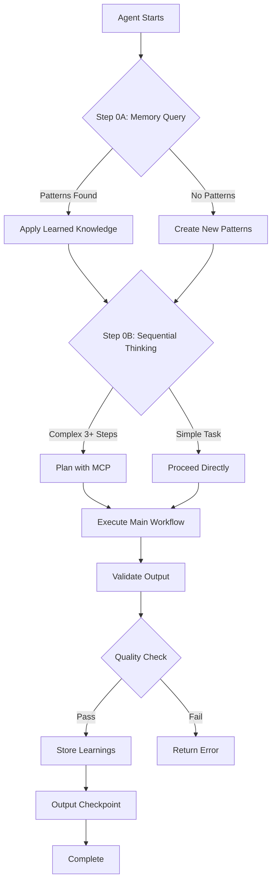
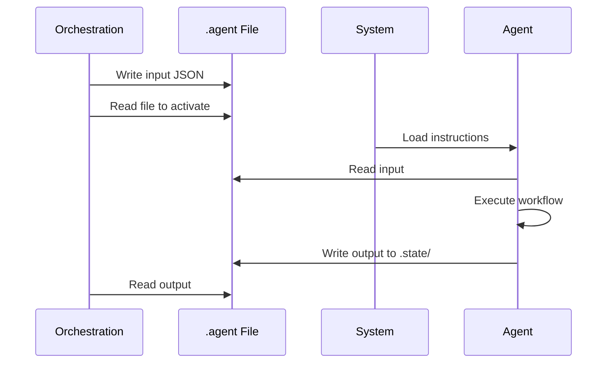
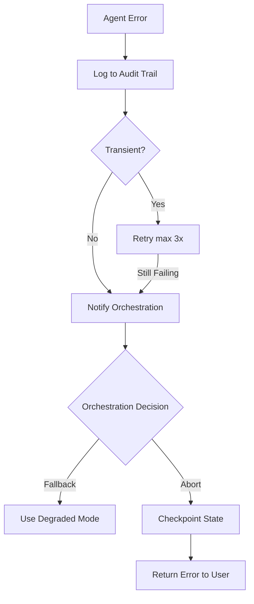

# GLOBAL AGENT RULES & PROTOCOLS

## Purpose

Define core operating principles, communication standards, and mandatory protocols for all agents in the QA automation pipeline. Establish single source of truth for cross-agent consistency.

## Reference Documentation

| Guide | Purpose |
|-------|---------|
| `critical_thinking_protocol.instructions.md` | Mandatory skepticism framework (5 pillars) |
| `mcp_integration_guide.instructions.md` | MCP tool specifications and usage patterns |
| `memory_patterns_reference.instructions.md` | Memory query and entity naming standards |
| `state_management_guide.instructions.md` | State file persistence and retrieval |
| `data_driven_guide.instructions.md` | Test data generation and parameterization |

## Communication Rules

### Code in Instructions = Documentation Only

All TypeScript/JavaScript examples are **structural templates**, not executable code.

**Correct Agent Output:**
```json
// Example output structure (non-executable)
{
  "agentName": "<AGENT_NAME>",
  "status": "SUCCESS",
  "outputData": { }
}
```

**Incorrect Agent Output:**
```typescript
// ❌ NEVER return TypeScript code
// const output = { agentName: "...", status: "..." };
```

### Output Format Standards

**File Output:** Write structured JSON to `.state/<DOMAIN>-<FEATURE>-gate<N>-output.json`

**Console Output:** Natural language progress updates via logger

**Schema Template:**
```typescript
// Required fields in all agent outputs (non-executable example):
// {
//   agentName: "<AGENT_NAME>",
//   timestamp: "<TIMESTAMP_ISO8601>",
//   status: "SUCCESS" | "PARTIAL" | "FAILED",
//   executionTimeMs: <DURATION_MS>,
//   outputData: <AGENT_SPECIFIC_OUTPUT>,
//   validationResult: {
//     passed: <BOOLEAN>,
//     score: <0_TO_1>,
//     issues: ["<ISSUE_1>", "<ISSUE_2>"]
//   },
//   executionTrace: {
//     startTime: "<TIMESTAMP_ISO8601>",
//     endTime: "<TIMESTAMP_ISO8601>",
//     executedSteps: ["<STEP_ID_1>", "<STEP_ID_2>"],
//     skippedSteps: ["<STEP_ID_3>"],
//     failedSteps: [],
//     checkpointCompleted: <BOOLEAN>
//   }
// }
```

## Agent Registry

| Agent | File Pattern | Responsibility |
|-------|--------------|----------------|
| Test Case Designer | `test_case_designer.agent` | Convert user stories to structured test cases |
| DOM Analysis | `dom_analysis.agent` | Map UI elements to locator strategies |
| POM Generator | `pom_generator.agent` | Generate Page Object Model code |
| Test Healing | `test_healing.agent` | Auto-repair failing tests |
| Orchestration | `copilot-instructions.md` | Coordinate pipeline execution |

## Core Operating Principles



### Principle 1: Critical Thinking Mandate

📖 **Reference:** See `critical_thinking_protocol.instructions.md` for complete framework.

Apply 5 pillars to ALL decisions:
1. **Mandatory Skepticism** - Challenge every decision
2. **Proactive Failure Enumeration** - List 3-5 failure modes before operation
3. **Assumption Surfacing** - Make implicit assumptions explicit
4. **Alternative Consideration** - Generate 2+ alternatives, justify choice
5. **Semantic Validation** - Validate meaning, not just structure

### Principle 2: Memory-First Protocol

📖 **Reference:** See `mcp_integration_guide.instructions.md` Section 2 for query patterns.

**Step 0A (MANDATORY):** Query memory before execution.

**Step 0B (MANDATORY):** Store learnings after completion with verification.

### Principle 3: Sequential Thinking Requirement

📖 **Reference:** See `mcp_integration_guide.instructions.md` Section 1 for parameter details.

**When Required:**
- Multi-step analysis (3+ steps)
- Error diagnosis with root cause analysis
- Complex decision-making with trade-offs

**When Not Required:**
- Simple lookups or file reads
- Single-step validations

Minimum: 3 thoughts (analysis → solution → verification)

### Principle 4: Instruction Priority Hierarchy

**Priority Order:**
1. Agent-specific instructions (highest)
2. Global rules (this file)
3. General copilot instructions (lowest)

## Agent Invocation Protocol



**Standard .agent File Schema:**
```json
// Example agent file structure (non-executable):
{
  "agentName": "<AGENT_NAME>",
  "timestamp": "<TIMESTAMP_ISO8601>",
  "input": {
    "metadata": {
      "domain": "<SANITIZED_DOMAIN>",
      "feature": "<SANITIZED_FEATURE>",
      "url": "<ORIGINAL_URL>"
    }
  }
}
```


### Rule 1: Memory-First (MANDATORY)

Query memory before ANY main execution using `mcp_memory_search_nodes`.

```typescript
// Example query pattern (non-executable):
// mcp_memory_search_nodes({
//   query: "<DOMAIN> <FEATURE> <PATTERN_TYPE> patterns"
// })
```

**Penalty:** Agent execution incomplete, must restart.

### Rule 2: Planning (MANDATORY for complex operations)

Use `mcp_sequential-th_sequentialthinking` for operations with 3+ steps.

```typescript
// Example planning invocation (non-executable):
// mcp_sequential-th_sequentialthinking({
//   thought: "<DETAILED_ANALYSIS>",
//   thoughtNumber: 1,
//   totalThoughts: 3,
//   nextThoughtNeeded: true
// })
```

**Penalty:** Decision-making lacks transparency and auditability.

### Rule 3: Learning (MANDATORY after success)

Store patterns in memory using `mcp_memory_create_entities` with verification.

```typescript
// Example storage pattern (non-executable):
// mcp_memory_create_entities({
//   entities: [{
//     name: "<DOMAIN>-<FEATURE>-<PATTERN_TYPE>",
//     entityType: "<PATTERN_TYPE>",
//     observations: ["<OBSERVATION_1>", "<OBSERVATION_2>"]
//   }]
// })
```

**Penalty:** Knowledge lost, future runs cannot benefit from learnings.

### Rule 4: Checkpoint (MANDATORY after major steps)

Output self-audit checklist showing completed MCPs.

**Template:**
```markdown
**CHECKPOINT: <PHASE_NAME>**

Required MCPs:
✅ mcp_memory_search_nodes - Queried <PATTERN_TYPE>
✅ mcp_sequential-th_sequentialthinking - Planned approach (3 thoughts)
✅ <OTHER_TOOL> - <STATUS>

MISSING STEPS: <LIST_OR_NONE>

ACTION: <PROCEEDING_OR_GOING_BACK>
```

**Penalty:** Execution not auditable, may have skipped steps.

### Rule 5: Parameter Completeness (MANDATORY)

All MCP tool calls must include ALL required parameters.

📖 **Reference:** See `mcp_integration_guide.instructions.md` for specifications.

**Penalty:** Tool call will fail or produce incomplete results.

## Error Handling

### Error Classification

| Type | Action | Max Retries | Escalation |
|------|--------|-------------|------------|
| Input Validation | Return error immediately | 0 | User |
| Transient | Retry with backoff | 3 | Orchestration |
| Agent Logic | Log + fallback strategy | 1 | Orchestration |
| Critical System | Abort pipeline | 0 | User |

### Escalation Flow



## Security & Safety Rules

**Input Sanitization:** Sanitize all user inputs for:
- File path traversal: `../`, absolute paths
- Command injection: `;`, `&&`, `|`
- XSS patterns: `<script>`, `eval()`

**File Operations:**
- Use absolute paths only
- Validate file existence before read
- Use atomic writes (temp → rename)

**External Calls:**
- Timeout all fetch operations (30s default)
- Validate URLs before fetching
- Handle authentication failures gracefully

## Quality Gates

| Gate | Criteria | Threshold |
|------|----------|-----------|
| Schema Validation | Output matches contract | 100% |
| Completeness | All required fields present | 100% |
| Quality Score | Confidence/coverage metric | ≥ 70% |
| Security Check | No injection/XSS patterns | 100% |
| Compilation | Generated code compiles | 100% |

**Failure Protocol:**
1. Retry with refined input (1x)
2. If still failing → Return error with specifics
3. Orchestration decides: abort or continue with degraded mode

## State Management

📖 **Reference:** See `state_management_guide.instructions.md` for complete schema.

**Checkpoint Triggers:**
- After each GATE completion (Orchestration)
- Before destructive operations (file write/delete)
- After agent completes successfully

**Resume Protocol:**
1. Load checkpoint from `.state/<PIPELINE_ID>.json`
2. Validate checkpoint integrity
3. Skip completed gates
4. Resume from current gate

## Documentation Standards

All agent instructions must include:
- Purpose (one paragraph)
- Input Contract (commented schema)
- Output Contract (commented schema)
- Step-by-Step Procedure (numbered steps)
- Validation Rules (measurable criteria)
- Constraints (what NOT to do)
- Error Handling (classification + recovery)
- Example Exchange (one complete example)

## Constraints

**NEVER:**
- Execute code from instruction examples
- Skip memory queries (Step 0A)
- Skip sequential thinking for complex operations (3+ steps)
- Skip storing learnings after success
- Return TypeScript code as agent output
- Use dynamic timestamps or UUIDs in examples
- Mix natural language with structured JSON output

**ALWAYS:**
- Query memory before main execution
- Use static placeholders in examples
- Validate output against schema
- Output checkpoint after major steps
- Reference supporting guides instead of duplicating
- Use Mermaid diagrams for process flows
- Maintain imperative, neutral tone