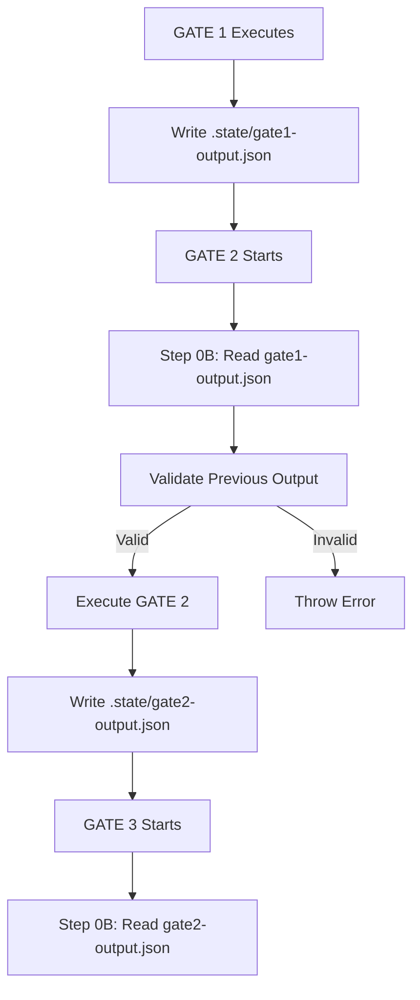

# STATE MANAGEMENT GUIDE

## Purpose

Define standardized approach for persisting gate outputs to `.state/` files and retrieving previous gate data. Enables crash recovery, data validation, and independent agent execution through dual-output system (structured JSON + markdown checkpoint).

## Core Concepts



### Dual-Output System

Every agent produces TWO outputs:

1. **Structured State File** (`.state/{domain}-{feature}-gate{N}-output.json`)
   - Machine-readable JSON format
   - Contains complete gate output with metadata
   - Used by next gate to load input data
   - Enables crash recovery and debugging

2. **Markdown Checkpoint** (console output)
   - Human-readable audit trail
   - Shows MCPs executed and quality metrics
   - User transparency

### File Naming Convention

**Format:** `{domain}-{feature}-gate{N}-output.json`

**Directory Structure:**
```
.state/
├── {domain}-{feature}-pipeline.json
├── {domain}-{feature}-gate0-output.json (conditional)
├── {domain}-{feature}-gate1-output.json
├── {domain}-{feature}-gate2-output.json
├── {domain}-{feature}-gate3-output.json
└── {domain}-{feature}-gate4-output.json
```

### Standardized Schema

```typescript
// Example gate state structure (non-executable):
// {
//   gate: <NUMBER>,
//   agent: "<AGENT_NAME>",
//   status: "SUCCESS" | "PARTIAL" | "FAILED",
//   metadata: {
//     domain: "<SANITIZED_DOMAIN>",
//     feature: "<SANITIZED_FEATURE>",
//     url: "<ORIGINAL_URL>"
//   },
//   output: {
//     <AGENT_SPECIFIC_OUTPUT>
//   },
//   validation: {
//     score: <0_TO_100>,
//     issues: ["<ISSUE_1>"],
//     passed: <BOOLEAN>
//   }
// }
```

```typescript
// Example pipeline state structure (non-executable):
// {
//   status: "IN_PROGRESS" | "SUCCESS" | "PARTIAL" | "FAILED",
//   currentGate: <NUMBER>,
//   completedGates: [<GATE_NUMBER_1>, <GATE_NUMBER_2>],
//   metadata: {
//     domain: "<DOMAIN>",
//     feature: "<FEATURE>",
//     url: "<URL>",
//     userStory: "<STORY>",
//     acceptanceCriteria: ["<AC_1>"]
//   }
// }
```

## Reference Patterns

### Pattern 1: Load Previous Gate Output (Step 0B)

**When:** ALWAYS after Step 0A (memory queries), before main execution

**Purpose:** Load structured output from previous gate for processing

**Implementation:**

```typescript
// Example implementation pattern (non-executable):
// logger.info('Step 0B: Loading previous gate output from state file')
//
// const currentGate = <GATE_NUMBER>
// const previousGate = currentGate - 1
// const previousGateFile = `.state/{domain}-{feature}-gate${previousGate}-output.json`
//
// let previousGateData = null
//
// try {
//   const fileContent = await read_file(previousGateFile, 1, 10000)
//   const previousGateState = JSON.parse(fileContent)
//   
//   if (previousGateState.status === 'SUCCESS' || previousGateState.status === 'PARTIAL') {
//     previousGateData = previousGateState.output
//     logger.info(`Loaded previous gate ${previousGate} output from ${previousGateState.agent}`)
//     
//     if (!validatePreviousGateOutput(previousGateData)) {
//       throw new Error('Invalid previous gate output structure')
//     }
//   }
// } catch (error) {
//   logger.info(`No previous gate state file found: ${previousGateFile}`)
//   logger.info('This is normal if orchestration is providing input directly')
// }
//
// const dataToProcess = previousGateData || input.<RELEVANT_FIELD>
```

**Validation Functions:**

```typescript
// Example GATE 2 validation (non-executable):
// validatePreviousGateOutput(data) {
//   return Array.isArray(data.testCases) && 
//          data.testCases.length > 0 &&
//          data.testCases.every(tc => tc.testId && tc.testSteps)
// }

// Example GATE 3 validation (non-executable):
// validatePreviousGateOutput(data) {
//   return Array.isArray(data.elementMappings) &&
//          data.elementMappings.length > 0 &&
//          data.elementMappings.every(em => em.locators?.primary)
// }
```

### Pattern 2: Pre-Flight Validation (Step 0C)

**When:** ALWAYS after Step 0B, before main execution

**Purpose:** Verify all prerequisites before execution (fail fast)

**Validation Checks:**

1. **File Existence** - Verify all referenced files exist
2. **Data Validity** - Parse JSON files using safeParse from json-utils
3. **Previous Gate Status** - Read todo list, verify previous gates completed
4. **Resource Availability** - Check disk space, memory system accessible

**Error Message Format:**
```
Pre-flight validation failed for GATE 2:
✗ GATE 1 output file missing: .state/gate1-output.json
  → Remediation: Ensure GATE 1 completed successfully
✗ Cached HTML file corrupted: Invalid JSON at line 45
  → Remediation: Re-fetch webpage using fetch-dom.ts script
```

### Pattern 3: Verify Pipeline State (Step 0D)

**When:** ALWAYS after Step 0C, before main execution

**Purpose:** Check overall pipeline progress and gate completion

**Implementation:**

```typescript
// Example pipeline verification (non-executable):
// const todoList = manage_todo_list({ operation: 'read' })
//
// const currentGateTodo = todoList.find(todo => todo.id === <CURRENT_GATE_ID>)
// if (currentGateTodo.status !== 'in-progress') {
//   throw new Error(`Cannot execute GATE ${<GATE_NUMBER>}: Current gate not in progress`)
// }
//
// const previousGateTodos = todoList.filter(todo => todo.id < <CURRENT_GATE_ID>)
// const anyPreviousFailed = previousGateTodos.some(todo => todo.status === 'failed')
//
// if (anyPreviousFailed) {
//   throw new Error(`Cannot execute GATE ${<GATE_NUMBER>}: Previous gate failed`)
// }
//
// logger.info('Pipeline state verified: All previous gates completed')
```

### Pattern 4: Write State File (Step N-1)

**When:** After main execution completes, BEFORE memory storage step

**Purpose:** Persist gate output to structured JSON file for next gate

**Implementation:**

```typescript
// Example state file creation (non-executable):
// const gateStateFile = {
//   gate: <CURRENT_GATE_NUMBER>,
//   agent: "<AGENT_NAME>",
//   status: validationScore >= 70 ? "SUCCESS" : "PARTIAL",
//   metadata: {
//     domain: metadata.domain,
//     feature: metadata.feature,
//     url: input.url
//   },
//   output: {
//     <AGENT_SPECIFIC_OUTPUT>
//   },
//   validation: {
//     score: <SCORE>,
//     issues: [<ISSUE_LIST>],
//     passed: <BOOLEAN>
//   }
// }
//
// await create_file(
//   `.state/${metadata.domain}-${metadata.feature}-gate${<GATE_NUMBER>}-output.json`,
//   safeStringify(gateStateFile)
// )
//
// logger.info(`State file created: .state/${metadata.domain}-${metadata.feature}-gate${<GATE_NUMBER>}-output.json`)
// logger.info(`Status: ${gateStateFile.status}, Score: ${gateStateFile.validation.score}%`)
```

**Important:** Use `safeStringify` from `src/utilities/common/json-utils.ts` (NOT `JSON.stringify`) to handle circular references, BigInt, functions safely.

### Pattern 5: Orchestration Pipeline State

**PRE-PROCESSING: Create Pipeline State**

```typescript
// Example pipeline state initialization (non-executable):
// const pipelineState = {
//   status: 'IN_PROGRESS',
//   currentGate: 0,
//   completedGates: [],
//   metadata: {
//     domain: metadata.domain,
//     feature: metadata.feature,
//     url: request.url,
//     userStory: request.userStory,
//     acceptanceCriteria: request.acceptanceCriteria
//   }
// }
//
// await create_file(
//   `.state/${metadata.domain}-${metadata.feature}-pipeline.json`,
//   JSON.stringify(pipelineState, null, 2)
// )
//
// logger.info(`Pipeline state initialized: .state/${metadata.domain}-${metadata.feature}-pipeline.json`)
```

**After Each Gate: Update Pipeline State**

```typescript
// Example pipeline update (non-executable):
// const pipelineStateFile = `.state/${metadata.domain}-${metadata.feature}-pipeline.json`
// const pipelineState = JSON.parse(await read_file(pipelineStateFile, 1, 1000))
//
// pipelineState.currentGate = <GATE_NUMBER>
// pipelineState.completedGates.push(<GATE_NUMBER>)
//
// await create_file(
//   pipelineStateFile,
//   JSON.stringify(pipelineState, null, 2)
// )
//
// logger.info(`Pipeline state updated: Gate ${<GATE_NUMBER>} completed`)
```

**FINAL: Mark Pipeline Complete**

```typescript
// Example pipeline completion (non-executable):
// const pipelineStateFile = `.state/${metadata.domain}-${metadata.feature}-pipeline.json`
// const pipelineState = JSON.parse(await read_file(pipelineStateFile, 1, 1000))
//
// pipelineState.status = overallStatus  // 'SUCCESS', 'PARTIAL', or 'FAILED'
// pipelineState.currentGate = 5
// pipelineState.completedGates.push(5)
//
// await create_file(
//   pipelineStateFile,
//   JSON.stringify(pipelineState, null, 2)
// )
//
// logger.info(`Pipeline complete: ${overallStatus}`)
```

### Pattern 6: Crash Recovery

**Resuming from Checkpoint:**

```typescript
// Example crash recovery (non-executable):
// const pipelineState = JSON.parse(
//   await read_file(`.state/${domain}-${feature}-pipeline.json`, 1, 1000)
// )
//
// logger.info(`Resuming pipeline from Gate ${pipelineState.currentGate}`)
// logger.info(`Completed gates: ${pipelineState.completedGates.join(', ')}`)
//
// const gatesToExecute = [0, 1, 2, 3, 4, 5].filter(
//   gate => !pipelineState.completedGates.includes(gate)
// )
//
// logger.info(`Will execute: ${gatesToExecute.join(', ')}`)
//
// for (const gate of gatesToExecute) {
//   await executeGate(gate, pipelineState.metadata)
// }
```

## Integration Points

**Used By:**
- All agents: Step 0B (load previous gate output), Step N-1 (write current gate output)
- Orchestration: PRE-PROCESSING (create pipeline state), after each gate (update state), FINAL (mark complete)

**Provides:**
- Crash recovery capability
- Data validation between gates
- Independent agent execution
- Complete audit trail
- Debugging support

**Dependencies:**
- `mcp_integration_guide.instructions.md` - MCP tool specifications
- `rules.instructions.md` - Global enforcement rules
- `src/utilities/common/json-utils.ts` - safeStringify for JSON serialization

## Examples

### Example 1: GATE 1 Output (Test Case Design)

```json
{
  "gate": 1,
  "agent": "TestCaseDesigner",
  "status": "SUCCESS",
  "metadata": {
    "domain": "demoqa_com",
    "feature": "student_registration",
    "url": "https://demoqa.com/automation-practice-form"
  },
  "output": {
    "testCases": [
      {
        "testId": "TC_001",
        "description": "Verify student registration with valid data",
        "testSteps": [
          {
            "stepNumber": 1,
            "action": "Enter first name",
            "target": "firstName input field"
          }
        ]
      }
    ],
    "dataStrategy": {
      "type": "data-driven",
      "totalCases": 5
    }
  },
  "validation": {
    "score": 95,
    "issues": [],
    "passed": true
  }
}
```

### Example 2: GATE 2 Output (DOM Mapping)

```json
{
  "gate": 2,
  "agent": "DOMAgent",
  "status": "SUCCESS",
  "metadata": {
    "domain": "demoqa_com",
    "feature": "student_registration",
    "url": "https://demoqa.com/automation-practice-form"
  },
  "output": {
    "elementMappings": [
      {
        "logicalName": "firstNameInput",
        "locators": {
          "primary": {
            "type": "id",
            "value": "firstName",
            "confidenceScore": 0.95
          },
          "fallbacks": [
            {
              "type": "placeholder",
              "value": "First Name",
              "confidenceScore": 0.85
            }
          ]
        }
      }
    ]
  },
  "validation": {
    "score": 87,
    "issues": ["2 elements have confidence < 80%"],
    "passed": true
  }
}
```

## Constraints

**NEVER:**
- Skip writing state files (even if gate fails - write FAILED status)
- Overwrite state files without reading first
- Store sensitive data in state files (passwords, API keys)
- Use relative paths for state files (always `.state/` directory)
- Parse JSON without try-catch

**ALWAYS:**
- Write state file BEFORE memory storage
- Use consistent domain-feature naming pattern
- Validate previous gate output structure before using
- Log state file operations (create, read, validate)
- Include validation score in state files
- Check if previous gate state file exists before reading
- Use safeStringify for JSON serialization
