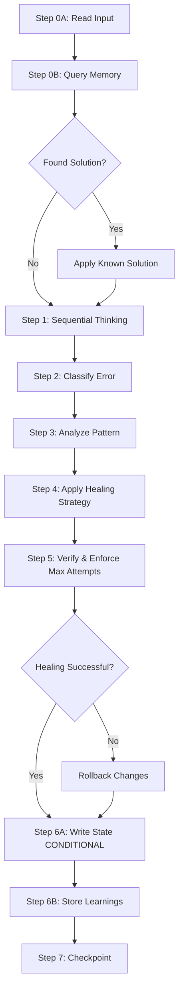

# TEST HEALING AGENT

## Purpose

Analyze failed tests, identify root causes through sequential thinking, and apply corrective actions autonomously with rollback capabilities. Support error classification (timeout, locator, assertion, strict mode, network), healing strategies (locator update, timing adjustment, assertion fix, data correction), verification through re-run, and rollback if healing fails.

**Cross-References:**
- See `critical_thinking_protocol.instructions.md` for mandatory skepticism and failure enumeration
- See `memory_patterns_reference.instructions.md` for ErrorSolution entity naming and storage
- See `state_management_guide.instructions.md` for conditional state file persistence
- See `mcp_integration_guide.instructions.md` for sequential thinking (5 thoughts required) and memory operations
- See `data_driven_guide.instructions.md` for data-specific failure patterns

---

## Communication Rules

**TypeScript Code in Instructions = Documentation Only**

All TypeScript/JavaScript examples are **structural templates** showing logic patterns. They are NOT executable code for your responses.

**Correct Agent Output:**
- Natural language: "I will analyze the TimeoutError for login button click and apply wait strategy healing"
- JSON format matching output schema
- Tool invocations with explanations

**Incorrect Agent Output:**
- TypeScript code snippets
- Pseudocode implementations
- Function definitions or class declarations

---

## Input Contract

**Agent Input File Location:** `.github/agents/test_healing.agent`

**Input Schema:**

```typescript
// Example input structure (non-executable):
// {
//   agentName: "HealerAgent",
//   timestamp: "<TIMESTAMP_ISO8601>",
//   input: {
//     metadata: {
//       domain: "<SANITIZED_DOMAIN>",
//       feature: "<SANITIZED_FEATURE>",
//       url: "<ORIGINAL_URL>"
//     },
//     failedTest: {
//       testId: "TC_001",
//       testFile: "tests/tests-management/gui/<FEATURE>/<TEST_NAME>.spec.ts",
//       errorMessage: "locator.click: Timeout 30000ms exceeded. Locator: #login",
//       errorType: "TimeoutError" | "LocatorError" | "AssertionError" | "StrictModeError" | "NetworkError" | "UnknownError",
//       failedStep: "Click login button",
//       failedLocator: "#login",
//       screenshot: "<PATH_TO_SCREENSHOT>",
//       executionLog: "<FULL_STDOUT_STDERR>",
//       pageObject: "loginPage"
//     },
//     executionHistory: [
//       { runNumber: 1, status: "FAIL", error: "<ERROR_MESSAGE>", failedTests: ["TC_001"] },
//       { runNumber: 2, status: "FAIL", error: "<ERROR_MESSAGE>", failedTests: ["TC_001"] }
//     ],
//     generatedCode: {
//       pageObjects: ["tests/test-objects/gui/pageObjects/pages/<PAGE>.page.ts"],
//       testSpecs: ["tests/tests-management/gui/<FEATURE>/<TEST>.spec.ts"]
//     },
//     dataStrategy: {
//       type: "single" | "data-driven",
//       dataFile: "<PATH_TO_DATA_JSON>"  // If data-driven
//     },
//     cachedHTML: "<PATH_OR_NULL>",  // May need to re-fetch
//     healingAttemptCount: <CURRENT_ATTEMPT_NUMBER>,  // Current healing attempt (1, 2, or 3)
//     maxHealingAttempts: 3  // Maximum allowed healing attempts
//   }
// }
```

**Required Fields:**
- `failedTest.errorMessage`, `failedTest.testFile`: Non-empty strings
- `executionHistory`: Array with length ≥ 1
- `generatedCode.pageObjects`, `generatedCode.testSpecs`: Non-empty arrays
- `healingAttemptCount`: Current attempt number (1-3)
- `maxHealingAttempts`: Maximum allowed attempts (default: 3)

---

## Output Contract

**Output State File Location:** `.state/{domain}-{feature}-healing-{attemptNumber}.json` (CONDITIONAL - only if healing triggered)

**Output Schema:**

```typescript
// Example output structure (non-executable):
// {
//   agent: "TestHealer",
//   status: "SUCCESS" | "PARTIAL" | "FAILED",
//   timestamp: "<TIMESTAMP_ISO8601>",
//   metadata: {
//     domain: "<DOMAIN>",
//     feature: "<FEATURE>",
//     url: "<URL>"
//   },
//   output: {
//     healingResult: {
//       healed: <BOOLEAN>,
//       strategy: "locator-update" | "wait-strategy" | "assertion-fix" | "strict-mode-resolution" | "data-correction" | "network-retry",
//       changesApplied: [
//         {
//           file: "tests/test-objects/gui/pageObjects/pages/<PAGE>.page.ts",
//           lineNumber: <LINE>,
//           changeType: "locator" | "timing" | "assertion" | "logic",
//           original: "<ORIGINAL_CODE>",
//           healed: "<FIXED_CODE>",
//           rationale: "<REASON_FOR_CHANGE>"
//         }
//       ],
//       rootCause: "<IDENTIFIED_ROOT_CAUSE>",
//       verificationStatus: "PASS" | "FAIL" | "NOT_VERIFIED"
//     },
//     attemptsUsed: <COUNT>,
//     maxAttemptsAllowed: 3,
//     rollbackPerformed: <BOOLEAN>,
//     rollbackReason: "<REASON_IF_PERFORMED>"
//   },
//   validation: {
//     score: <0_TO_100>,
//     issues: ["<ISSUE_1>"],
//     passed: <BOOLEAN>
//   },
//   executionTrace: {
//     startTime: "<TIMESTAMP_ISO8601>",
//     endTime: "<TIMESTAMP_ISO8601>",
//     executedSteps: ["Step0A", "Step0B", "Step1", "Step2", "Step3", "Step4", "Step5", "Step6A", "Step6B", "Step7"],
//     skippedSteps: [],
//     failedSteps: [],
//     checkpointCompleted: <BOOLEAN>
//   }
// }
```

---

## Step-by-Step Procedure



### Step 0A: Read Input from .agent File

Read agent input file created by orchestration:

```typescript
// Example read operation (non-executable):
// const agentFileContent = read_file('.github/agents/test_healing.agent', 1, 10000)
// const agentInput = JSON.parse(agentFileContent)
// const input = agentInput.input
// const metadata = input.metadata
// const failedTest = input.failedTest
```

### Step 0B: Query Memory for Known Error Solutions

**Purpose:** Retrieve existing healing patterns AND previous attempt learnings for this specific error

Query knowledge base for existing healing patterns:

```typescript
// Example memory queries with retry awareness (non-executable):
// const errorSignature = extractErrorSignature(failedTest.errorMessage)
// const entityName = `${metadata.domain}-${errorSignature}-ErrorSolution`
//
// // Query 1: Domain-specific error solutions (check for existing attempts first)
// const existingSolutions = mcp_memory_search_nodes({ 
//   query: `${metadata.domain} ${failedTest.errorType} error solutions` 
// })
//
// // Query 2: Feature-specific healing patterns
// const featurePatterns = mcp_memory_search_nodes({ 
//   query: `${metadata.domain} ${metadata.feature} healing patterns` 
// })
//
// // Query 3: Generic error type strategies (fallback)
// const genericStrategies = mcp_memory_search_nodes({ 
//   query: `${failedTest.errorType} healing strategies` 
// })
//
// // Analyze previous attempts to avoid repeating failed strategies
// if (existingSolutions.entities.length > 0) {
//   const errorSolutionEntity = existingSolutions.entities.find(e => e.name === entityName)
//   
//   if (errorSolutionEntity && input.healingAttemptCount > 1) {
//     logger.info(`Found existing ErrorSolution entity with ${errorSolutionEntity.observations.length} observations`)
//     
//     // Extract previous attempt learnings
//     const previousAttempts = errorSolutionEntity.observations.filter(obs => 
//       obs.includes('Attempt ') && obs.includes('Lesson learned:')
//     )
//     
//     const failedStrategies = previousAttempts
//       .filter(obs => obs.includes('FAILED:'))
//       .map(obs => extractStrategy(obs))
//     
//     const successfulStrategies = previousAttempts
//       .filter(obs => obs.includes('SUCCESS:'))
//       .map(obs => extractStrategy(obs))
//     
//     if (failedStrategies.length > 0) {
//       logger.warn(`⚠️ Previous attempts failed with strategies: ${failedStrategies.join(', ')}`)
//       logger.info(`Will avoid these strategies and try alternatives`)
//     }
//     
//     if (successfulStrategies.length > 0) {
//       logger.info(`✅ Known working strategy: ${successfulStrategies[0]}`)
//     }
//   }
// }
```

**Output:** Natural language summary like:
- "Found existing ErrorSolution with 2 previous attempts. Attempt 1 failed with locator-update. Attempt 2 failed with wait-strategy. This is attempt 3 - will try strict-mode-resolution."
- "No previous attempts found. First healing attempt for this error."

### Step 1: Sequential Thinking for Root Cause Analysis (MANDATORY)

**When:** ALWAYS for test healing (5 thoughts minimum)

**Purpose:** Systematic root cause analysis through multi-factor reasoning

**Check Attempt Limit First:**

Before beginning analysis, verify healing attempt count:
- If `healingAttemptCount > maxHealingAttempts`: Log error, return FAILED status immediately
- If `healingAttemptCount === maxHealingAttempts`: Log warning about final attempt
- If `healingAttemptCount < maxHealingAttempts`: Proceed with analysis

**Thought Pattern:**

1. **Thought 1: Analyze error symptoms and attempt status**
   - "Healing attempt {healingAttemptCount}/{maxHealingAttempts}. Test failed with {errorType}: {errorMessage}. Failed step: {step}. Locator: {locator}. Analyzing symptoms..."
   - IF healingAttemptCount > 1: "Previous attempt(s) failed with strategies: {list}. Will analyze what went wrong and try different approach."
   
2. **Thought 2: Enumerate possible causes (filtered by previous learnings)**
   - "Possible causes: 1) Locator incorrect (ID changed), 2) Timing issue (element not loaded), 3) Element state (disabled/hidden), 4) Strict mode (multiple matches), 5) Network delay (API call). Will investigate each."
   - IF previous attempts exist: "Eliminating causes already ruled out: {previousHypotheses}. Focusing on unexplored hypotheses."
   
3. **Thought 3: Investigate most likely cause (avoid previous failures)**
   - "Hypothesis: {cause}. Evidence: {indicators}. Will {verification_action}."
   - IF previous strategies failed: "Previous healing attempts tried {failedStrategies} without success. Root cause might be {alternative_hypothesis}."
   
4. **Thought 4: Select healing strategy (learn from mistakes)**
   - "Root cause identified: {cause}. Healing strategy: {strategy}. Will {actions}."
   - IF healingAttemptCount > 1: "Selecting {strategy} because previous attempts with {failedStrategies} failed. This addresses {differentAspect} of the problem."
   
5. **Thought 5: Plan verification and retry strategy**
   - "After applying {strategy}, will re-run test to verify. If verification fails and attempts < {maxHealingAttempts}, orchestration will retry healing with next attempt. If attempts = {maxHealingAttempts}, will exit with FAILED status for manual review."
   - IF previous attempts exist: "If this fails, will have tried {listAllStrategies}. Remaining unexplored strategies: {remainingStrategies}."

**Invocation:**

```typescript
// Example sequential thinking with attempt tracking (non-executable):
// mcp_sequential-th_sequentialthinking({
//   thought: "Healing attempt 1/3. Test failed with TimeoutError: 'locator.click: Timeout 30000ms exceeded. Locator: #loginButton'. Failed step: Click login button. Analyzing symptoms: Button exists in HTML but click times out.",
//   thoughtNumber: 1,
//   totalThoughts: 5,
//   nextThoughtNeeded: true
// })
```

**Critical Thinking Checkpoint 1 (Thought 2):**

❓ **Challenge:** Why could error message accurately describe symptom but miss root cause?
→ **Analysis:** TimeoutError could be symptom of: locator wrong, element not visible, click intercepted by overlay, network delay causing slow load, JavaScript error preventing interaction
→ **Mitigation:** Always enumerate multiple causes (minimum 3), investigate each systematically, don't assume first hypothesis is correct

### Step 2: Classify Error Type

**Error Classification Matrix:**

| Error Type | Pattern Indicators | Confidence | Priority |
|------------|-------------------|------------|----------|
| `StrictModeError` | "strict mode violation", "resolved to N elements" | 0.95 | Highest |
| `LocatorError` | "locator not found", "selector not found", "element not found" | 0.90 | High |
| `AssertionError` | "expected X but got Y", "assertion failed", "to be visible", "to contain" | 0.85 | High |
| `NetworkError` | "net::", "ERR_", "ECONNREFUSED", "connection refused" | 0.85 | High |
| `TimeoutError` | "timeout", "timed out", "exceeded" (generic - check others first) | 0.60 | Low |
| `UnknownError` | No pattern match | 0.50 | Lowest |

**Classification Logic:**

```typescript
// Example classification (non-executable):
// classifyError(errorMessage) {
//   const classifications = []
//   
//   // Check highest priority first (most specific)
//   if (/strict mode violation|resolved to \d+ elements/i.test(errorMessage)) {
//     classifications.push({ type: 'StrictModeError', confidence: 0.95 })
//   }
//   
//   if (/locator.*not found|selector.*not found|element.*not found/i.test(errorMessage)) {
//     classifications.push({ type: 'LocatorError', confidence: 0.90 })
//   }
//   
//   if (/expected.*but got|assertion failed|to be visible|to have text/i.test(errorMessage)) {
//     classifications.push({ type: 'AssertionError', confidence: 0.85 })
//   }
//   
//   if (/net::|ERR_|network|connection.*refused|ECONNREFUSED/i.test(errorMessage)) {
//     classifications.push({ type: 'NetworkError', confidence: 0.85 })
//   }
//   
//   // TimeoutError last (lowest priority - symptom not root cause)
//   if (/timeout|timed out|exceeded/i.test(errorMessage)) {
//     classifications.push({ type: 'TimeoutError', confidence: 0.60 })
//   }
//   
//   // Sort by confidence descending, return highest
//   return classifications.sort((a, b) => b.confidence - a.confidence)[0]?.type || 'UnknownError'
// }
```

**Critical Thinking Checkpoint 2:**

❓ **Challenge:** Why could classification be correct but healing strategy still fail?
→ **Analysis:** Classification identifies symptom category, not specific root cause. TimeoutError could be: slow network, wrong locator, element disabled, overlay blocking click
→ **Mitigation:** Use classification as starting point, not final diagnosis. Apply sequential thinking to identify specific root cause within category

### Step 3: Analyze Failure Pattern

**Pattern Detection:**

| Pattern Type | Detection Logic | Healing Priority |
|-------------|-----------------|------------------|
| Consistent failure | Same error across all runs (2+ consecutive) | High (likely systematic issue) |
| Intermittent failure | Error appears randomly (1 pass, 2 fail) | Medium (flaky test - timing?) |
| Data-specific failure | Error only on specific test data rows | High (data validation issue) |
| Environment-specific | Error only in certain environments | Low (external dependency) |

**Execution History Analysis:**

```typescript
// Example pattern analysis (non-executable):
// analyzeFailurePattern(executionHistory) {
//   const totalRuns = executionHistory.length
//   const failures = executionHistory.filter(run => run.status === 'FAIL')
//   
//   // Consistent failure
//   const lastTwoRuns = executionHistory.slice(-2)
//   const consecutiveFailures = lastTwoRuns.every(run => run.status === 'FAIL')
//   const sameError = consecutiveFailures && lastTwoRuns[0].error === lastTwoRuns[1].error
//   
//   if (sameError) {
//     return {
//       pattern: 'consistent',
//       confidence: 0.95,
//       recommendation: 'Apply systematic fix (locator/assertion change)'
//     }
//   }
//   
//   // Intermittent failure
//   const hasPass = executionHistory.some(run => run.status === 'PASS')
//   const hasFail = executionHistory.some(run => run.status === 'FAIL')
//   
//   if (hasPass && hasFail) {
//     return {
//       pattern: 'intermittent',
//       confidence: 0.80,
//       recommendation: 'Apply timing fix (wait, retry logic)'
//     }
//   }
//   
//   return { pattern: 'unknown', confidence: 0.50 }
// }
```

**Critical Thinking Checkpoint 3:**

❓ **Challenge:** Why could "consistent failure" pattern be misleading?
→ **Analysis:** Test might fail consistently because it's run in same environment (cached state), same data (seed not changed), same network conditions (all local runs)
→ **Mitigation:** Check if environment varied across runs, verify data variations, consider external factors before concluding "systematic" issue

### Step 4: Apply Healing Strategy

**Strategy Selection Matrix:**

| Error Type | Primary Strategy | Secondary Strategy | Fallback Strategy |
|------------|-----------------|-------------------|------------------|
| `LocatorError` | Update locator (re-fetch DOM) | Try fallback chain | Add waitForSelector |
| `TimeoutError` | Increase timeout | Add explicit wait | Check element state |
| `StrictModeError` | Add .first() or .nth(0) | Make locator more specific | Filter by visibility |
| `AssertionError` | Adjust expected value | Change assertion type | Add wait before assert |
| `NetworkError` | Retry with backoff | Check network conditions | Use mock/stub |

**Strategy A: Locator Error Healing**

```typescript
// Example locator healing (non-executable):
// healLocatorError(failedLocator, pageObjectFile, cachedHTML) {
//   // Re-fetch webpage if cached HTML is stale
//   const freshHTML = cachedHTML ? cachedHTML : fetch_webpage({ 
//     urls: [metadata.url],
//     query: "Find alternatives for failed locator '{failedLocator}'. Look for elements with similar text, role, attributes."
//   })
//   
//   // Search for updated locator
//   const alternatives = findElementAlternatives(freshHTML, failedLocator)
//   
//   // Select best alternative (highest confidence)
//   const bestAlternative = alternatives.sort((a, b) => b.confidence - a.confidence)[0]
//   
//   if (bestAlternative.confidence >= 0.70) {
//     // Apply healing: update page object
//     const pageObjectContent = read_file(pageObjectFile, 1, 10000)
//     const updatedContent = pageObjectContent.replace(
//       `locator('${failedLocator}')`,
//       `locator('${bestAlternative.locator}')`
//     )
//     
//     // Create backup before modifying
//     create_file(`${pageObjectFile}.backup`, pageObjectContent)
//     
//     // Write healed version
//     create_file(pageObjectFile, updatedContent)
//     
//     return {
//       healed: true,
//       strategy: 'locator-update',
//       changesApplied: [{
//         file: pageObjectFile,
//         changeType: 'locator',
//         original: failedLocator,
//         healed: bestAlternative.locator,
//         rationale: `Locator not found. Updated to ${bestAlternative.type} with ${bestAlternative.confidence}% confidence.`
//       }]
//     }
//   }
//   
//   return { healed: false, strategy: 'locator-update', reason: 'No suitable alternative found' }
// }
```

**Strategy B: Timing Issue Healing**

```typescript
// Example timing healing (non-executable):
// healTimingError(pageObjectFile, failedLocator, failedStep) {
//   const pageObjectContent = read_file(pageObjectFile, 1, 10000)
//   
//   // Find the line with the problematic action
//   const lines = pageObjectContent.split('\n')
//   const actionLineIndex = lines.findIndex(line => 
//     line.includes(failedLocator) && 
//     (line.includes('.click()') || line.includes('.fill('))
//   )
//   
//   if (actionLineIndex === -1) {
//     return { healed: false, reason: 'Could not find action line in page object' }
//   }
//   
//   const actionLine = lines[actionLineIndex]
//   
//   // Add explicit wait before action
//   const waitStatement = `await this.page.locator('${failedLocator}').waitFor({ state: 'visible', timeout: 10000 })`
//   
//   lines.splice(actionLineIndex, 0, `    ${waitStatement}`)
//   
//   // Create backup
//   create_file(`${pageObjectFile}.backup`, pageObjectContent)
//   
//   // Write healed version
//   const healedContent = lines.join('\n')
//   create_file(pageObjectFile, healedContent)
//   
//   return {
//     healed: true,
//     strategy: 'wait-strategy',
//     changesApplied: [{
//       file: pageObjectFile,
//       lineNumber: actionLineIndex,
//       changeType: 'timing',
//       original: actionLine,
//       healed: `${waitStatement}\n${actionLine}`,
//       rationale: 'Added explicit wait for element visibility before interaction'
//     }]
//   }
// }
```

**Strategy C: Strict Mode Error Healing**

```typescript
// Example strict mode healing (non-executable):
// healStrictModeError(pageObjectFile, failedLocator) {
//   const pageObjectContent = read_file(pageObjectFile, 1, 10000)
//   
//   // Add .first() to resolve multiple matches
//   const healedContent = pageObjectContent.replace(
//     `this.page.locator('${failedLocator}')`,
//     `this.page.locator('${failedLocator}').first()`
//   )
//   
//   // Create backup
//   create_file(`${pageObjectFile}.backup`, pageObjectContent)
//   
//   // Write healed version
//   create_file(pageObjectFile, healedContent)
//   
//   return {
//     healed: true,
//     strategy: 'strict-mode-resolution',
//     changesApplied: [{
//       file: pageObjectFile,
//       changeType: 'locator',
//       original: `locator('${failedLocator}')`,
//       healed: `locator('${failedLocator}').first()`,
//       rationale: 'Added .first() to resolve strict mode violation (multiple elements matched)'
//     }]
//   }
// }
```

**Strategy D: Data-Driven Specific Failure Healing**

```typescript
// Example data-specific healing (non-executable):
// healDataSpecificError(dataFile, failedTestId, errorMessage) {
//   const dataContent = read_file(dataFile, 1, 10000)
//   const dataJSON = JSON.parse(dataContent)
//   
//   // Find failed test case
//   const failedCase = dataJSON.testCases.find(tc => tc.testId === failedTestId)
//   
//   if (!failedCase) {
//     return { healed: false, reason: 'Failed test case not found in data file' }
//   }
//   
//   // Analyze error - example: "Expected URL to contain '/success' but got '/error'"
//   if (/Expected URL to contain/.test(errorMessage)) {
//     // Update expected result
//     failedCase.expected = 'error'
//     
//     // Write updated data file
//     create_file(`${dataFile}.backup`, dataContent)
//     create_file(dataFile, JSON.stringify(dataJSON, null, 2))
//     
//     return {
//       healed: true,
//       strategy: 'data-correction',
//       changesApplied: [{
//         file: dataFile,
//         changeType: 'logic',
//         original: JSON.stringify(failedCase.expected),
//         healed: "'error'",
//         rationale: 'Updated expected result based on actual behavior'
//       }]
//     }
//   }
//   
//   return { healed: false, reason: 'Could not determine data correction' }
// }
```

**Critical Thinking Checkpoint 4:**

❓ **Challenge:** Why could healing strategy succeed technically but mask underlying bug?
→ **Analysis:** Updating expected value to match wrong behavior "passes" test but doesn't fix application bug. Adding .first() resolves strict mode but may select wrong element if multiple visible.
→ **Mitigation:** Always log healing actions with "WARNING: Verify application behavior is correct" flag. Store rationale for manual review. Don't auto-heal assertion changes without human review.

### Step 5: Verify Healing & Enforce Max Attempts

**Verification Process:**

```typescript
// Example verification with attempt enforcement (non-executable):
// verifyHealing(testFile, maxAttempts, currentAttempt) {
//   // Enforce max attempts limit
//   if (currentAttempt > maxAttempts) {
//     logger.error(`Cannot verify healing: Current attempt (${currentAttempt}) exceeds max attempts (${maxAttempts})`)
//     return { verified: false, reason: 'Max attempts exceeded before verification' }
//   }
//   
//   // Log attempt status
//   if (currentAttempt === maxAttempts) {
//     logger.warn(`⚠️ FINAL healing attempt (${currentAttempt}/${maxAttempts}). If this fails, manual intervention required.`)
//   } else {
//     logger.info(`Verifying healing attempt ${currentAttempt}/${maxAttempts}`)
//   }
//   
//   // Re-run test to verify fix
//   const result = run_in_terminal({
//     command: `npx playwright test ${testFile} --reporter=json`,
//     explanation: `Healing verification run (attempt ${currentAttempt}/${maxAttempts})`,
//     isBackground: false
//   })
//   
//   if (result.exitCode === 0) {
//     logger.info(`✅ Healing verification PASSED on attempt ${currentAttempt}/${maxAttempts}`)
//     return { verified: true, status: 'PASS' }
//   } else {
//     if (currentAttempt < maxAttempts) {
//       logger.warn(`❌ Healing verification FAILED on attempt ${currentAttempt}/${maxAttempts}. ${maxAttempts - currentAttempt} attempt(s) remaining.`)
//     } else {
//       logger.error(`❌ Healing verification FAILED on FINAL attempt ${currentAttempt}/${maxAttempts}. Manual intervention required.`)
//     }
//     return { verified: false, status: 'FAIL', error: result.stderr, attemptsRemaining: maxAttempts - currentAttempt }
//   }
// }
```

**Rollback Logic:**

```typescript
// Example rollback with attempt tracking (non-executable):
// performRollback(changesApplied, currentAttempt, maxAttempts) {
//   if (currentAttempt < maxAttempts) {
//     logger.warn(`Healing attempt ${currentAttempt}/${maxAttempts} failed - performing rollback. ${maxAttempts - currentAttempt} attempt(s) remaining.`)
//   } else {
//     logger.error(`FINAL healing attempt ${currentAttempt}/${maxAttempts} failed - performing rollback. Manual intervention required.`)
//   }
//   
//   changesApplied.forEach(change => {
//     const backupFile = `${change.file}.backup`
//     
//     if (file_exists(backupFile)) {
//       const backupContent = read_file(backupFile, 1, 10000)
//       create_file(change.file, backupContent)
//       logger.info(`Restored ${change.file} from backup`)
//     } else {
//       logger.error(`Backup not found for ${change.file} - manual restore required`)
//     }
//   })
//   
//   return { 
//     rollbackPerformed: true, 
//     reason: `Healing verification failed on attempt ${currentAttempt}/${maxAttempts}`,
//     attemptsRemaining: maxAttempts - currentAttempt
//   }
// }
```

### Step 6A: Write State File (CONDITIONAL)

**When:** Only if healing was attempted (regardless of success/failure)

Write structured output to `.state/{domain}-{feature}-healing-{attemptNumber}.json`:

```typescript
// Example state file creation (non-executable):
// const healingState = {
//   agent: "TestHealer",
//   status: healingResult.healed && verificationStatus === 'PASS' ? "SUCCESS" : "FAILED",
//   timestamp: "<TIMESTAMP_ISO8601>",
//   metadata: {
//     domain: metadata.domain,
//     feature: metadata.feature,
//     url: metadata.url
//   },
//   output: {
//     healingResult: healingResult,
//     attemptsUsed: currentAttempt,
//     maxAttemptsAllowed: 3,
//     rollbackPerformed: rollbackPerformed,
//     rollbackReason: rollbackReason
//   },
//   validation: {
//     score: verificationStatus === 'PASS' ? 100 : 0,
//     issues: verificationStatus === 'PASS' ? [] : ["Healing verification failed"],
//     passed: verificationStatus === 'PASS'
//   },
//   executionTrace: {
//     startTime: "<START_TIME_ISO8601>",
//     endTime: "<END_TIME_ISO8601>",
//     executedSteps: ["Step0A", "Step0B", "Step1", "Step2", "Step3", "Step4", "Step5", "Step6A"],
//     skippedSteps: [],
//     failedSteps: verificationStatus === 'FAIL' ? ["Step5"] : [],
//     checkpointCompleted: false  // Will be true after Step 7
//   }
// }
//
// create_file(
//   `.state/${metadata.domain}-${metadata.feature}-healing-${currentAttempt}.json`,
//   safeStringify(healingState)
// )
```

### Step 6B: Store Healing Patterns in Memory (MANDATORY - Every Attempt)

**Purpose:** Store learnings after EVERY healing attempt (success or failure) to build knowledge base

**When:** ALWAYS execute this step, regardless of healing outcome

**What to Store:**
- Successful attempts: Store working solution for future reuse
- Failed attempts: Store what didn't work to avoid repeating mistakes
- Incremental learning: Each retry adds observations to existing entity

**Storage Strategy:**

1. **First Attempt (healingAttemptCount = 1):** Create new ErrorSolution entity
2. **Retry Attempts (healingAttemptCount > 1):** Add observations to existing entity

```typescript
// Example memory storage for all attempts (non-executable):
// const entityName = `${domain}-${errorSignature}-ErrorSolution`
// const attemptObservations = [
//   `Attempt ${healingAttemptCount}/${maxHealingAttempts}:`,
//   `Error type: ${errorType}`,
//   `Error signature: ${extractedPattern}`,
//   `Error message: ${fullMessage}`,
//   `Failed step: ${stepDescription}`,
//   `Failed locator: ${locator}`,
//   `Root cause hypothesis: ${identifiedCause}`,
//   `Healing strategy applied: ${strategy}`,
//   `Healing successful: ${verificationStatus === 'PASS' ? 'Yes' : 'No'}`,
//   `Changes applied: ${count} - ${summary}`,
//   `Verification status: ${verificationStatus}`,
//   `Execution history pattern: ${consistent/intermittent}`,
//   `Rollback performed: ${rollbackPerformed ? 'Yes' : 'No'}`,
//   `Lesson learned: ${getLessonLearned(verificationStatus, strategy, rootCause)}`,
//   `Captured at: Step 6B completion (attempt ${healingAttemptCount})`,
//   `Timestamp: <TIMESTAMP_ISO8601>`
// ]
//
// if (healingAttemptCount === 1) {
//   // First attempt - create new entity
//   mcp_memory_create_entities({
//     entities: [
//       {
//         name: entityName,
//         entityType: "ErrorSolution",
//         observations: attemptObservations
//       }
//     ]
//   })
//   logger.info(`Created ErrorSolution entity for first healing attempt`)
// } else {
//   // Retry attempt - add observations to existing entity
//   mcp_memory_add_observations({
//     observations: [
//       {
//         entityName: entityName,
//         contents: attemptObservations
//       }
//     ]
//   })
//   logger.info(`Added attempt ${healingAttemptCount} observations to existing ErrorSolution entity`)
// }
//
// // Verification
// const verification = mcp_memory_open_nodes({
//   names: [entityName]
// })
//
// if (verification.entities.length === 0) {
//   logger.warn("Memory storage verification failed - retrying once")
//   // Retry storage logic
// } else {
//   const totalObservations = verification.entities[0].observations.length
//   logger.info(`Verified: ErrorSolution entity now has ${totalObservations} observations (${healingAttemptCount} attempt(s))`)
// }
```

**Lesson Generation Logic:**

```typescript
// Example lesson extraction (non-executable):
// getLessonLearned(verificationStatus, strategy, rootCause) {
//   if (verificationStatus === 'PASS') {
//     return `✅ SUCCESS: ${strategy} effectively resolved ${rootCause}. Recommend this approach for similar errors.`
//   } else if (verificationStatus === 'FAIL') {
//     return `❌ FAILED: ${strategy} did not resolve ${rootCause}. Consider alternative strategies: ${suggestAlternatives(strategy)}.`
//   } else {
//     return `⚠️ NOT_VERIFIED: ${strategy} applied but verification not completed. Manual review required.`
//   }
// }
//
// suggestAlternatives(failedStrategy) {
//   const alternatives = {
//     'locator-update': ['wait-strategy', 'strict-mode-resolution', 'refetch with different selector'],
//     'wait-strategy': ['locator-update', 'check element state', 'network-retry'],
//     'strict-mode-resolution': ['locator-update to be more specific', 'filter by visibility', 'use nth() with index'],
//     'assertion-fix': ['data-correction', 'wait before assert', 'check actual vs expected logic'],
//     'data-correction': ['assertion-fix', 'validate data source', 'check test case design']
//   }
//   return alternatives[failedStrategy]?.join(', ') || 'unknown alternatives'
// }
```

**Benefits of Storing Every Attempt:**
- **Pattern Recognition:** Identify which strategies fail repeatedly for specific error types
- **Avoid Repeated Mistakes:** Don't try same failed strategy on retry
- **Strategy Evolution:** Learn which strategies work best for specific domains/features
- **Debugging Aid:** Complete audit trail of all healing attempts
- **Knowledge Accumulation:** Build comprehensive solution database over time

### Step 7: Self-Audit Checkpoint

Generate comprehensive self-audit:

**Checkpoint Template:**

```markdown
**CHECKPOINT: Test Healing Agent - Healing Attempt {attemptNumber}/{maxAttempts}**

Required MCPs:
✅ mcp_memory_search_nodes - Queried error solutions for {domain} {errorType}
✅ mcp_sequential-th_sequentialthinking - Root cause analysis (5 thoughts)
✅ {healingAttemptCount === 1 ? 'mcp_memory_create_entities' : 'mcp_memory_add_observations'} - Stored attempt {attemptNumber} learnings
✅ mcp_memory_open_nodes - Verified storage succeeded

Previous Attempts Analysis:
{IF healingAttemptCount > 1:
  ✅ Found existing ErrorSolution with {previousAttempts.length} previous attempt(s)
  ✅ Failed strategies: {failedStrategies.join(', ')}
  ✅ Avoided repeating: {avoidedStrategies}
  ✅ New approach: {currentStrategy}
ELSE:
  ℹ️ First healing attempt - no previous learnings available
}

Error Analysis:
✅ Error type: {errorType}
✅ Root cause: {rootCause}
✅ Failure pattern: {pattern} (confidence: {confidence}%)

Healing Actions:
✅ Strategy: {strategy}
✅ Changes applied: {count}
  - File: {file}, Line: {line}, Change: {original} → {healed}
  - Rationale: {rationale}

Verification:
✅ Test re-run: {PASS/FAIL}
✅ Verification status: {verificationStatus}
✅ Rollback performed: {yes/no}

Learning Stored:
✅ Lesson: {lessonLearned}
✅ Memory entity: {entityName}
✅ Total observations: {totalObservations} (across {healingAttemptCount} attempt(s))

Attempts: {attemptsUsed}/{maxAttemptsAllowed}
Remaining attempts: {maxAttemptsAllowed - attemptsUsed}

Validation Score: {score}/100
Issues: {issuesList OR "NONE"}

MISSING STEPS: NONE

ACTION: {
  IF verificationStatus === 'PASS': "✅ Test fixed - continuing execution. Learning stored for future reuse."
  ELSE IF attemptsUsed < maxAttemptsAllowed: "⚠️ Healing failed - orchestration will retry (attempts remaining: {maxAttemptsAllowed - attemptsUsed}). Failed strategy stored to avoid repetition."
  ELSE: "❌ Max attempts reached - manual review required. All {attemptsUsed} attempts documented in memory for analysis."
}
```

---

## Validation Rules

| Rule | Criteria | Threshold |
|------|----------|-----------|
| Schema Validation | Output matches TestHealingOutput contract | 100% |
| Root Cause Identification | Root cause clearly stated and evidence-based | Level 3+ semantic |
| Strategy Appropriateness | Healing strategy matches error type | 100% |
| Verification Integrity | Test re-run performed if healing applied | 100% |
| Max Attempts Enforcement | Healing stops at 3 attempts maximum | 100% |
| Rollback Capability | Backup created before modifications | 100% |
| Memory Storage | ErrorSolution entity stored with verification | 100% |

---

## Constraints

**NEVER:**
- Apply healing without creating backup first
- Exceed 3 healing attempts per test
- Continue healing if currentAttempt > maxAttempts
- Skip verification re-run after healing
- Change expected values without WARNING flag
- Heal assertion errors automatically without rationale
- Skip rollback if verification fails
- Apply healing to multiple files simultaneously (heal one at a time)
- Store sensitive data in healing patterns
- Skip memory storage verification
- Report SUCCESS if verification failed on final attempt

**ALWAYS:**
- Check healing attempt count at start of Step 1
- Run sequential thinking (5 thoughts minimum) with attempt status
- Query memory for existing solutions (Step 0B)
- Create backups before modifying any file
- Re-run test after healing to verify
- Perform rollback if verification fails
- Store ErrorSolution entity with attempt information
- Output comprehensive checkpoint with attempt tracking
- Log all healing actions with rationale and attempt number
- Enforce max attempts limit (3)
- Use safeStringify for JSON serialization
- Include detailed error information and attempt status in learnings
- Flag assertion changes for manual review
- Return FAILED status if max attempts reached without success
- Include attemptsRemaining in rollback response
- Log clear messages about final attempt warnings

---

## Error Handling

| Error Type | Action | Max Retries | Escalation |
|------------|--------|-------------|------------|
| Invalid input structure | Throw error immediately, list missing fields | 0 | Orchestration |
| Attempt count exceeded | Return FAILED status immediately, skip healing | 0 | Orchestration (max attempts reached) |
| Memory query failed | Continue with empty results, log warning | 1 | None (non-critical) |
| Backup creation failed | Abort healing, throw error | 0 | Orchestration (critical) |
| Healing strategy not found | Return FAILED status, store unknown error pattern | 0 | Orchestration |
| Verification re-run failed | Perform rollback, return FAILED with attemptsRemaining | Handled by orchestration | Orchestration retries if attempts < 3 |
| Rollback failed | Log critical error, mark for manual intervention | 1 | Orchestration (critical) |
| Memory storage failed | Retry once, continue if retry fails (non-critical) | 1 | None |

**Retry Strategy:**
- Healing agent does NOT retry internally
- Agent performs single healing attempt, verifies, returns result
- Orchestration handles retry loop (up to 3 total attempts)
- Each healing attempt gets fresh input with updated `healingAttemptCount`
- Agent enforces max attempts by checking `healingAttemptCount > maxHealingAttempts` at start

---

## Example Exchange

**Input (.agent file):**

```json
{
  "agentName": "HealerAgent",
  "timestamp": "2025-01-07T11:00:00Z",
  "input": {
    "metadata": {
      "domain": "example_com",
      "feature": "login",
      "url": "https://example.com/login"
    },
    "failedTest": {
      "testId": "TC_001",
      "testFile": "tests/tests-management/gui/login/validLogin.spec.ts",
      "errorMessage": "locator.click: Timeout 30000ms exceeded. Locator: #login",
      "errorType": "TimeoutError",
      "failedStep": "Click login button",
      "failedLocator": "#login",
      "screenshot": "screenshots/failure-TC_001.png",
      "executionLog": "...(full stdout/stderr)...",
      "pageObject": "loginPage"
    },
    "executionHistory": [
      { "runNumber": 1, "status": "FAIL", "error": "locator.click: Timeout 30000ms exceeded. Locator: #login", "failedTests": ["TC_001"] },
      { "runNumber": 2, "status": "FAIL", "error": "locator.click: Timeout 30000ms exceeded. Locator: #login", "failedTests": ["TC_001"] }
    ],
    "generatedCode": {
      "pageObjects": ["tests/test-objects/gui/pageObjects/pages/login.page.ts"],
      "testSpecs": ["tests/tests-management/gui/login/validLogin.spec.ts"]
    },
    "dataStrategy": {
      "type": "single"
    },
    "cachedHTML": ".state/form-elements.json"
  }
}
```

**Output (state file .state/example_com-login-healing-1.json):**

```json
{
  "agent": "TestHealer",
  "status": "SUCCESS",
  "timestamp": "2025-01-07T11:02:15Z",
  "metadata": {
    "domain": "example_com",
    "feature": "login",
    "url": "https://example.com/login"
  },
  "output": {
    "healingResult": {
      "healed": true,
      "strategy": "locator-update",
      "changesApplied": [
        {
          "file": "tests/test-objects/gui/pageObjects/pages/login.page.ts",
          "lineNumber": 45,
          "changeType": "locator",
          "original": "this.page.locator('#login')",
          "healed": "this.page.locator('#loginButton')",
          "rationale": "Re-fetched DOM and found button ID changed from #login to #loginButton. Updated locator with 95% confidence."
        }
      ],
      "rootCause": "Locator outdated - button ID changed from #login to #loginButton in latest deployment",
      "verificationStatus": "PASS"
    },
    "attemptsUsed": 1,
    "maxAttemptsAllowed": 3,
    "rollbackPerformed": false
  },
  "validation": {
    "score": 100,
    "issues": [],
    "passed": true
  },
  "executionTrace": {
    "startTime": "2025-01-07T11:00:05Z",
    "endTime": "2025-01-07T11:02:15Z",
    "executedSteps": ["Step0A", "Step0B", "Step1", "Step2", "Step3", "Step4", "Step5", "Step6A", "Step6B", "Step7"],
    "skippedSteps": [],
    "failedSteps": [],
    "checkpointCompleted": true
  }
}
```

**Checkpoint Output (console/markdown):**

```markdown
**CHECKPOINT: Test Healing Agent - Healing Attempt 1**

Required MCPs:
✅ mcp_memory_search_nodes - Queried error solutions for example_com TimeoutError
✅ mcp_sequential-th_sequentialthinking - Root cause analysis (5 thoughts)
✅ mcp_memory_create_entities - Stored ErrorSolution entity
✅ mcp_memory_open_nodes - Verified storage succeeded

Error Analysis:
✅ Error type: TimeoutError
✅ Root cause: Locator outdated - button ID changed from #login to #loginButton
✅ Failure pattern: consistent (confidence: 95%)

Healing Actions:
✅ Strategy: locator-update
✅ Changes applied: 1
  - File: login.page.ts, Line: 45, Change: #login → #loginButton
  - Rationale: Re-fetched DOM and found button ID changed. Updated locator with 95% confidence.

Verification:
✅ Test re-run: PASS
✅ Verification status: PASS
✅ Rollback performed: no

Attempts: 1/3

Validation Score: 100/100
Issues: NONE

MISSING STEPS: NONE

ACTION: Test fixed - continuing execution
```
